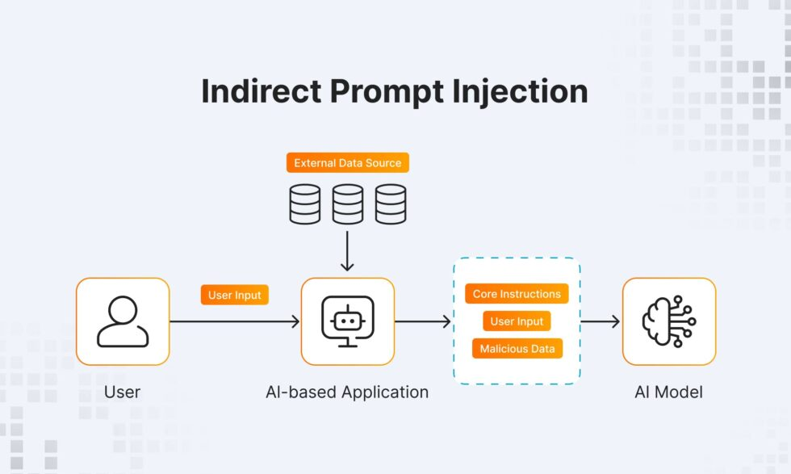
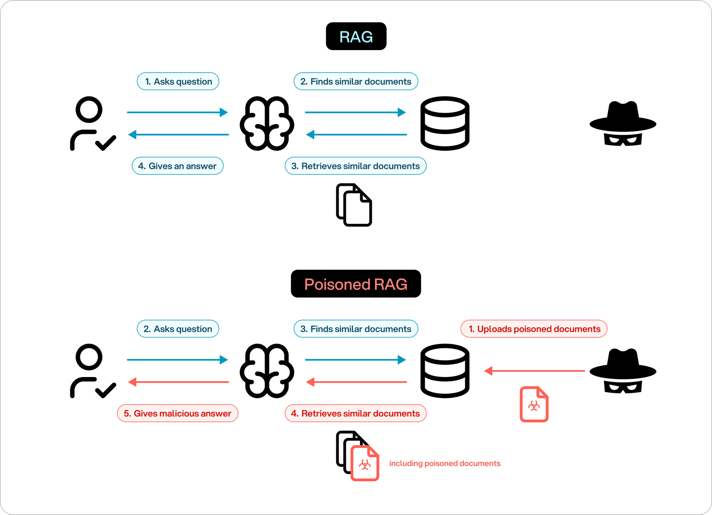

---
title: The Confused Deputy Problem in LLMs
description: A technical analysis of confused-deputy failures in LLM systems, including trust boundaries, attack chains, and practical mitigations.
publishDate: 2026-04-21
read: 20
tags:
  - LLM Security
  - Prompt Injection
  - Confused Deputy
img: /assets/blog/llmoutput.png
img_alt: The Confused Deputy Problem in LLMs
featured: true
---

import AttackFlow from '@/components/blogs/AttackFlow.astro';
import ScenarioTabs from '@/components/blogs/ScenarioTabs.astro';
import RiskRadar from '@/components/blogs/RiskRadar.astro';

## Why This Problem Keeps Returning

The confused deputy is not a new weakness, but modern LLM systems make it easier to trigger and harder to detect. In classical security, the issue appears when a privileged component is tricked into using its authority for someone else’s intent. In LLM-driven architectures, the same pattern emerges when an agent can read untrusted content and call privileged tools within the same execution flow.

This is why many AI failures that look like "model mistakes" are actually authorization mistakes. The model may be doing exactly what the system allows it to do: consuming input, interpreting instructions, and invoking tools under broad credentials. If authority is not tied to explicit intent at each boundary, a malicious instruction can ride on trusted privileges and produce unauthorized actions.

## Classical Root and Why It Maps Cleanly to LLMs

Norm Hardy’s original confused-deputy example centered on a compiler that received a user-provided file designator but executed with stronger system privileges. The core failure was not that the compiler “wanted” to violate policy. The failure was that designation and authority were decoupled, and the system silently resolved access using the deputy’s power.

LLM systems recreate that same structure. A prompt or retrieved document acts as the designator. The LLM or tool gateway acts as the deputy. The downstream API validates the deputy’s credentials and executes. If no mechanism re-checks who is actually entitled to the action, the attacker effectively borrows the deputy’s authority without ever holding it directly.

## Trust Boundaries in Typical LLM Pipelines

A standard agentic pipeline often follows this route: user input and external context are combined by the LLM, the LLM selects a tool call, the call is sent through a gateway, and an internal service executes with agent credentials. Each hop crosses a trust boundary, and each boundary can erase context if the system is not designed carefully.

The first boundary is semantic: trusted policy text and untrusted data are merged into one token stream. The second boundary is operational: model output becomes executable tool input. The third boundary is identity-related: backend services usually see only service credentials, not the original user’s authorization scope. When all three boundaries are weak, confused-deputy behavior becomes systemic rather than exceptional.

## Threat Model (Focused for LLM Systems)

A practical threat model for this problem assumes that the attacker cannot directly access sensitive targets but can influence what the LLM ingests. This influence can come from direct prompts, poisoned documents in retrieval sources, or compromised intermediate content in a multi-agent chain. The defender’s challenge is that the attacker does not need to break authentication directly; they only need to influence intent before a privileged tool call happens.

The most relevant targets are internal APIs, restricted documents, automation actions, and mutation-capable tools. The highest-risk deployments are those where a single agent identity has broad read/write scope and where tool invocation is treated as inherently trusted if it came from the model.

## Anatomy of the Confusion

Indirect prompt injection is the most common delivery mechanism. Malicious instructions can be embedded in web pages, emails, PDFs, knowledge bases, or shared collaboration documents. Once retrieved, the payload is interpreted in the same context window as legitimate task content.

The second element is ambient authority. If the model can call `send_email`, `execute_sql`, or internal admin APIs with broad credentials, then any successful injection immediately upgrades from “text attack” to “privileged action.” This is what distinguishes confused-deputy exploitation from ordinary jailbreak behavior: the consequence is not just harmful text output, but real system-side execution.

The final element is data-instruction fusion. Many systems still assemble prompts through straightforward concatenation of system directives, retrieved context, user input, and tool outputs. Without strict policy gates at execution time, the runtime cannot consistently distinguish what should be interpreted as data from what should be treated as actionable instruction.

<AttackFlow />

## Canonical Attack Chain

A canonical chain starts when an attacker injects a hidden instruction through prompt or retrieved content. The model interprets that instruction as relevant task context and emits a tool call that appears syntactically valid. The gateway forwards the call, and the backend service accepts it because the deputy identity is authorized. At that point, privilege misuse is complete: data can be exfiltrated, state can be modified, or side effects can be triggered in systems the attacker cannot access directly.

This chain is especially dangerous because every step can appear normal in isolation. The prompt looks like text, the model output looks like a valid function call, and the API call is authenticated. The malicious transition happens in the gap between intent and authority.

## Attack Scenarios

<ScenarioTabs />

## Mitigations That Actually Change Risk

Effective mitigation requires reducing authority and strengthening intent validation simultaneously. Least privilege alone is insufficient if prompts remain unconstrained and tool calls are blindly trusted. Prompt filtering alone is also insufficient if delegated credentials remain broad. Strong design combines scoped authority, execution-time policy checks, and traceable provenance.

Scoped and short-lived delegation tokens reduce blast radius by preventing a single compromised context from unlocking full platform privileges. Tool-level policy enforcement should validate not only schema correctness but also whether the requested action matches user scope and task context. Provenance tracking adds another layer by tagging data origins so untrusted retrieval content cannot silently trigger high-risk operations. Runtime monitoring then provides detection and containment when prevention fails.

### Vector-Component-Control Mapping

| Attack Vector | Affected Component | Primary Control |
| --- | --- | --- |
| Direct prompt injection | LLM + tool gateway | strict tool policy + argument validation |
| RAG poisoning | retrieval pipeline + context builder | source trust scoring + content isolation |
| Delegation token misuse | agent-to-agent handoff | attenuated short-lived capability tokens |
| SSRF / internal fetch abuse | HTTP/tool connector | allowlist, egress policy, network segmentation |
| Chain delegation confusion | orchestration layer | per-step intent binding + auditable trace |

<RiskRadar />

## Conclusion

The confused deputy in LLM systems is fundamentally an authorization architecture problem expressed through language interfaces. The core question is never only "what did the model understand," but also "under whose authority did it act." If that mapping is implicit, attackers can exploit it repeatedly through prompt or context manipulation.

A secure path forward is to treat every delegation hop as a security boundary, bind privilege to explicit context, and enforce policy at the exact point of execution. Systems that do this can still remain useful and agentic, but they stop converting untrusted instructions into trusted actions by default.
