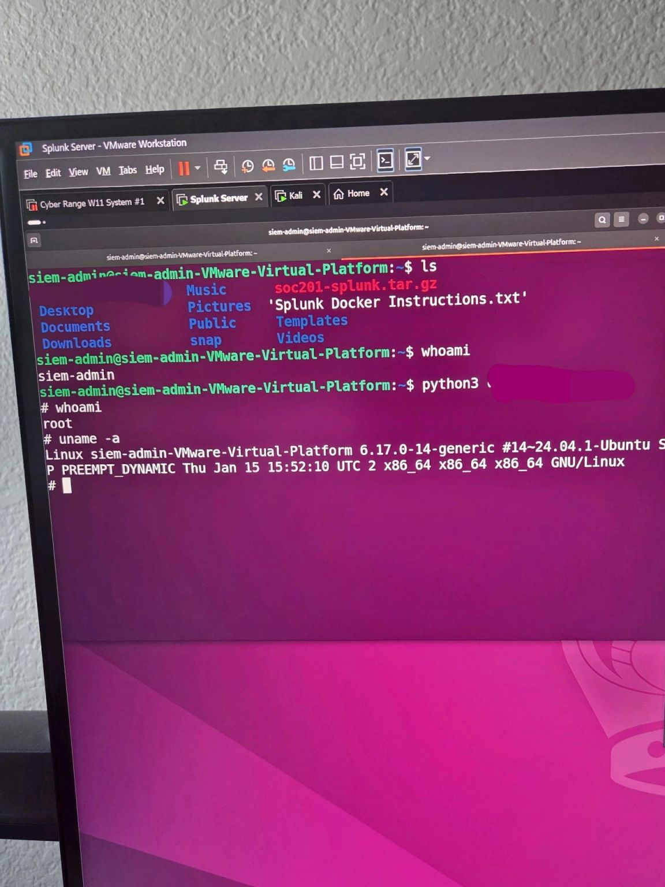

import demoVideo from './demo.mp4';

<video
  autoplay
  controls
  loop
  muted
  playsinline
  webkit-playsinline
  preload="auto"
  class="my-6 w-full rounded-2xl border border-primary/15"
>
  <source src={demoVideo} type="video/mp4" />
  Your browser does not support the video tag.
</video>

Some vulnerability names sound dramatic just for the sake of drama. **Copy Fail** is not really one of them.

This one is a pretty serious Linux kernel vulnerability tracked as **CVE-2026-31431**. In simple terms, it is a **local privilege escalation** bug. That means an attacker who already has some kind of local access to a vulnerable Linux machine may be able to jump from a normal user account to **root**.

And in Linux world, root is the final boss.

Root can read sensitive files, change system settings, install persistence, tamper with logs, access other users' data, and generally own the machine. So even though Copy Fail is not a remote exploit by itself, it is still dangerous because it can turn a small foothold into full control.

## What actually happened

Copy Fail lives in the Linux kernel, specifically around the kernel's cryptographic interface. The affected area is commonly discussed around **AF_ALG** and the **algif_aead** module.

That already sounds super low-level, so let us translate it.

Linux gives programs a way to ask the kernel for cryptographic operations. Instead of every program implementing everything by itself, some crypto work can go through kernel interfaces. This is normal. The problem is that a logic mistake in that area made it possible for a local user to influence memory in a way they should not be able to.

The scary part is not just "crypto bug equals bad." The scary part is what the bug allows: a controlled small write into the **page cache** of readable files.

## What is page cache in normal human language

Imagine Linux is reading a book from disk.

Instead of going back to the shelf every single time it needs the same page, Linux keeps recently used pages on the desk. That desk is basically the **page cache**.

It makes the system faster because files that were recently read can be reused from memory instead of being fetched again from disk.

Normally, a normal user should not be able to secretly rewrite the content of protected files through that cache. Especially not files owned by root. But Copy Fail creates a weird situation where the system can be tricked into modifying cached file content in memory.

That matters because some Linux binaries are trusted by the system.

One classic example is `/usr/bin/su`, a program used to switch users. It usually has special permissions because it needs to perform privileged actions. If an attacker can change how a trusted binary behaves while the system is using it, they may be able to run code with root-level privileges.

## Why this is a privilege escalation and not remote code execution

This distinction is important.

Copy Fail does **not** mean someone on the internet can magically attack your Linux server from zero access.

The attacker needs local execution first. That could be:

- a normal SSH accounts
- a compromised low-privilege user
- a malicious CI/CD job
- code execution inside a container
- a shared development box
- an untrusted workload running on a Linux host

So the flow looks more like this:

```txt
Initial access as low-privilege user
        ↓
Trigger Copy Fail on vulnerable kernel
        ↓
Abuse trusted root-related behavior
        ↓
Gain root privileges
```



That is still a big deal.

Many real attacks are not one-shot hacks. Attackers usually chain bugs. They might first get basic access through a weak password, leaked token, exposed service, vulnerable web app, or malicious package. Then they use a local privilege escalation like Copy Fail to fully take over the host.

## Why people are worried

The concern is not only the bug itself. It is the combination of several factors:

1. **Linux is everywhere**  
   Servers, cloud workloads, Kubernetes nodes, CI runners, developer machines, appliances, and containers all depend on Linux.

2. **The bug affects kernel-level behavior**  
   Kernel bugs are serious because the kernel is the core authority of the operating system.

3. **The exploit path is local but practical**  
   Local access is not rare in modern infrastructure. Shared servers, CI pipelines, containers, and developer environments create many places where untrusted code can run.

4. **The public proof of concept increased urgency**  
   Once exploit logic is public, defenders need to patch quickly because attackers can study and adapt it.

5. **Cloud and container environments make LPE bugs more painful**  
   A local privilege escalation inside a workload can become more dangerous when that workload is close to sensitive host resources.

In short, Copy Fail is the kind of vulnerability that rewards attackers who already got their foot in the door.

## A simple analogy

Think of a building with many rooms.

A normal user has a key to one small room. Root has the master key.

Copy Fail is not someone breaking in from outside the building. It is more like someone who already entered one room discovering that a copy machine in the hallway can accidentally print them a master key if they press the buttons in the wrong order.

That is why the bug is so dangerous in shared environments. The attacker does not need to start as admin. They just need a low-level place to run code.

## A safer way to discuss the exploit

I'll describe the full `copyfail_exploit.py` chain at a high level.

For example:

```txt
1. Open a target setuid binary such as /usr/bin/su
2. Interact with the kernel crypto API through AF_ALG
3. Abuse the vulnerable algif_aead behavior
4. Use splice-related behavior to influence page-cache-backed memory
5. Modify execution flow in memory
6. Run the trusted binary and gain root-level execution
```

That is enough for a public educational post.

If the audience is more technical, you can add a small non-weaponized pseudocode block:

```python
# Pseudocode only, not a working exploit

target = open_readonly("/path/to/trusted/setuid/binary")

crypto_socket = open_kernel_crypto_interface("AF_ALG", "AEAD")

prepare_controlled_payload()

abuse_copy_path(
    source=target,
    destination=crypto_socket,
    primitive="page-cache write"
)

execute_target_again()
```

This keeps the explanation clear without making the blog a drop-in exploitation manual.

## What defenders should do

The best fix is simple to say but sometimes annoying to execute:

**Patch the kernel.**

If your Linux distribution has released a fixed kernel package, apply it and reboot into the patched kernel. Kernel updates usually do not fully protect you until the system is actually running the updated kernel.

For Ubuntu-based systems, a normal update flow may look like this:

```bash
sudo apt update
sudo apt upgrade
sudo reboot
```

After rebooting, check the running kernel:

```bash
uname -r
```

For enterprise environments, the exact patch process depends on your distribution and fleet management setup.

## Temporary mitigation ideas

When patching cannot happen immediately, some vendors and advisories discuss reducing exposure by blocking or disabling the affected interface or module.

Common defensive ideas include:

- disabling or blocking `algif_aead` where possible
- limiting untrusted local users
- restricting SSH access
- hardening containers with seccomp
- preventing untrusted workloads from creating `AF_ALG` sockets
- keeping SELinux or AppArmor enforcement enabled
- reducing access to CI/CD runners and shared build machines
- monitoring unusual attempts to execute privilege-related binaries

Mitigation is not the same as patching. Treat it like putting a chair behind the door while you wait for the lock to be replaced.

## Why this matters for bug hunters and CTF players

For CTF players, Copy Fail is a good reminder that privilege escalation is often about weird system behavior, not only obvious misconfigurations.

In beginner boxes, privilege escalation might be something like:

```txt
sudo -l
SUID binary abuse
weak file permissions
cronjob misconfiguration
PATH hijacking
```

But in real systems, kernel-level LPEs can become the cleanest path from user to root.

The lesson is to think in layers:

```txt
Can I execute code locally?
Can I reach an affected kernel feature?
Can I influence a privileged file or process?
Can I turn a small memory corruption into root?
```

That mindset is useful whether you are doing CTF, internal pentesting, incident response, or cloud security.

## Detection thoughts

Detecting Copy Fail exploitation is tricky because the interesting change may happen in memory rather than as a normal file write on disk.

Traditional file integrity monitoring can miss some in-memory abuse because the file on disk may not visibly change. That is one reason page-cache-related bugs feel uncomfortable for defenders.

Still, defenders can watch for suspicious patterns such as:

- unexpected use of `AF_ALG`
- suspicious interaction with `algif_aead`
- unusual execution of setuid binaries
- untrusted users running crypto socket operations
- privilege jumps shortly after local code execution
- exploit-like behavior inside containers or CI jobs

Detection should not be your only plan, though. Patch first, monitor second.

## Conclusion

Copy Fail is a strong example of why local bugs still matter.

It does not start the attack from the internet. It does not magically compromise every Linux machine without access. But once an attacker has even a small local foothold, this kind of vulnerability can completely change the situation.

A normal user becoming root is not a minor upgrade. It is the difference between being inside one room and owning the whole building.

So the takeaway is simple:

```txt
Do not ignore local privilege escalation.
Patch fast.
Harden local execution paths.
Treat untrusted workloads like real risk.
```

Copy Fail shows that sometimes the most dangerous bugs are not loud at first. They sit quietly inside trusted system behavior until someone figures out how to make the system copy the wrong thing to the wrong place.

And when that copy fails, root may be waiting on the other side.

## References

- Microsoft Security Blog, "CVE-2026-31431: Copy Fail vulnerability enables Linux root privilege escalation across cloud environments"  
  https://www.microsoft.com/en-us/security/blog/2026/05/01/cve-2026-31431-copy-fail-vulnerability-enables-linux-root-privilege-escalation/

- Ubuntu / Canonical, "Fixes available for CVE-2026-31431 (Copy Fail) Linux Kernel Local Privilege Escalation Vulnerability"  
  https://ubuntu.com/blog/copy-fail-vulnerability-fixes-available

- CERT-EU Security Advisory 2026-005, "High Vulnerability in the Linux Kernel Copy Fail"  
  https://cert.europa.eu/publications/security-advisories/2026-005/

- Red Hat, "Cryptographic Subsystem Privilege Escalation Linux Kernel CVE-2026-31431 Copy Fail"  
  https://access.redhat.com/security/vulnerabilities/RHSB-2026-002
