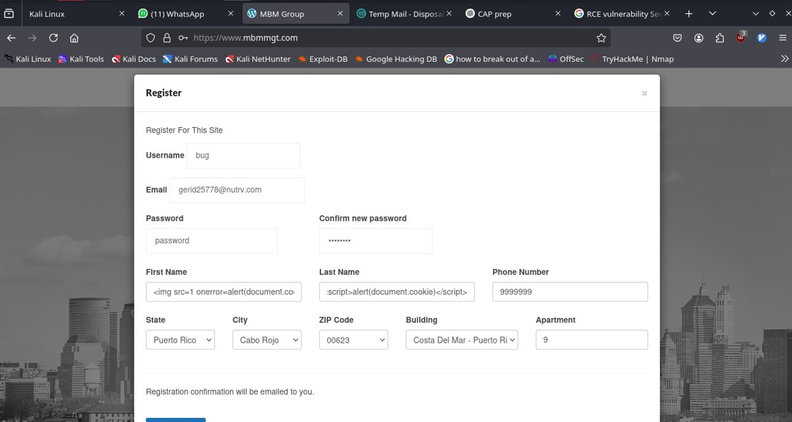
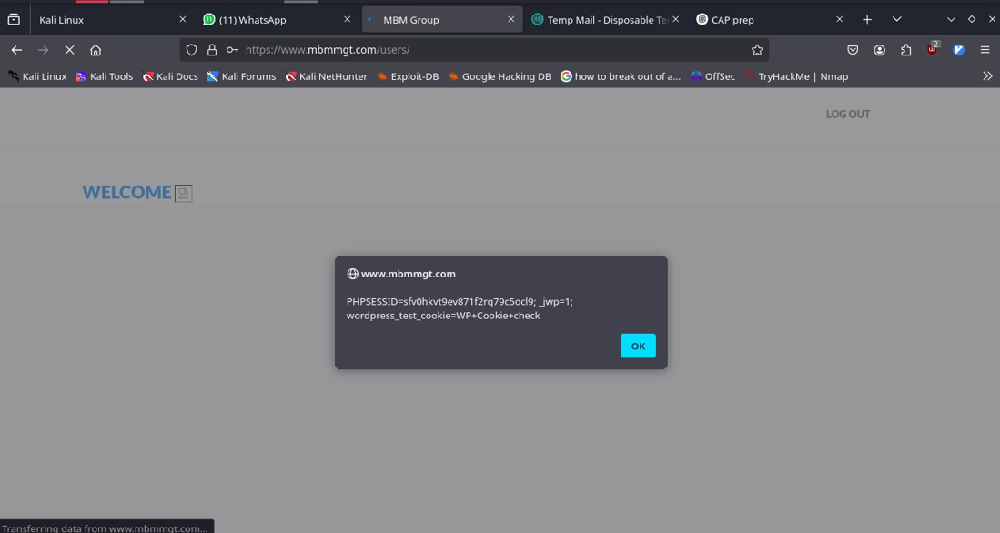
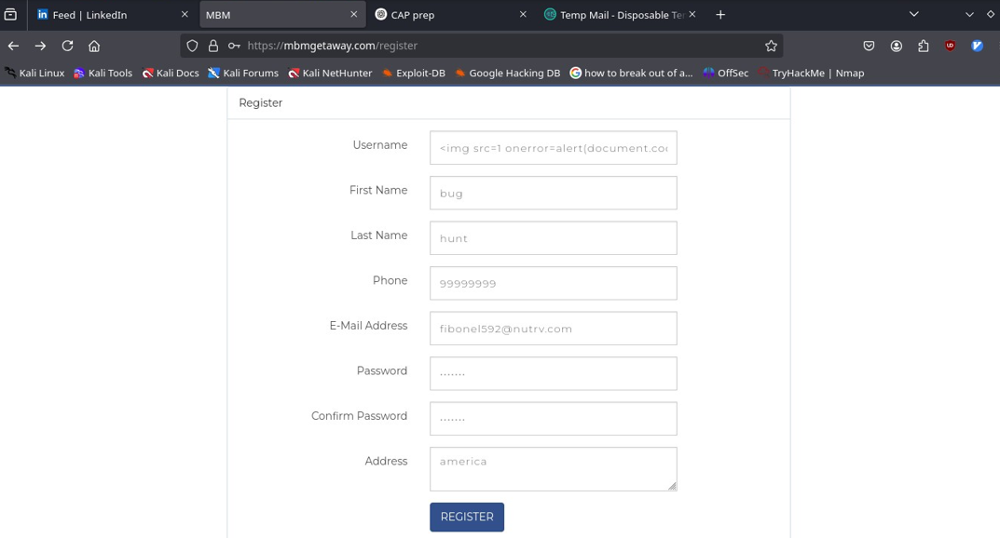
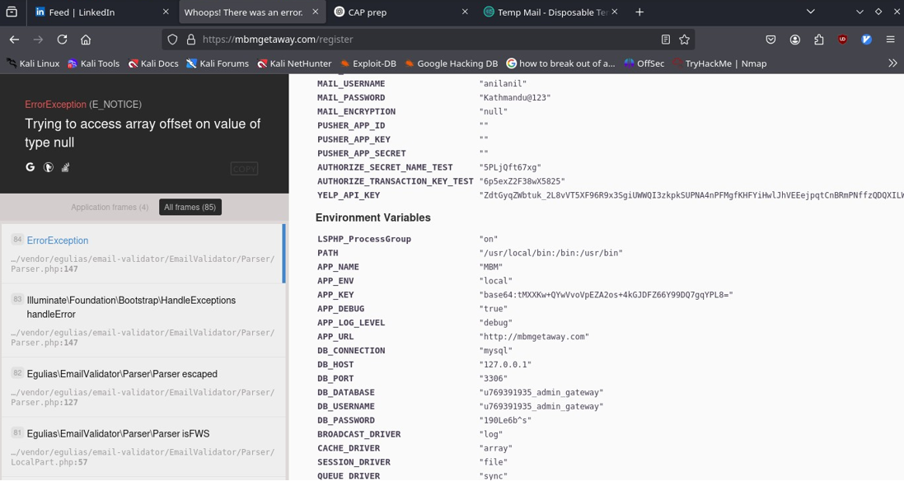

## MBM Vulnerabilities

Target: [ https://mbmmgt.com ]   
Target: [https://mbmgetaway.com/register]

---

## Stored Cross Site Scripting(XSS) vulnerability found.

Severity: High to Critical

### Summary:

A stored XSS vulnerability exists in the user registration process of the application. Malicious payloads injected into the first_name and last_name fields during registration are reflected and executed in the logged-in user's dashboard, without proper sanitization or encoding. This allows persistent script execution each time the page is loaded.

### Steps to Reproduce:

1. Go to the registration page ( /register ).
2. In the registration form:
   First Name: ``
   Last Name: ``
3. Complete the registration and log in with the newly created account.
4. Upon logging in, the dashboard loads and the injected script executes automatically.

### Impact:

Persistent XSS can be used to:

Steal session tokens
Hijack user accounts
Perform unauthorized actions on behalf of the user (session riding)
Deliver malware or phishing payloads

If an attacker can register users, this can be used against admin dashboards as well (depending on implementation).

Can lead to RCE(Remote Code Execution) Vulnerability which severity is Critical.

### Proof of Concept:

Payload:

### Result

### Recommended Fix:

- Sanitize and encode user inputs when rendering on any page.
- Apply a proper Content Security Policy (CSP) to mitigate script injection.
- Use context-aware encoding (e.g., HTML escaping in templates).
- Perform server-side validation to disallow unsafe input.

---

## Critical Information Disclosure via Laravel Debug Mode

Severity : Critical

### Summary:

The application is running in debug mode ( APP_DEBUG=true ) and set to the local environment ( APP_ENV=local ), which exposes a full stack trace and sensitive environment variables when a malformed input is submitted.

This includes:

Database credentials ( DB_HOST , DB_DATABASE , DB_USERNAME , DB_PASSWORD )
Mail server credentials ( MAIL_USERNAME , MAIL_PASSWORD )
Laravel application key ( APP_KEY )
API keys (e.g., Yelp, Authorize.Net)
Internal file paths and application configuration
Framework fingerprinting (Laravel-specific errors and stack trace)

### Steps to Reproduce:

1. Go to: https://mbmgetaway.com/register
2. Submit a crafted payload like `` in the username field.
3. Observe error page with dumped environment variables

### Impact:

Database compromise — attacker could connect to and manipulate backend DB   
Email abuse — exposed SMTP credentials could be used for phishing or spam   
Remote Code Execution (RCE) — Laravel debug mode can aid attackers in locating attack vectors   
Information disclosure — leaked keys and internal paths provide further foothold   

### Proof of Concept

Step 1: use any XSS payload or malformed input.
Step 2: Get Error Page that discloses sensitive info.

### Recommended Fix:

- Set APP_DEBUG=false and APP_ENV=production in the .env file
- Rotate all exposed credentials (DB, SMTP, API)
- Use .htaccess or web server config to restrict access to .env or other sensitive files

---